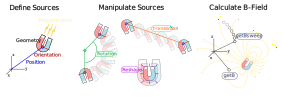
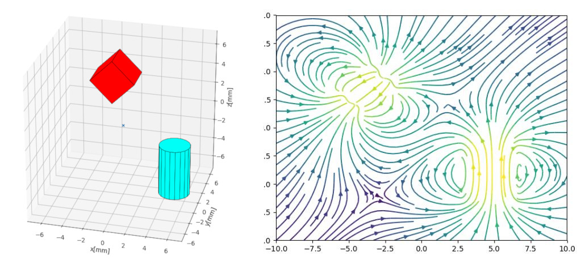

[](https://circleci.com/gh/OrtnerMichael/magPyLib) 
[](https://magpylib-magpylib.readthedocs-hosted.com/)

---

# About
*A simple and user friendly magnetic toolbox for Python 3.2+*

## What is magpylib ?
- Python package for calculating magnetic fields of magnets, currents and
  moments (sources).
- It provides convenient methods to generate, geometrically manipulate, group
  and vizualize assemblies of sources.
- The magnetic fields are determined from underlying (semi-analytical)
  solutions which results in fast computation times (sub-millisecond) and
  requires little computation power.

<p align="center">
    </center>
</p>


### Dependencies: 
_Python3.2+_, _Numpy_, _Matplotlib_

---

### Guides & Installation:

**Please [check out our documentation](https://magpylib-magpylib.readthedocs-hosted.com/) for [getting started](https://magpylib-magpylib.readthedocs-hosted.com/) and more info!**
_Installation methods are still WIP._

Installing this project locally:
- Clone this repository to your machine.
- In the directory, run `pip install .` in your conda terminal.


### Example:

- Two permanent magnets with axial magnetization are created and geometrically manipulated. They are grouped in a single collection and the system geometry is displayed using a supplied method.
- The total magnetic field that is generated by the collection is calculated on a grid in the xz-plane and is displayed using matplotlib.

**Program output:**


**Code:**
```python
# imports
import numpy as np
import matplotlib.pyplot as plt
import magpylib as magpy
 
# create magnets
magnet1 = magpy.source.magnet.Box(mag=[0,0,600],dim=[3,3,3],pos=[-4,0,3])
magnet2 = magpy.source.magnet.Cylinder(mag=[0,0,500], dim=[3,5], pos=[0,0,0])

# manipulate magnets
magnet1.rotate(45,[0,1,0],anchor=[0,0,0])
magnet2.move([5,0,-4])

# collect magnets
pmc = magpy.Collection(magnet1,magnet2)

# display system geometry
pmc.displaySystem()

# calculate B-fields on a grid
xs = np.linspace(-10,10,20)
zs = np.linspace(-10,10,20)
Bs = np.array([[pmc.getB([x,0,z]) for x in xs] for z in zs])

# display fields using matplotlib
fig, ax = plt.subplots()
X,Y = np.meshgrid(xs,zs)
U,V = Bs[:,:,0], Bs[:,:,2]
ax.streamplot(X, Y, U, V, color=np.log(U**2+V**2), density=1.5)
plt.show() 
```


