.. _docu:

******************************
Documentation v2.0.1b
******************************

The idea behind magpylib is to provide a simple and easy-to-use interface for computing the magnetic field of magnets, currents and moments. The computations are based on (semi-)analytical solutions found in the literature, discussed in the :ref:`physComp` section.

Contents
########

* :ref:`docu-PackageStructure`
* :ref:`docu-unitsAndIO`
* :ref:`docu-sourceClass`

  * :ref:`docu-posOrient`
  * :ref:`docu-DimExc`
  * :ref:`docu-GeoManip`

* :ref:`docu-CalcBfield`

  * :ref:`docu-vector`

* :ref:`docu-collection`
* :ref:`docu-sensor`
* :ref:`docu-displaySystem`
* :ref:`docu-math`

.. _docu-PackageStructure:

Package Structure
#################

The top level of magpylib contains the sub-packages  and :mod:`~magpylib.source`, :mod:`~magpylib.vector` and :mod:`~magpylib.math`, the classes :class:`magpylib.Collection` and :class:`magpylib.Sensor` as well as the function :meth:`magpylib.displaySystem`.

1. The **source module** includes a set of classes that represent physical sources of the magnetic field (e.g. permanent magnets).

2. The **vector module** includes functions for performance computation.

3. The **math module** contains practical functions for working with angle-axis rotations and transformation to and from Euler angle representation.

4. The **Collection class** is used to group sources and for common manipulation.

5. The **Sensor Class** represents a 3D magnetic sensor.

6. The **displaySystem function** is used to create a graphical output of the system geometry.

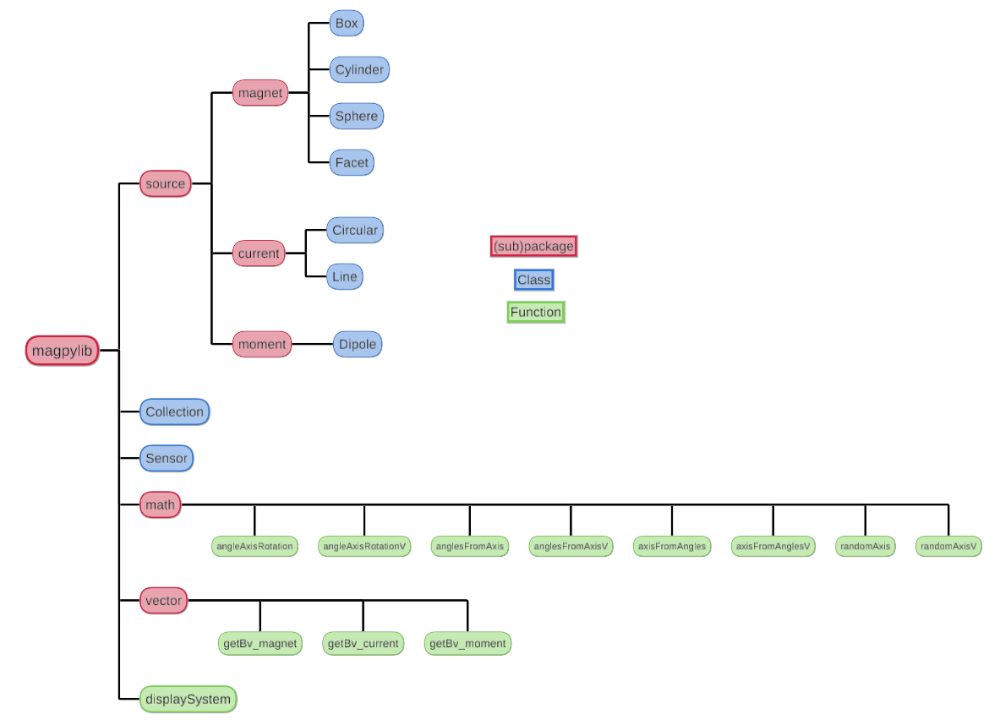

    **Figure:** Outline of library structure.

Check out the :ref:`genindex` and :ref:`modindex` for more details.

.. _docu-unitsAndIO:

Units and IO types
##################

In magpylib all inputs and outputs are made in the physical units of

- **Millimeter** for lengths
- **Degree** for angles
- **Millitesla** for magnetization/remanence, magnetic moment and magnetic field,
- **Ampere** for currents.

Unless specifically state otherwise in the docstring, **scalar input** can be of ``int`` or ``float`` type and **vector/matrix input** can be given either in the form of a ``list``, as a ``tuple`` or as a ``numpy.array``.

The library output and all object attributes are either of ``numpy.float64`` or ``numpy.array64`` type.

.. _docu-sourceClass:

The Source Class
#################

This is the core class of the library. The idea is that source objects represent physical magnetic field sources in Cartesian three-dimensional space. The following source types are currently implemented,

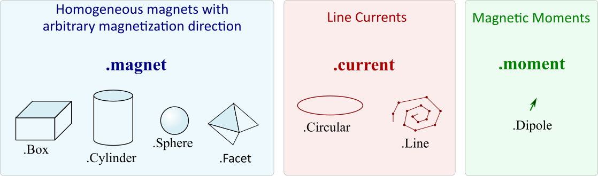

  **Figure:** Source types currently available in magpylib.

All source objects share various attributes and methods. The attributes characterize the source (e.g. position, orientation, dimension) while the methods can be used for geometric manipulation and for calculating the magnetic field. The figure below gives a graphical overview.

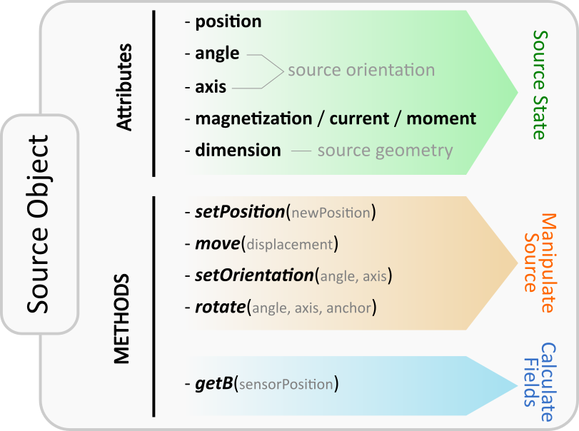

  **Figure:** Illustration of attributes and methods of the source class objects.

.. _docu-posOrient:

Position and Orientation
------------------------
The most fundamental properties of a source object ``s`` are position and orientation which are represented through the attributes ``s.position`` (*arr3*), ``s.angle`` (*float*) and ``s.axis`` (*arr3*). At source initialization, if no values are specified, the source object is initialized by default with ``position=(0,0,0)``, and **init orientation** defined to be ``angle=0`` and ``axis=(0,0,1)``.

Due to their different nature each source type is characterized by different attributes. However, in general the ``position`` attribute refers to the position of the geometric center of the source. The **init orientation** generally defines sources standing upright oriented along the Cartesian coordinates axes, see e.g. the following image below.

An orientation of a source ``s`` given by (``angle``, ``axis`` ) refers to a rotation of ``s`` RELATIVE TO the **init orientation** about an axis specified by the ``s.axis`` vector which is anchored at ``s.position``. The angle of this rotation is given by the ``s.angle`` attribute. Mathematically, every possible orientation can be expressed by such a single angle-axis rotation. For easier use of the angle-axis rotation and transformation to Euler angles the :ref:`docu-math` provides some useful methods.

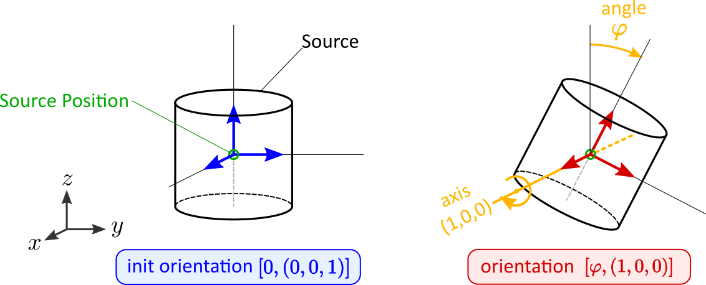

  **Figure:** Illustration of the angle-axis system used to describe source orientations.

.. _docu-DimExc:

Dimension & Excitation
--------------------

While position and orientation have default values, a source is defined through its geometry (e.g. cylinder) and excitation (e.g. magnetization vector) which must be initialized to provide meaning.

The ``dimension`` input specifies the size of the source. However, as each source type requires different input parameters the format is always different:

* ``Box.dimension`` is a 3D array of the cuboid sides, *[a,b,c]*
* ``Cylinder.dimension`` is a 2D array of diameter and height, *[d,h]*
* ``Sphere.dimension`` is a float describing the diameter *d*
* ``Facet.dimension`` is a 3x3 array of the three corner vertices, *[A,B,C]*
* ``Line.dimension`` is a Nx3 array of N subsequent vertices, *[V1,V2,V3,...]*
* ``Circular.dimension`` is a float describing the diameter *d*

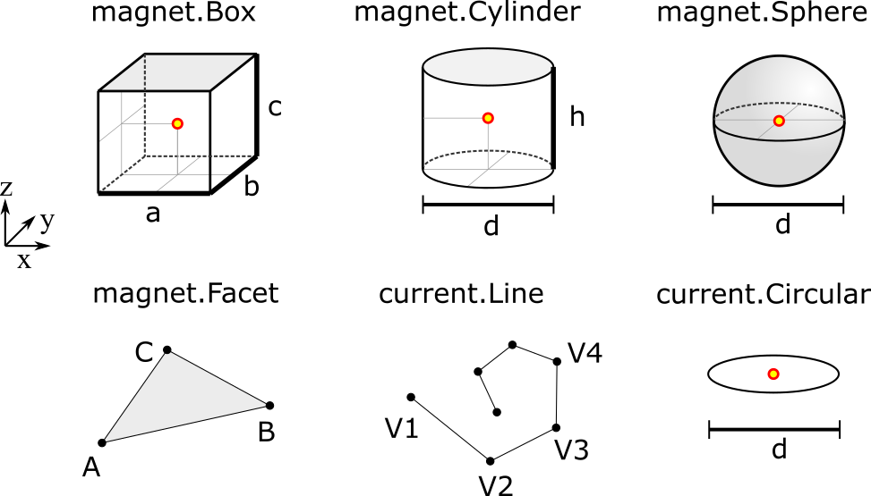

  **Figure:** Illustration of information given by the dimension-attribute. The source positions (typically the geometric center) is indicated by the red dot.

The excitation of a source is either the ``magnetization``, the ``current`` or the magnetic ``moment``:

* Magnet sources represent homogeneously magnetized permanent magnets (other types with radial or multipole magnetization are not implemented at this point). Such excitations are given by the ``magnetization`` (*vec3*) input which is always given with respect to the **init orientation** of the magnet.
* Current sources represent electrical line currents. Their excitation is simply the electrical current in units of Ampere defined by the ``current`` (*float*) input.
* The moment class represents a magnetic dipole moment described by the ``moment`` (*vec3*) input.

Detailed information about the attributes of each specific source type and how to initialize them can also be found in the respective class docstrings:
:mod:`~magpylib.source.magnet.Box`, :mod:`~magpylib.source.magnet.Cylinder`, :mod:`~magpylib.source.magnet.Sphere`, :mod:`~magpylib.source.magnet.Facet`, :mod:`~magpylib.source.current.Line`, :mod:`~magpylib.source.current.Circular`, :mod:`~magpylib.source.moment.Dipole` 

.. note::
  For convenience the attributes ``magnetization``, ``current``, ``dimension`` and ``position`` are initialized through the keywords ``mag``, ``curr``, ``dim`` and ``pos``.

The following code shows how to initialize a source object, a D4H5 permanent magnet cylinder with diagonal magnetization, positioned with the center in the origin, standing upright with axis in z-direction.

.. code-block:: python

  from magpylib.source.magnet import Cylinder

  s = Cylinder( mag = [500,0,500], # The magnetization vector in mT.
                dim = [4,5])       # dimension (diameter,height) in mm.
                
  # no pos, angle, axis specified so default values are used

  print(s.magnetization)  # Output: [500. 0. 500.]
  print(s.dimension)      # Output: [4. 5.]
  print(s.position)       # Output: [0. 0. 0.]
  print(s.angle)          # Output: 0.0
  print(s.axis)           # Output: [0. 0. 1.]

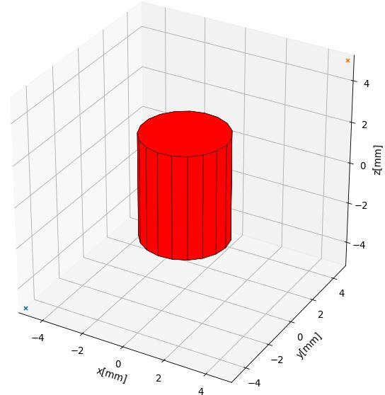

  **Figure:** Magnet geometry created by above code: A cylinder which stands upright with geometric center at the origin.

.. _docu-GeoManip:

Methods for Geometric Manipulation
----------------------------------

In most cases we want to move the source to a designated position, orient it in a desired way or change its dimension dynamically. There are several ways to achieve this:

**At initialization:**

When initializing the source we can set all attributes as desired. So instead of *moving one source around* one could create a new source for each parameter set of interest.

**Manipulation after initialization:**

We initialize the source and manipulate it afterwards as desired by

1. directly setting the source attributes (e.g. ``s.position=newPosition``),
2. or by using provided methods of manipulation.

The latter is often the most practical and intuitive way. To this end the source class provides a set of methods for convenient geometric manipulation. The methods include ``setPosition`` and ``move`` for translation of the objects as well as ``setOrientation`` and ``rotate`` for rotation operations. Upon application they will simply modify the source object attributes accordingly.

* ``s.setPosition(newPos)``: Moves the source to the position given by the argument vector (``s.position`` -> ``newPos``)
* ``s.move(displacement)``: Moves the source by the argument vector. (``s.position`` -> ``s.position + displacement``) 
* ``s.setOrientation(angle,axis)``: Sets a new source orientation given by the arguments. (``s.angle``-> ``angle``, ``s.axis`` -> ``axis``)
* ``s.rotate(ang,ax,anchor=anch)``: Rotates the source object by the angle ``ang`` about the axis ``ax`` which passes through a position given by ``anch``. As a result, source position and orientation attributes are modified. If no value for anchor is specified, the anchor is set to the object position, which means that the object rotates about itself.

The following videos show the application of the four methods for geometric manipulation.

|move| |setPosition|

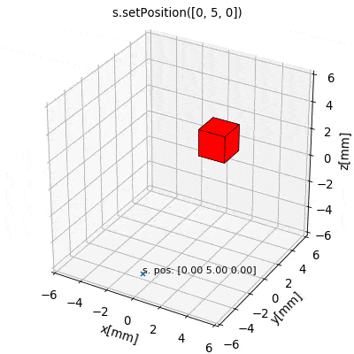

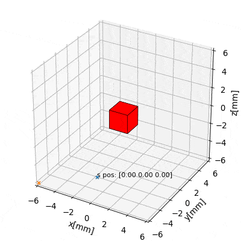

|rotate| |setOrientation|

.. |setOrientation| image:: ../_static/images/documentation/setOrientation.gif
   :width: 45%

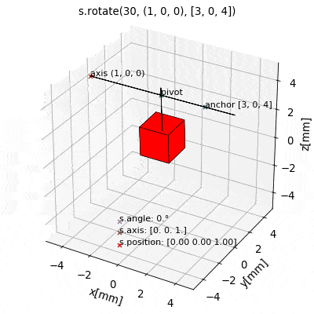

The following example code shows how geometric operations are applied to source objects.

.. code-block:: python

  from magpylib.source.magnet import Cylinder

  s = Cylinder( mag = [500,0,500], dim = [4,5])

  print(s.position)       # Output: [0. 0. 0.]

  s.move([1,2,3])
  print(s.position)       # Output: [1. 2. 3.]

  s.move([1,2,3])
  print(s.position)       # Output: [2. 4. 6.]

.. _docu-CalcBfield:

Calculating the Magnetic Field
##############################

To calculate the field, magpylib uses mostly analytical expressions that can be found in the literature. References, validity and discussion of these solutions can be found in the :ref:`physComp` section. In a nutshell, the fields of the dipole and the currents are exact. The analytical magnet solutions deal with homogeneous, fixed magnetizations. For hard ferromagnets with large coercive fields like Ferrite, Neodyme and SmCo the error is typically below 2%.

There are two possibilities to calculate the magnetic field of a source object ``s``:

1. Using the ``s.getB(pos)`` method
2. Using the ``magpylib.vector`` subpackage

**The first method:** Each source object (or collection) ``s`` has a method ``s.getB(pos)`` which returns the magnetic field generated by ``s`` at the position ``pos``.

.. code-block:: python

  from magpylib.source.magnet import Cylinder
  s = Cylinder( mag = [500,0,500], dim = [4,5])
  print(s.getB([4,4,4]))       

  # Output: [ 7.69869084 15.407166    6.40155549]

.. _docu-vector:

Using magpylib.vector
---------------------

**The second method:** In most cases one will be interested to determine the field for a set of positions, or for different magnet positions and orientations. While this can manually be achieved by looping ``s.getB`` the computation will be inefficient. For performance computation the ``magpylib.vector`` subpackage contains the ``getBv`` functions that offer quick access to VECTORIZED CODE. A discussion of vectorization, SIMD and performance is presented in the :ref:`physComp` section.

The ``magpylib.vector.getBv`` functions evaluate the field for *N* different sets of input parameters. These *N* parameter sets are provided to the ``getBv`` functions as arrays of size *N* for each input (e.g. an *Nx3* array for the *N* different positions):

``getBv_magnet(type, MAG, DIM, POSo, POSm, [angs1,angs2,...], [AXIS1,AXIS2,...], [ANCH1,ANCH2,...])``

* ``type`` is a string that specifies the magnet geometry (e.g. *'box'* or *'sphere'*).
* ``MAG`` is an *Nx3* array of magnetization vectors.
* ``DIM`` is an *Nx3* array of magnet dimensions.
* ``POSo`` is an *Nx3* array of observer positions.
* ``POSm`` is an *Nx3* array of initial (before rotation) magnet positions.
* The inputs ``[angs1, angs2, ...]``, ``[AXIS1, AXIS2, ...]``, ``[ANCH1, ANCH2, ...]`` are a lists of size *N*/*Nx3* arrays that correspond to angles, axes and anchors of rotation operations. By providing multiple list entries one can apply subsequent rotation operations. By ommitting these inputs it is assumed that no rotations are applied.

As a rule of thumb, ``s.getB()`` will be faster than ``getBv`` for ~5 or less field evaluations while the vectorized code will be up to ~100 times faster for 10 or more field evaluations. To achieve this performance it is critical that one follows the vectorized code paradigm when creating the ``getBv`` inputs. This is demonstrated in the following example where the magnetic field at a fixed observer position is calculated for a magnet that moves linearly in x-direction above the observer.

.. code-block:: python

  import magpylib as magpy
  import numpy as np

  # vector size: we calculate the field N times with different inputs
  N = 1000

  # Constant vectors, specify dtype
  mag  = np.array([0,0,1000.])    # magnet magnetization
  dim  = np.array([2,2,2.])       # magnet dimension
  poso = np.array([0,0,-4.])      # position of observer

  # magnet x-positions
  xMag = np.linspace(-10,10,N)

  # magpylib classic ---------------------------

  Bc = np.zeros((N,3))
  for i,x in enumerate(xMag):
      s = magpy.source.magnet.Box(mag,dim,[x,0,0])
      Bc[i] = s.getB(poso)

  # magpylib vector ---------------------------

  # Vectorizing input using numpy native instead of python loops
  MAG = np.tile(mag,(N,1))        
  DIM = np.tile(dim,(N,1))        
  POSo = np.tile(poso,(N,1))
  POSm = np.c_[xMag,np.zeros((N,2))]

  # Evaluation of the N fields using vectorized code
  Bv = magpy.vector.getBv_magnet('box',MAG,DIM,POSo,POSm)

  # result ----------------------------------- 
  # Bc == Bv    ... up to some 1e-16

Compare the computation speed by timing the classical versus the vectorized code using .e.g the ``time.perf_counter()`` function. More examples of vectorized code can be found in the :ref:`examples-vector` section.

.. _docu-collection:

Collections
###########

The idea behind the top level :class:`magpylib.Collection` class is to group multiple source objects for common manipulation and evaluation of the fields. 

In principle a collection ``c`` is simply a list of source objects that are collected in the attribute ``c.sources`` (*list*). Operations applied individually to the collection will be applied to all sources that are part of the collection.

Collections can be constructed at initialization by simply giving the sources objects as arguments. It is possible to add single sources, lists of multiple sources and even other collection objects. All sources are simply added to the ``sources`` attribute of the target collection.

With the collection kwarg ``dupWarning=True``, adding multiples of the same source will be prevented, and a warning will be displayed informing the user that a source object is already in the collection's ``source`` attribute. Adding the same object multiple times can be done by setting ``dupWarning=False``.

In addition, the collection class features methods to add and remove sources for command line like manipulation. The method `c.addSources(*sources)` will add all sources given to it to the collection `c`. The method `c.removeSource(ref)` will remove the referenced source from the collection. Here the `ref` argument can be either a source or an integer indicating the reference position in the collection, and it defaults to the latest added source in the Collection.

.. code-block:: python

  import magpylib as magpy

  #define some magnet objects
  mag1 = magpy.source.magnet.Box(mag=[1,2,3],dim=[1,2,3])
  mag2 = magpy.source.magnet.Box(mag=[1,2,3],dim=[1,2,3],pos=[5,5,5])
  mag3 = magpy.source.magnet.Box(mag=[1,2,3],dim=[1,2,3],pos=[-5,-5,-5])

  #create/manipulate collection and print source positions
  c = magpy.Collection(mag1,mag2,mag3)
  print([s.position for s in c.sources])
  #OUTPUT: [array([0., 0., 0.]), array([5., 5., 5.]), array([-5., -5., -5.])]

  c.removeSource(1)
  print([s.position for s in c.sources])
  #OUTPUT: [array([0., 0., 0.]), array([-5., -5., -5.])]

  c.addSources(mag2)
  print([s.position for s in c.sources])
  #OUTPUT: [array([0., 0., 0.]), array([-5., -5., -5.]), array([5., 5., 5.])]

All methods for geometric operations (`setPosition`, `move`, `setOrientation` and `rotate`) are also methods of the collection class. A geometric operation applied to a collection is directly applied to each object within that collection individually. In practice this means that a whole group of magnets can be rotated about a common pivot point with a single command.

For calculating the magnetic field that is generated by a whole collection the method `getB` is also available. The total magnetic field is simply given by the superposition of the fields of all sources.

|Collection| |total Field|

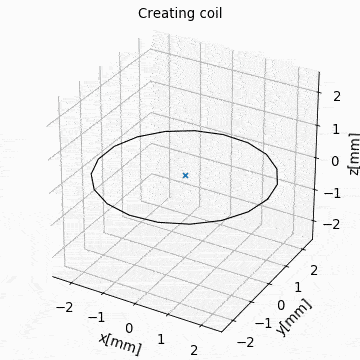

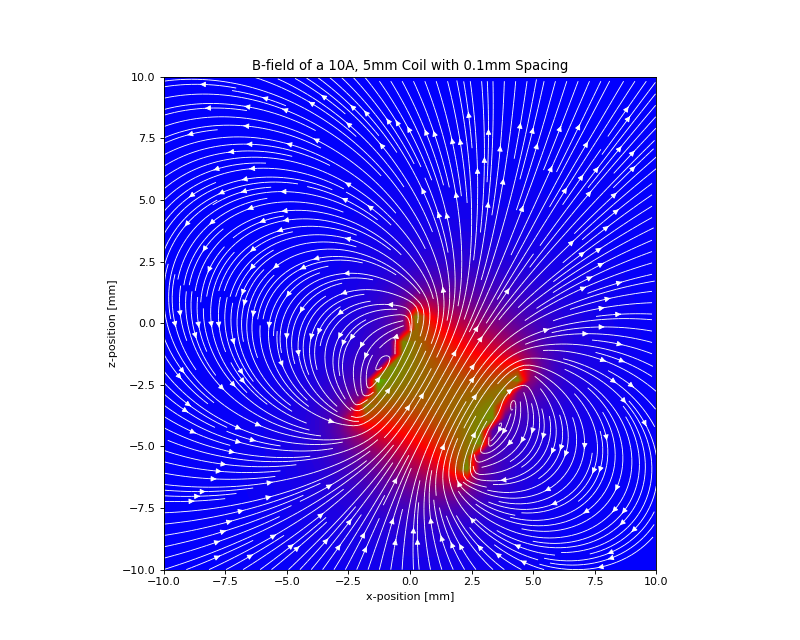

**Figure:** *Collection Example. Circular current sources are grouped into a collection to form a coil. The whole coil is then geometrically manipulated and the total magnetic field is calculated and shown in the xz-plane.*

.. _docu-sensor:

The Sensor Class
################

The `getB` method will always calculate the field in the underlying canonical basis. While a sensor orientation is easily implemented, magpylib also offers a :class:`magpylib.Sensor` class. 

Geometrically, a sensor object `sens` behaves just like a source object, having position and orientation attributes that can be set using the convenient methods `sens.setPosition`, `sens.move`, `sens.setOrientation` and `sens.rotate`.

For a sensor object `sens`, the method `sens.getB(s)` returns the field of the source `s` as seen by the sensor. Here `s` can be a source object or a collection of sources.

.. code-block:: python

  import magpylib as magpy

  # define sensor
  sens = magpy.Sensor(pos=[5,0,0])

  # define source
  s = magpy.source.magnet.Sphere(mag=[123,0,0],dim=5)

  # determine sensor-field
  B1 = sens.getB(s)

  # rotate sensor about itself (no anchor specified)
  sens.rotate(90,[0,0,1])

  # determine sensor-field
  B2 = sens.getB(s)

  # print fields
  print(B1)   # output: [10.25  0.  0.]
  print(B2)   # output: [0. -10.25  0.]

.. _docu-displaySystem:

Display System Graphically
############################

Then top level function `displaySystem(c)` can be used to quickly check the geometry of a source-sensor-marker assembly. Here `c` can be a source/sensor, a list thereof or a collection. `displaySystem`uses the matplotlib package and its limited capabilities of 3D plotting which often results in bad object overlapping.

`displaySystem(c)` comes with several keyword arguments:

* `markers=listOfPos` for displaying reference positions. By default a marker is set at the origin. By providing *[a,b,c,'text']* instead of just a simple position vector *'text'* is displayed with the marker.
* `suppress=True` for suppressing the figure output. To suppress the output it is necessary to deactivate the interactive mode by calling *pyplot.ioff()*. With `Spyder's <https://www.spyder-ide.org/>`_ IPython *Inline* plotting, graphs made with :meth:`~magpylib.displaySystem()` can be blank if the suppress=True option is not used. Set IPython Graphics backend to *Automatic* or *Qt5* instead of *Inline* in settings/IPython console/Graphics method to address this.
* `direc=True` for displaying current and magnetization directions in the figure.
* `subplotAx=None` for displaying the plot on a designated figure subplot instance.

The following example code shows how to use `displaySystem()`:

.. plot:: pyplots/doku/displaySys.py
  :include-source:

  **Figure:** Several magnet and sensor object are created and manipulated. Using `displaySystem()` they are displayed in a 3D plot together with some markers which allows one to quickly check if the system geometry is ok.

.. _docu-math:

Math Package
###############