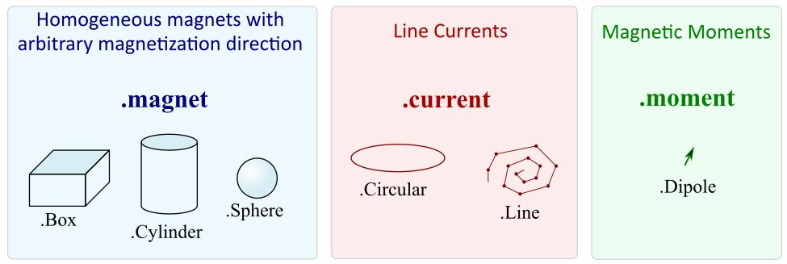
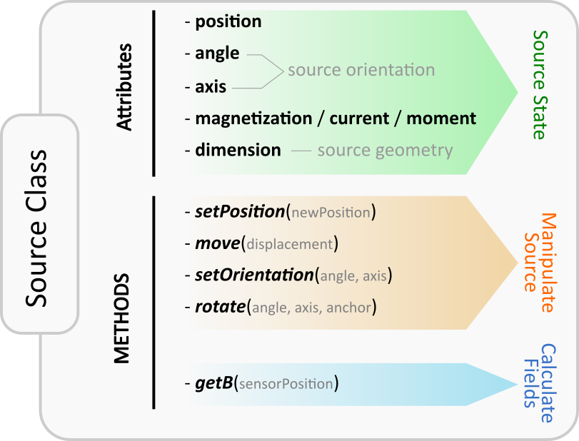
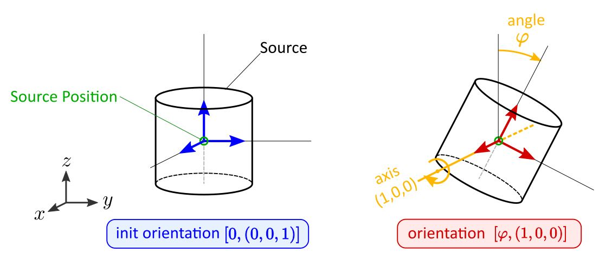

*********************
Library Documentation
*********************

The idea behind magpylib is to provide a simple and easy-to-use interface
for computing the magnetic field of magnets, currents and moments. The
computation is based on (semi-)analytical solutions found in the literature
discussed in the `Physics Section`__.

__ _pages/9_Physics/

Contents
########

* `Package Structure`_
* `Units`_
* `IO types`_
* `The Source Class`_

  * `Position and Orientation`_
  * `Geometry / Dimension & Excitation`_

Package Structure
#################

The top level of magpylib contains the sub-packages  and :mod:`~magpylib.source`, :mod:`~magpylib.vector` and :mod:`~magpylib.math`, the classes :class:`magpylib.Collection` and :class:`magpylib.Sensor` as well as the function :function:`magpylib.displaySystem`.

1. The **source module** includes a set of classes that represent physical sources of the magnetic field (e.g. permanent magnets).

2. The **vector module** includes functions for performance computation of the magnetic field.

3. The **math module** contains practical functions for working with angle-axis rotations and transformation to Euler angles.

4. The **Collection class** is used to group sources and for common manipulation.

5. The **Sensor Class** represents a 3-axis magnetic field point-sensor.

6. The **displaySystem function** is used to create a graphical output of the system geometry.

.. figure:: ../_static/images/documentation/lib_structure.png
    :align: center
    :alt: Library structure fig missing !!!
    :figclass: align-center
    :scale: 60 %

    **Figure:** Outline of library structure.

Units
######

In magpylib all inputs and outputs are made in the physical units of

- **Millimeter** for lengths
- **Degree** for angles
- **Millitesla** for magnetization, magnetic moment and magnetic field,
- **Ampere** for currents.

IO types
##########

The library **input** is constructed so that any

- **scalar input** can be `int`, `float` or of `numpy.float` type
- **vector/matrix input** can be given either in the form of a `list`, as a `tuple` or as a `numpy.array`

unless specifically state otherwise in the docstrings. For example, the `magpylib.vector` functions require `numpy.array` input.

The library **output** and all object attributes are either of `numpy.float64` or `numpy.array64` type.

The Source Class
#################

This is the core class of the library. The idea is that source objects represent physical magnetic sources in Cartesian three-dimensional space. The following source types are currently implemented in magpylib.

  **Figure:** Source types currently available in magpylib.

All source objects share various attributes and methods. The attributes characterize the source (e.g. position, orientation, dimension) while the methods can be used for geometric manipulation and for calculating the magnetic field. The figure below gives a graphical overview.

  **Figure:** Illustration of attributes and methods of the source class.

Position and Orientation
------------------------
The most fundamental properties of a source object `s` are position and orientation which are represented through the attributes `s.position` (arr3), `s.angle` (float) and `s.axis`(arr3). At source initialization, if no values are specified, the source object is initialized by default with `position=(0,0,0)`, and **init orientation** defined to be `angle=0` and `axis=(0,0,1)`.

Due to their different nature each source type is characterized by different attributes. However, in general the `position` attribute refers to the position of the geometric center of the source. The **init orientation** generally defines sources standing upright oriented along the Cartesian coordinates axes, see e.g. the following image.

An orientation given by (`angle`,`axis`) refers to a rotation of the source RELATIVE TO the **init orientation** about an axis specified by the `axis` vector anchored at the source `position`. The angle of this rotation is given by the `angle` attribute. Mathematically, every possible orientation can be expressed by such a single angle-axis rotation. For easier use of the angle-axis rotation and transformation to Euler angles the `Math Package`_ provides some useful methods. 

  **Figure:** Illustration of the angle-axis system for source orientations.

Geometry / Dimension & Excitation
--------------------

While position and orientation have default values, a source is defined through its geometry (e.g. Cylinder) and excitation (e.g. Magnetization Vector) which must be initialized to provide meaning. The source geometry is generally described by the `dimension` attribute. However, as each source requires different input parameters, the format is always different. Detailed information about the attributes of each specific source type and how to initialize them can be found in the respective class docstrings:
:mod:`~magpylib.source.magnet.Box`, :mod:`~magpylib.source.magnet.Cylinder`,:mod:`~magpylib.source.magnet.Sphere`, :mod:`~magpylib.source.magnet.Facet`, :mod:`~magpylib.source.current.Line`, :mod:`~magpylib.source.current.Circular`, :mod:`~magpylib.source.moment.Dipole` 

The excitation is either the magnetization, the current or the magnetic moment. Magnet sources represent homogeneously magnetized permanent magnets (other types with radial or multipole magnetization are not implemented at this point). The magnetization vector is described by the `magnetization` attribute (arr3). The magnetization vector is always given with respect to the INIT ORIENTATION of the magnet. The current sources represent line currents. They require a scalar `current` input. The moment class represents a magnetic dipole moment which requires a `moment` (arr3) input.

.. note::
  For convenience `magnetization`, `current`, `dimension`, `position` are initialized through the keywords *mag*, *curr*, *dim* and *pos*.

The following code shows how to initialize a source object, a D4H5 permanent magnet cylinder with diagonal magnetization, positioned with the center in the origin, standing upright with axis in z-direction.

.. code-block:: python

  from magpylib.source.magnet import Cylinder

  s = Cylinder( mag = [500,0,500], # The magnetization vector in mT.
                dim = [4,5])       # dimension (diameter,height) in mm.
                
  # no pos, angle, axis specified so default values are used

  print(s.magnetization)  # Output: [500. 0. 500.]
  print(s.dimension)      # Output: [4. 5.]
  print(s.position)       # Output: [0. 0. 0.]
  print(s.angle)          # Output: 0.0
  print(s.axis)           # Output: [0. 0. 1.]

.. figure:: ../_static/images/documentation/Source_Display.JPG

  :align: center
  :scale: 50 %

  **Figure:** Magnet geometry created by above code: A cylinder which stands upright with geometric center at the origin.
