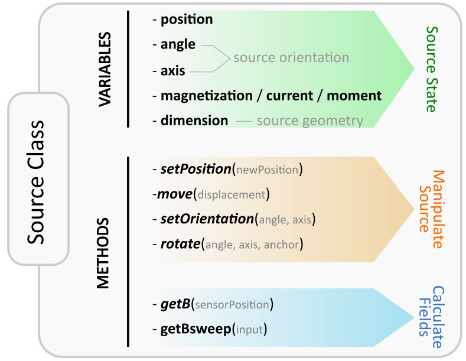

*********************
Library Documentation
*********************

The idea behind magpylib is to provide a simple and easy-to-use interface
for computing the magnetic field of magnets, currents and moments. The
computation is based on (semi-)analytical solutions found in the literature
discussed in the `Physics Section`__.

__ _pages/9_Physics/

Contents
--------

* `Package Structure`_
* `Units`_
* `IO types`_
* `The Source Class`_

Package Structure
-----------------

The top level of magpylib contains the sub-packages :mod:`~magpylib.math` and :mod:`~magpylib.source` as well as the class :class:`magpylib.Collection`.

Within the :mod:`~magpylib.math` module several practical functions are provided. They include e.g. elementary geometric operations like rotations and their transformations between Euler-Angles and Quaternion representation.

The :mod:`~magpylib.source` module includes the core classes of the library, i.e. the magnetic sources. They are grouped in sub-packages :mod:`~magpylib.source.magnet`, :mod:`~magpylib.source.current` and :mod:`~magpylib.source.moment` which contain the respective source classes.

The :class:`magpylib.Collection` class offers an easy way of grouping multiple source objects for common manipulation.

..  currentmodule:: magpylib

.. figure:: ../_static/images/documentation/lib_structure.png
    :align: center
    :alt: Library structure fig missing !!!
    :figclass: align-center
    :scale: 100 %

    **Figure:** Outline of library structure.

Units
------

In magpylib all inputs and outputs are made in the physical units of

- **Millimeter** for lengths
- **Degree** for angles
- **Millitesla** for magnetization, magnetic moment and magnetic field,
- **Ampere** for currents.

IO types
--------

The library is constructed so that any

- **scalar input** can be `int`, `float` or of `numpy.float` type
- **vector/matrix input** can be given either in the form of a `list`, as a `tuple` or as a `numpy.array`

unless specifically state otherwise in the docstrings. E.g. `magpylib.vector` functions require `numpy.array` input.

The library output and all object attributes are either of `numpy.float64` or `numpy.array64` type.

The Source Class
----------------

This is the core class of the library. The idea is that source objects represent physical magnetic sources in Cartesian three-dimensional space. The following source types are currently implemented in magpylib.

.. figure:: ../_static/images/documentation/SourceTypes.JPG
  :align: center
  :scale: 60 %

  **Figure:** Source types currently available in magpylib.

All source objects share various attributes and methods. The attributes characterize the source (e.g. position, orientation, dimension) while the methods can be used for geometric manipulation and for calculating the magnetic field. The figure below gives a graphical overview.

  **Figure:** Illustration of attributes and methods of the source class.
