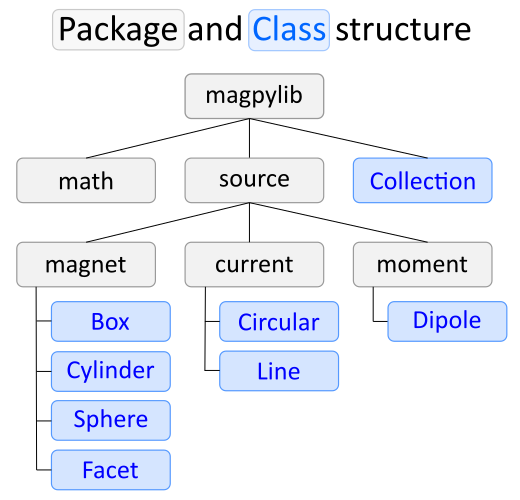

# Fundamentals of magpylib

The idea behind magpylib is to provide simple and easy to use classes for calculating magnetic fields. The core of the library is the [source class](#source-class) which represents a permanent magnet, a current distributions or a magnetic moment. The library provides simple methods to generate such source classes, to manipulate them geometrically, to group several sources into [Collections](#the-collection-class) and calculate the fields of such systems. 

In this part of the documentation the fundamental structure of the magpylib library is detailed.

  - [Package Structure](#package-structure)
  - [Units and IO Types](#units-and-IO-types)
  - [The Source Class](#the-source-class)
      - [Geometric Equivalence of Source Classes](#geometric-equivalence-of-source-classes)
    - [Positioning and Orientation](#positioning-and-orientation)
  - [The Collection Class](#the-collection-class)
    - [Advanced Shapes with Collections](#advanced-shapes-with-collections)
  - [Math Package](#math-package)

For code examples, check out the [Getting Started with magpylib](2_gettingStarted.md) guide and the [Examples](x_examples.rst) page.


## Package Structure

The top level of magpylib contains the sub-packages **magpylib.math** and **magpylib.source** as well as the class **magpylib.Collection**.

Within the **magpylib.math** module several practical functions are provided. They include e.g. elementary geometric operations like rotations and their transformations between Euler-Angles and Quaternion representation.

The **magpylib.source** module includes the core classes of the library, i.e. the magnetic sources. They are grouped in sub-packages **magpylib.source.magnet**, **magpylib.source.current** and **magpylib.source.moment** which contain the respective source classes.

The **magpylib.Collection** class offers an easy way of grouping multiple source objects for common manipulation.




## Units and IO Types

In magpylib all inputs and outputs are made in the physical units of **Millimeter** for lengths, **Degree** for angles and **Millitesla** for magnetization and magnetic field.

The library is constructed so that any scalar input can be **float** or **int** type and any vector/matrix input can be given either in the form of a **list**, as a **tuple** or as a **numpy.array**.

The library output is always a **float** or a **numpy.array**.

## The Source Class

This is the core class of the library. It is designed so that a source object represents a physical magnetic source in a cartesian three-dimensional space. Different source types are characterized by different variables given through their mathematical representation. 

The most fundamental properties of every source object **s** are position and orientation which are represented through the 3D-array **s**.*position*, the 3D-array **s**.*angle* and the float **s**.*axis*. The *position* refers to the geometric center of the source while the orientation (*angle*,*axis*) refers to a rotation of the source by *angle* about *axis* anchored at *position* RELATIVE TO the init orientation. The init orientation is defined to be (*0*,*(0,0,1)*). This is the default value of the orientation at initialization of a source object and it refers to sources standing upright, oriented along the cartesian coordinates axes. How the init orientation is specifically defined for each source type is outlined below. If no other values are given, a source object is initialized by default with *position=(0,0,0)*, *angle=0* and *axis=(0,0,1)*.

The magnet sources represent homogeneously magnetized permanent magnets. They are described by the *dimension* and the *magnetization* variables. The *dimension* format is different for each magnet type. The *magnetization* is always a 3D vector which indicates the direction and amplitude of the material magnetization.

For convenience *magnetization*, *dimension*, *position* are initializes through the keywords *mag*, *dim* and *pos*.


In addition to the fundamental geometric variables the magnet sources 

Magnet sources are 


 This is defined specifically for 


 which is the default value at initialization of a source object. 


In MagPyLib, multiple Classes have been defined to **represent different, fundamental Electromagnetic Sources** with their own peculiarities and characteristics as defined by their Mathematical representations:

#### Geometric Equivalence of Source Classes

These **Source Types** are what the **Source Classes** are based upon, and these are used to **define Source Objects**. 

After describing their Source Object characteristics, calling **their Field Methods** will let users quickly compose their data for fast Electromagnetic Field Analysis.


```eval_rst
.. note::
   **When a Source Object is created, it is spatially isolated from all other Source Objects** in program memory. This means that, **by themselves, methods for extracting electromagnetic field samples will only calculate the field belonging to the target object.**
```

### Positioning and Orientation

All of the Source Objects can be manipulated in their own 3D Space, as **all Source Objects possess *Methods* for absolute reorienting, relative rotation and relative movement**.

<i><p align="center" style="font-weight: 600;"> Rotating and Orienting </p></i>

```eval_rst

|rotate| |setOrientation|

.. |setOrientation| image:: ../_static/images/fundamentals/setOrientation.gif
   :width: 45%

.. |rotate| image:: ../_static/images/fundamentals/rotate.gif
   :width: 45%

```

<i><p align="center" style="font-weight: 600;"> Moving and Positioning </p></i>

```eval_rst

|move| |setPosition|

.. |setPosition| image:: ../_static/images/fundamentals/setPosition.gif
   :width: 45%

.. |move| image:: ../_static/images/fundamentals/move.gif
   :width: 45%
```
---

## The Collection Class

The linear nature of the field equations utilized **provides a superposition principle**. This means that **arbitrary magnet compounds can be generated** by “Union” and “Difference” operations.

To **group and display** Source Objects or to **perform group rotations and compound analysis**, the Collection Class is utilized. Otherwise, source objects will not interact.

Collections can be utilized in many ways, and may include other Collections inside of themselves. 

The following animation shows the creation of a 5mm long coil with 0.1mm spacing between each turn, constituting 50 turns.
The Coil **Collection is then moved and rotated** in two axes (Y and Z Tilt). 

```eval_rst
.. image:: ../_static/images/fundamentals/collectionExample.gif
   :align: center
```

The coils are defined as having 10 Amps running through each. 
The electromagnetic field **analysis of the compounded objects** looks like the following:

```eval_rst
.. image:: ../_static/images/fundamentals/collectionAnalysis.png
   :align: center
```

Movement may also be realized with the use of an **anchored pivot point**.

```eval_rst
.. image:: ../_static/images/fundamentals/pivot.gif
   :align: center
```

```eval_rst
.. image:: ../_static/images/fundamentals/pivotAnalysis.gif
   :align: center
```

### Advanced Shapes with Collections

Complex magnet formations may be created due to the superposition principle, where magnets of complex shapes are defined by Collections of basic ones.

Magnets with holes may be described by adding sources of conflicting magnetism inside of other sources.


## Math Package

The Math Package is utilized to assist users in performing Angle/Axis conversions and rotations utilizing [the quaternion notation](https://en.wikipedia.org/wiki/Quaternions_and_spatial_rotation).

[paper]: http://mystery-404.herokuapp.com