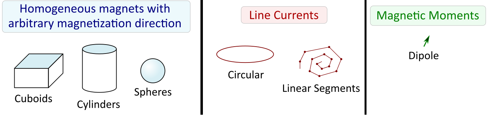
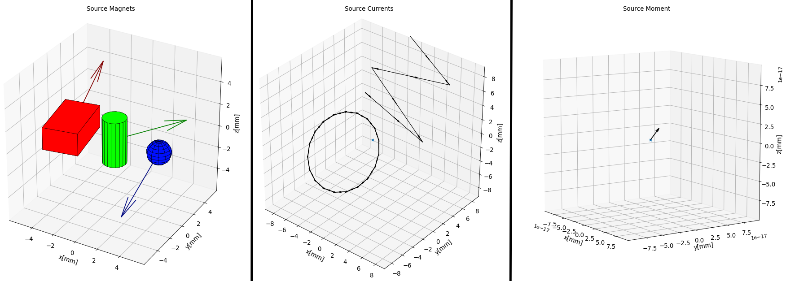
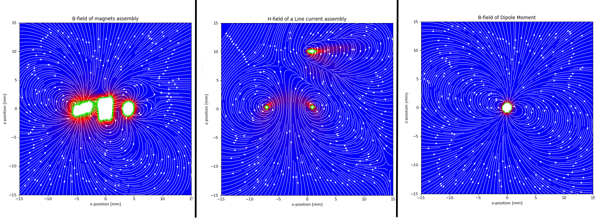
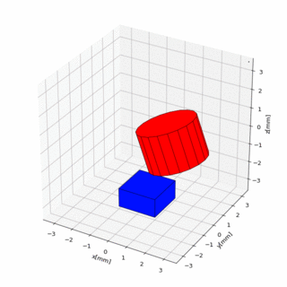

# [WIP] Fundamentals of MagPyLib

MagPyLib introduces a programming environment for you to define and manipulate permanent magnets in order to quickly compute their homogeneous magnetic fields in a 3D coordinate space using [ analytical approaches][paper]. 

To utilize this toolbox effectively, the following concepts particular to the library need to be made clear:

## Source Classes

<details>
<summary> <a>Primer: What's a Class?</a> </summary>

```eval_rst
.. note::
    A **Class in Object Oriented Programming** stands for **the grouping of Characteristics** that **define an Object** and its **behavior**, which gets **expressed through various Methods**. 
    
    Programmers can define instances of a Class, called Objects, then procedurally interact with these Objects by **updating** their attributes or by **executing** their Methods.
```
</details>

&nbsp;

In MagPyLib, multiple Classes have been defined to **represent different, fundamental Electromagnetic Sources** with their own peculiarities and characteristics as defined by their Mathematical representations:

#### Geometric Equivalence of Source Classes


These **Source Types** are what the **Source Classes** are based upon, and these are used to **define Source  Objects**. 





After describing their Source Object characteristics, calling **their methods** will let users quickly compose their data for fast Electromagnetic Field Analysis.

One way of Electromagnetic Field Analysis can be seen as follows:



### Positioning and Orientation

**When a Source Object is created, it is isolated from all other Source Objects** in program memory.

All of the Source Objects can be manipulated in their own 3D Space, as **all Source Objects possess *Methods* for absolute reorienting, relative rotation and relative movement**.


Movement may also be realized with the use of an **anchored pivot point**.



---

## The Collection Class

To group and display Source Objects or to perform group rotations and compound analysis, the Collection Class is utilized. 


### Advanced Shapes with Collections

Collections can be utilized in many ways, and may include other Collections inside of themselves. 

Complex magnet formations may be created due to the superposition principle, where magnets of complex shapes are defined by Collections of basic ones.

Magnets with holes may be described by adding sources of conflicting magnetism inside of other sources.


## Math Package

The Math Package is utilized to assist users in performing Angle/Axis conversions and rotations utilizing the quaternion notation.

[paper]: http://mystery-404.herokuapp.com