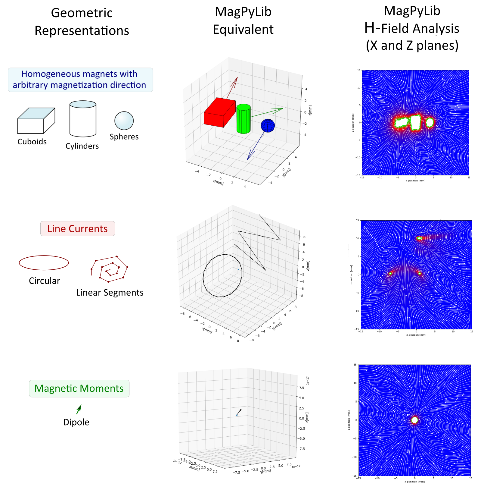

# [WIP] Fundamentals of MagPyLib

MagPyLib introduces a simplified programming environment for you to define and manipulate permanent magnets in order to quickly compute their homogeneous magnetic fields in a 3D coordinate space using [ analytical approaches][paper]. 

To utilize this toolbox effectively, the following concepts particular to the library need to be made clear. 

  - [Source Classes](#source-classes)
      - [Geometric Equivalence of Source Classes](#geometric-equivalence-of-source-classes)
    - [Positioning and Orientation](#positioning-and-orientation)
  - [The Collection Class](#the-collection-class)
    - [Advanced Shapes with Collections](#advanced-shapes-with-collections)
  - [Math Package](#math-package)

```eval_rst
.. note::
    For code examples, check out the :doc:`_guide/1_gettingStarted` guide and the :doc:`_guide/x_examples` page.
```

## Source Classes

<details>
<summary> <a>Primer: What's a Class?</a> </summary>

```eval_rst
.. note::
    A **Class in Object Oriented Programming** stands for **the grouping of Characteristics** that **define an Object** and its **behavior**, their interactions being **expressed through function calls known as Methods**. 
    
    Programmers can define instances of a Class, called Objects, then procedurally interact with these Objects by **updating** their attributes or by **executing** their Methods.
```
</details>

&nbsp;

In MagPyLib, multiple Classes have been defined to **represent different, fundamental Electromagnetic Sources** with their own peculiarities and characteristics as defined by their Mathematical representations:

#### Geometric Equivalence of Source Classes

These **Source Types** are what the **Source Classes** are based upon, and these are used to **define Source Objects**. 

After describing their Source Object characteristics, calling **their Field Methods** will let users quickly compose their data for fast Electromagnetic Field Analysis.



```eval_rst
.. note::
   **When a Source Object is created, it is spatially isolated from all other Source Objects** in program memory. This means that, **by themselves, methods for extracting electromagnetic field samples will only calculate the field belonging to the target object.**
```

### Positioning and Orientation

All of the Source Objects can be manipulated in their own 3D Space, as **all Source Objects possess *Methods* for absolute reorienting, relative rotation and relative movement**.

<i><p align="center" style="font-weight: 600;"> Rotating and Orienting </p></i>

```eval_rst

|rotate| |setOrientation|

.. |setOrientation| image:: ../_static/images/fundamentals/setOrientation.gif
   :width: 45%

.. |rotate| image:: ../_static/images/fundamentals/rotate.gif
   :width: 45%

```

<i><p align="center" style="font-weight: 600;"> Moving and Positioning </p></i>

```eval_rst

|move| |setPosition|

.. |setPosition| image:: ../_static/images/fundamentals/setPosition.gif
   :width: 45%

.. |move| image:: ../_static/images/fundamentals/move.gif
   :width: 45%
```
---

## The Collection Class

The linear nature of the field equations utilized **provides a superposition principle**. This means that **arbitrary magnet compounds can be generated** by “Union” and “Difference” operations.

To **group and display** Source Objects or to **perform group rotations and compound analysis**, the Collection Class is utilized. Otherwise, source objects will not interact.

Collections can be utilized in many ways, and may include other Collections inside of themselves. 

The following animation shows the creation of a 5mm long coil with 0.1mm spacing between each turn, constituting 50 turns.
The Coil **Collection is then moved and rotated** in two axes (Y and Z Tilt). 

```eval_rst
.. image:: ../_static/images/fundamentals/collectionExample.gif
   :align: center
```

The coils are defined as having 10 Amps running through each. 
The electromagnetic field **analysis of the compounded objects** looks like the following:

```eval_rst
.. image:: ../_static/images/fundamentals/collectionAnalysis.png
   :align: center
```

Movement may also be realized with the use of an **anchored pivot point**.

```eval_rst
.. image:: ../_static/images/fundamentals/pivot.gif
   :align: center
```

```eval_rst
.. image:: ../_static/images/fundamentals/pivotAnalysis.gif
   :align: center
```

### Advanced Shapes with Collections

Complex magnet formations may be created due to the superposition principle, where magnets of complex shapes are defined by Collections of basic ones.

Magnets with holes may be described by adding sources of conflicting magnetism inside of other sources.


## Math Package

The Math Package is utilized to assist users in performing Angle/Axis conversions and rotations utilizing [the quaternion notation](https://en.wikipedia.org/wiki/Quaternions_and_spatial_rotation).

[paper]: http://mystery-404.herokuapp.com