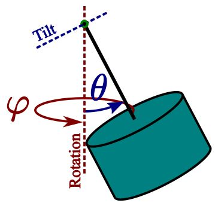

.. _examples:

*******************************
Example Codes
*******************************

This section includes a few code examples that show how the library can be used. Detailed information about the library structure can be found in the :ref:`docu`.

.. _examples-simplest:

Simplest Example
#################

The simplest possible example - calculate the B-field of a cylinder with 3 lines of code.

.. code-block:: python

    from magpylib.source.magnet import Cylinder
    s = Cylinder( mag = [0,0,350], dim = [4,5])
    print(s.getB([4,4,4]))       

    # Output: [ 5.08641867  5.08641867 -0.60532983]

.. _examples-basic:

Basic Functionality: The Field of a Collection
###############################################

In this example the basic functionality is outlined by calculating the field of two magnets. The magnets are geometrically manipulated and the system geometry is displayed using the `displaySystem` method. The field is then calculated on a grid and displayed in the xz-plane.

.. plot:: pyplots/examples/01_SimpleCollection.py
    :include-source:

:download:`01_SimpleCollection.py <../pyplots/examples/01_SimpleCollection.py>`

.. _examples-sourceObjects:

The Source Objects and their Fields
###################################

In this example we define all existing source objects and display their fields. Notice that the respective magnetization vectors are chosen arbitrarily.

.. plot:: pyplots/examples/01b_AllSources.py
   :include-source:

:download:`01b_AllSources.py <../pyplots/examples/01b_AllSources.py>`

.. _examples-motionBasics:

Translation, Orientation and Rotation Basics
#############################################

Translation of magnets can be realized in three ways, using the methods `move` and `setPosition`, or by directly setting the object `position` attribute.

.. plot:: pyplots/examples/00a_Trans.py
   :include-source:

:download:`00a_Trans.py <../pyplots/examples/00a_Trans.py>`

The next example shows a cubical magnet initialized with four different orientations defined by the classical Euler angle rotations about the three Cartesian axes. Notice that the magnetization direction is defined in the INIT ORIENTATION so that different orientations results in a rotation of the magnetization vector.

.. plot:: pyplots/examples/00b_OrientRot1.py
   :include-source:

:download:`00b_OrientRot1.py <../pyplots/examples/00b_OrientRot1.py>`

The following example shows a general form of orientation for different angles about an axis (1,-1,1). The upper three boxes are initialized with different orientations. The lower three boxes are all initialized with INIT ORIENTATION and are then rotated (about themselves) to achieve the same result as above.

.. plot:: pyplots/examples/00c_OrientRot2.py
   :include-source:

:download:`00c_OrientRot2.py <../pyplots/examples/00c_OrientRot2.py>`

The following example shows rotations with designated anchor-axis combinations. Here we distinguish between pivot points (the closest point on the rotation axis to the magnet) and anchor points which are simply required to define an axis in 3D space (together with the direction).

.. plot:: pyplots/examples/00d_OrientRot3.py
   :include-source:

:download:`00d_OrientRot3.py <../pyplots/examples/00d_OrientRot3.py>`

Collections can be manipulated using the previous logic as well. Notice how objects can be grouped into collections and sub-collections for common manipulation. For rotations keep in mind that if an anchor is not provided, all objects will rotate relative to their own center.

.. plot:: pyplots/examples/00e_ColTransRot.py
   :include-source:

:download:`00e_ColTransRot.py <../pyplots/examples/00e_ColTransRot.py>`

.. _examples-joystick:

Magnet Motion: Simulating a Magnetic Joystick
##############################################

In this example a joystick is simulated. A magnetic joystick is realized by a rod that can tilt freely (two degrees of freedom) about a center of tilt. The upper part of the rod is the joystick handle. At the bottom of the rod a cylindrical magnet (dimension *D/H*) with axial magnetization (amplitude *M0*) is fixed. The magnet lies at a distance *d* below the center of tilt. The system is constructed such that, when the joystick is in the center position a sensor lies at distance *gap* below the magnet and in the origin of a Cartesian coordinate system. The magnet thus moves with the joystick above the fixed sensor.

In the following program the magnetic field is calculated for all degrees of freedom. Different tilt angles are set by rotation about the center of tilt by the angle *th* (different colors). Then the tilt direction is varied from 0 to 360 degrees by simulating the magnet 'motion' as rotation about the z-axis, see also the following sketch.

.. plot:: pyplots/examples/02_MagnetMotion.py
   :include-source:

:download:`02_MagnetMotion.py <../pyplots/examples/02_MagnetMotion.py>`

.. _examples-complexShapes:

Complex Magnet Shapes: Hollow Cylinder
###########################################

The superposition principle allows us to calculate complex magnet shapes by 'addition' and 'subtraction' operations. A common application for this is the field of an axially magnetized hollow cylinder. The hollow part is cut out of the first cylinder by placing a second, smaller cylinder inside with opposite magnetization. Unfortunately the `displaySystem` method cannot properly display such objects intersecting with each other.

.. plot:: pyplots/examples/04_ComplexShape.py
   :include-source:

:download:`04_ComplexShape.py <../pyplots/examples/04_ComplexShape.py>`

.. _examples-vector:

Vectorized vs Classical Code
######################################

In this example a magnet is tilted above a sensor just like in a 1D-joystick system. The magnetic field is computed using vectorized code, taking care to create the ``getBv`` input using numpy native methods only. 

.. plot:: pyplots/examples/05_VectorJoystick1d.py
   :include-source:

:download:`05_VectorJoystick1d.py <../pyplots/examples/05_VectorJoystick1d.py>`