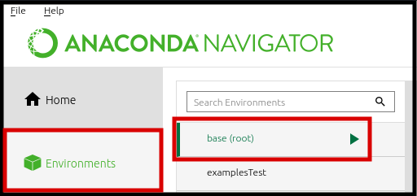
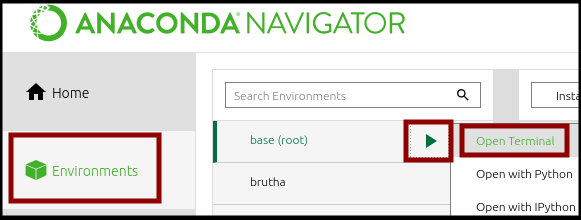
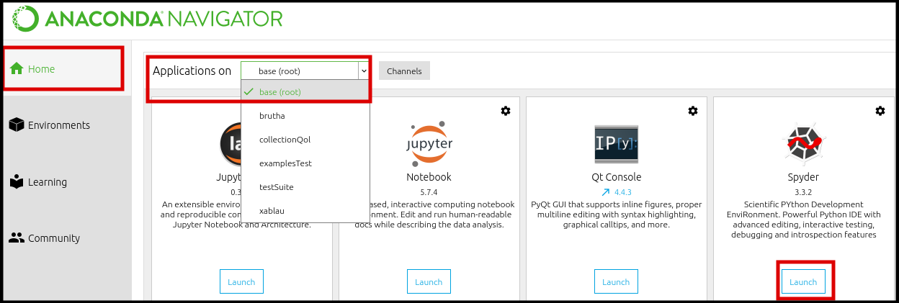

# Installation Instructions

Here you'll find instructions to Install MagPyLib.

- [Installation Instructions](#installation-instructions)
  - [Windows Install](#windows-install)
      - [Anaconda 3 Install for Spyder or Jupyter Notebook](#anaconda-3-install-for-spyder-or-jupyter-notebook)
      - [Clean Python 3 install](#clean-python-3-install)
  - [Linux Install](#linux-install)
      - [Anaconda 3 Install](#anaconda-3-install)
      - [Terminal Python 3 Install](#terminal-python-3-install)
  - [Download Pages](#download-pages)
  
  
---

## Windows Install

#### Anaconda 3 Install for Spyder or Jupyter Notebook

_Anaconda is a distribution of Python tools for Scientific Computing, making it easier to set up and run projects with that goal in mind._

<details>

<a href=#anaconda-3-install-for-spyder-or-jupyter-notebook><summary> Click here for Steps </summary></a>

1. [Download Anaconda][anaconda]
2. Start Anaconda Navigator 
3. On the interface, go to `Environments` and choose the environment you wish to install MagPyLib in. For this example, we will use the base environment:
   
4. Look for MagPyLib in the Package search bar
   
5. On the Anaconda interface, in the Home tab, select your environment and Open Spyder/Jupyter 
   

```eval_rst
6. Run the example script :doc:`_guide/x_examples` .
```

</details>

&nbsp;
&nbsp;

--- 

#### Clean Python 3 install

_If [Anaconda][anaconda] is either overkill or unfit for your purposes, or if you want to have a custom environment without using conda, you may simply install the library with [pip]_

<details>


<a href=#clean-python-3-install><summary> Click here for Steps </summary></a>

1. Install [Python][python3]
2. Open `cmd.exe`
3. Add Python to your path
   - [External Guide on setting up Python + pip](https://projects.raspberrypi.org/en/projects/using-pip-on-windows/5)
4. Install magpylib with the following command:
    ```
    python -m pip install magpylib
    ```
</details>

&nbsp;
&nbsp;

---

## Linux Install

#### Anaconda 3 Install

<details>

<a href="#anaconda-3-install"><summary> Click here for Steps </summary></a>

1. [Download Anaconda][anaconda]
2. Open a terminal window and type `anaconda-navigator`
3. On the interface, go to `Environments` and choose the environment you wish to install MagPyLib in. For this example, we will use the base environment:
   
4. Look for MagPyLib in the Package search bar
   
5. On the Anaconda interface, in the Home tab, select your environment and Open Spyder/Jupyter 
   

```eval_rst
6. Run the example script :doc:`_guide/x_examples` .
```

</details>

&nbsp;
&nbsp;

---

#### Terminal Python 3 Install

<details>


<a href="#terminal-python-3-install"><summary> Click here for Steps </summary></a>

1. Install [Python][python3]
2. Open your Terminal
3. Install magpylib with the following command:
    ```
    pip install magpylib
    ```
</details>

&nbsp;
&nbsp;

## Download Pages

_Currently MagPyLib is hosted over at:_
- [Conda Cloud][CondaCloud]
- [PyPi][PyPi]

_Source code:_
- [GitHub repository][GitHub]


[pip]: https://pip.pypa.io/en/stable/installing/
[anaconda]: https://www.anaconda.com/distribution/
[python3]: https://www.python.org/downloads/
[CondaCloud]:  https://mystery-404.herokuapp.com/
[GitHub]:  https://mystery-404.herokuapp.com/
[PyPi]:  https://mystery-404.herokuapp.com/