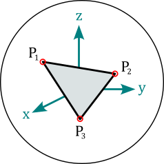

<hr style="border:3px solid gray">

(docu-magpylib)=
(docu-io)=

# Magpylib API

<hr style="border:3px solid gray">

## Types

Magpylib requires no special input format. All scalar types (`int`, `float`, ...) and vector types (`list`, `tuple`, `np.ndarray`, ... ) are accepted. Magpylib returns everything as `np.ndarray`.

(docu-units)=
## Units

The important quantity <span style="color: orange">**mu_0**</span> lies at the top level. It's value is not $4 \pi 10^{-7}$ since [the redefinition of the SI base units](https://en.wikipedia.org/wiki/2019_redefinition_of_the_SI_base_units), but a value close to it.

For historical reasons Magpylib used non-SI units until Version 4. Starting with version 5 all inputs and outputs are SI-based.

::::{grid} 3
:::{grid-item}
:columns: 1
:::

:::{grid-item}
:columns: 10
| PHYSICAL QUANTITY | MAGPYLIB PARAMETER | UNITS from v5| UNITS until v4|
|:---:|:---:|:---:|:---:|
| Magnetic Polarization $\vec{J}$  | `polarization`, `getJ()`      | **T**      | -        |
| Magnetization $\vec{M}$          | `magnetization`, `getM()`     | **A/m**    | mT       |
| Electric Current $i_0$           | `current`                     | **A**      | A        |
| Magnetic Dipole Moment $\vec{m}$ | `moment`                      | **A·m²**   | mT·mm³   |
| B-field $\vec{B}$                | `getB()`                      | **T**      | mT       |
| H-field $\vec{H}$                | `getH()`                      | **A/m**    | kA/m     |
| Length-inputs                    | `position`, `dimension`, `vertices`, ...  | **m**      | mm       |
| Angle-inputs                     | `angle`, `dimension`, ...     | **°**      | °        |
:::

::::

```{warning}
Up to version 4, Magpylib was unfortunately contributing to the naming confusion in magnetism that is explained well [here](https://www.e-magnetica.pl/doku.php/confusion_between_b_and_h). The input `magnetization` in Magpylib < v5 was refering to the magnetic polarization (and not the magnetization), the difference being only in the physical unit. From version 5 onwards this is fixed.
```

```{note}
All input and output units in Magpylib (version 5 and higher) are SI-based, see table above. However, for advanced use one should be aware that the analytical solutions are scale invariant - _"a magnet with 1 mm sides creates the same field at 1 mm distance as a magnet with 1 m sides at 1 m distance"_. The choice of length input unit is therefore not relevant, but it is critical to keep the same length unit for all inputs in one computation.

In addition, `getB` returns the same unit as given by the `polarization` input. With polarization input in mT, getB will return mT as well. At the same time when the `magnetization` input is kA/m, then `getH` returns kA/m as well. The B/H-field outputs are related to a M/J-inputs via a factor of $µ_0$.
```

```{note}
The connection between the magnetic polarization J, the magnetization M and the material parameters of a real permanent magnet are shown in {ref}`gallery-tutorial-magnetmodel`.
```

<!-- ################################################################## -->
<!-- ################################################################## -->
<!-- ################################################################## -->

<br/><br/>
<hr style="border:3px solid gray">

(docu-classes)=

# The Magpylib Classes

<hr style="border:3px solid gray">

In Magpylib's object oriented interface magnetic field **sources** (generate the field) and **observers** (read the field) are created as Python objects with various defining attributes and methods.

## Base properties

The following basic properties are shared by all Magpylib classes:

* The <span style="color: orange">**position**</span> and <span style="color: orange">**orientation**</span> attributes describe the object placement in the global coordinate system.

* The <span style="color: orange">**move()**</span> and <span style="color: orange">**rotate()**</span> methods enable relative object positioning.

* The <span style="color: orange">**reset_path()**</span> method sets position and orientation to default values.

* The <span style="color: orange">**barycenter**</span> property returns the object barycenter (often the same as position).

See {ref}`docu-position` for more information on these features.


* The <span style="color: orange">**style**</span> attribute includes all settings for graphical object representation.

* The <span style="color: orange">**show()**</span> method gives quick access to the graphical representation.

See {ref}`docu-graphics` for more information on graphic output, default styles and customization possibilities.

* The <span style="color: orange">**getB()**</span>, <span style="color: orange">**getH()**</span>, <span style="color: orange">**getJ()**</span> and <span style="color: orange">**getM()**</span> methods give quick access to field computation.

See {ref}`docu-field-computation` for more information.


* The <span style="color: orange">**parent**</span> attribute references a [Collection](docu-collection) that the object is part of.

* The <span style="color: orange">**copy()**</span> method creates a clone of any object where selected properties, given by kwargs, are modified.

* The <span style="color: orange">**describe()**</span> method provides a brief description of the object and returns the unique object id.


---------------------------------------------


## Local and global coordinates

::::{grid} 2
:::{grid-item}
:columns: 9
Magpylib objects span a local reference frame, and all object properties are defined within this frame, for example the vertices of a `Tetrahedron` magnet. The position and orientation attributes describe how the local frame lies within the global coordinates. The two frames coincide by default, when `position=(0,0,0)` and `orientation=None` (=unit rotation). The `position` and `orientation` attributes are described in detail in {ref}`docu-position`.
:::
:::{grid-item}
:columns: 3

:::
::::


---------------------------------------------


(docu-magnet-classes)=
## Magnet classes

All magnets are sources. They have the <span style="color: orange">**polarization**</span> attribute which is of the format $\vec{J}=(J_x, J_y, J_z)$ and denotes a homogeneous magnetic polarization vector in the local object coordinates in units of T. Alternatively, the magnetization vector can be set via the  <span style="color: orange">**magnetization**</span> attribute of the format $\vec{M}=(M_x, M_y, M_z)$. These two parameters are codependent and Magpylib ensures that they stay in sync via the relatoin $\vec{J}=\mu_0\cdot\vec{M}$. Information on how this is related to material properties from data sheets is found in {ref}`gallery-tutorial-magnetmodel`.


### Cuboid
```python
magpylib.magnet.Cuboid(position, orientation, dimension, polarization, magnetization, style)
```

::::{grid} 2
:::{grid-item}
:columns: 9
`Cuboid` objects represent magnets with cuboid shape. The <span style="color: orange">**dimension**</span> attribute has the format $(a,b,c)$ and denotes the sides of the cuboid units of meter. The center of the cuboid lies in the origin of the local coordinates, and the sides are parallel to the coordinate axes.
:::
:::{grid-item}
:columns: 3

:::
::::


### Cylinder
```python
magpylib.magnet.Cylinder(position, orientation, dimension, polarization, magnetization, style)
```

::::{grid} 2
:::{grid-item}
:columns: 9
`Cylinder` objects represent magnets with cylindrical shape. The <span style="color: orange">**dimension**</span> attribute has the format $(d,h)$ and denotes diameter and height of the cylinder in units of meter. The center of the cylinder lies in the origin of the local coordinates, and the cylinder axis coincides with the z-axis.
:::
:::{grid-item}
:columns: 3

:::
::::


### CylinderSegment
```python
magpylib.magnet.CylinderSegment(position, orientation, dimension, polarization, magnetization, style)
```

::::{grid} 2
:::{grid-item}
:columns: 9
`CylinderSegment` objects represent magnets with the shape of a cylindrical ring section. The <span style="color: orange">**dimension**</span> attribute has the format $(r_1,r_2,h,\varphi_1,\varphi_2)$ and denotes inner radius, outer radius and height in units of meter, and the two section angles $\varphi_1<\varphi_2$ in °. The center of the full cylinder lies in the origin of the local coordinates, and the cylinder axis coincides with the z-axis.
:::
:::{grid-item}
:columns: 3

:::
:::{grid-item}
:columns: 12
**Info:** When the cylinder section angles span 360°, then the much faster `Cylinder` methods are used for the field computation.
:::
::::


### Sphere
```python
magpylib.magnet.Sphere(position, orientation, diameter, polarization, magnetization, style)
```

::::{grid} 2
:::{grid-item}
:columns: 9
`Sphere` objects represent magnets of spherical shape. The <span style="color: orange">**diameter**</span> attribute is the sphere diameter $d$ in units of meter. The center of the sphere lies in the origin of the local coordinates.
:::
:::{grid-item}
:columns: 3

:::
::::


### Tetrahedron
```python
magpylib.magnet.Tetrahedron(position, orientation, vertices, polarization, magnetization, style)
```

::::{grid} 2
:::{grid-item}
:columns: 9
`Tetrahedron` objects represent magnets of tetrahedral shape. The <span style="color: orange">**vertices**</span> attribute stores the four corner points $(\vec{P}_1, \vec{P}_2, \vec{P}_3, \vec{P}_4)$ in the local object coordinates in units of m.
:::
:::{grid-item}
:columns: 3

:::
:::{grid-item}
:columns: 12
**Info:** The `Tetrahedron` field is computed from four `Triangle` fields.
:::
::::

(docu-magpylib-api-trimesh)=

### TriangularMesh
```python
magpylib.magnet.TriangularMesh(position, orientation, vertices, faces, polarization, magnetization, check_open, check_disconnected, check_selfintersecting, reorient_faces, style)
```

::::{grid} 2
:::{grid-item}
:columns: 9
`TriangularMesh` objects represent magnets with surface given by a triangular mesh. The mesh is defined by the <span style="color: orange">**vertices**</span> attribute, an array of all unique corner points $(\vec{P}_1, \vec{P}_2, ...)$ in units of meter, and the <span style="color: orange">**faces**</span> attribute, which is an array of index-triplets that define individual faces $(\vec{F}_1, \vec{F}_2, ...)$. The property <span style="color: orange">**mesh**</span> returns an array of all faces as point-triples $[(\vec{P}_1^1, \vec{P}_2^1, \vec{P}_3^1), (\vec{P}_1^2, \vec{P}_2^2, \vec{P}_3^2), ...]$.
:::
:::{grid-item}
:columns: 3

:::
:::{grid-item}
:columns: 12
At initialization the mesh integrity is automatically checked, and all faces are reoriented to point outwards. These actions are controlled via the kwargs
* <span style="color: orange">**check_open**</span>
* <span style="color: orange">**check_disconnected**</span>
* <span style="color: orange">**check_selfintersecting**</span>
* <span style="color: orange">**reorient_faces**</span>

which are all by default set to `"warn"`. Options are `"skip"` (don't perform check), `"ignore"` (ignore if check fails), `"warn"` (warn if check fails), `"raise"` (raise error if check fails).

Results of the checks are stored in the following object attributes
* <span style="color: orange">**status_open**</span> can be `True`, `False` or `None` (unchecked)
* <span style="color: orange">**status_open_data**</span> contains an array of open edges
* <span style="color: orange">**status_disconnected**</span> can be `True`, `False` or `None` (unchecked)
* <span style="color: orange">**status_disconnected_data**</span> contains an array of mesh parts
* <span style="color: orange">**status_selfintersecting**</span> can be `True`, `None` or `None` (unchecked)
* <span style="color: orange">**status_selfintersecting_data**</span> contains an array of self-intersecting faces
* <span style="color: orange">**status_reoriented**</span> can be `True` or `False`

The checks can also be performed after initialization using the methods
* <span style="color: orange">**check_open()**</span>
* <span style="color: orange">**check_disconnected()**</span>
* <span style="color: orange">**check_selfintersecting()**</span>
* <span style="color: orange">**reorient_faces()**</span>

The following class methods enable easy mesh creating and mesh loading.

* <span style="color: orange">**TriangularMesh.from_mesh()**</span> generates a `TriangularMesh` objects from the input <span style="color: orange">**mesh**</span>, which is an array in the mesh format $[(\vec{P}_1^1, \vec{P}_2^1, \vec{P}_3^1), (\vec{P}_1^2, \vec{P}_2^2, \vec{P}_3^2), ...]$.
* <span style="color: orange">**TriangularMesh.from_ConvexHull()**</span> generates a `TriangularMesh` object from the input <span style="color: orange">**points**</span>, which is an array of positions $(\vec{P}_1, \vec{P}_2, \vec{P}_3, ...)$ from which the convex Hull is computed via the [Scipy ConvexHull](https://docs.scipy.org/doc/scipy/reference/generated/scipy.spatial.ConvexHull.html) implementation.
* <span style="color: orange">**TriangularMesh.from_triangles()**</span> generates a `TriangularMesh` object from the input <span style="color: orange">**triangles**</span>, which is a list or a `Collection` of `Triangle` objects.
* <span style="color: orange">**TriangularMesh.from_pyvista()**</span> generates a `TriangularMesh` object from the input <span style="color: orange">**polydata**</span>, which is a [Pyvista PolyData](https://docs.pyvista.org/version/stable/api/core/_autosummary/pyvista.PolyData.html) object.

The method <span style="color: orange">**to_TriangleCollection()**</span> transforms a `TriangularMesh` object into a `Collection` of `Triangle` objects.

**Info:** While the checks may be disabled, the field computation guarantees correct results only if the mesh is closed, connected, not self-intersecting and all faces are oriented outwards. Examples of working with the `TriangularMesh` class are found in {ref}`gallery-shapes-triangle` and in {ref}`gallery-shapes-pyvista`.
:::
::::


---------------------------------------------


## Current classes

All currents are sources. Current objects have the <span style="color: orange">**current**</span> attribute which is a scalar that denotes the electrical current in units of ampere.

### Circle
```python
magpylib.current.Circle(position, orientation, diameter, current, style)
```

::::{grid} 2
:::{grid-item}
:columns: 9
`Circle` objects represent circular line current loops. The <span style="color: orange">**diameter**</span> attribute is the loop diameter $d$ in units of meter. The loop lies in the xy-plane with it's center in the origin of the local coordinates.
:::
:::{grid-item}
:columns: 3

:::
::::

### Polyline
```python
magpylib.current.Polyline(position, orientation, vertices, current, style)
```

::::{grid} 2
:::{grid-item}
:columns: 9
`Polyline` objects represent line current segements where the electric current flows in straight lines from vertex to vertex. The <span style="color: orange">**vertices**</span> attribute is a vector of all vertices $(\vec{P}_1, \vec{P}_2, ...)$ given in the local coordinates in units of meter.
:::
:::{grid-item}
:columns: 3

:::
::::

---------------------------------------------

## Miscellanous classes

There are classes listed hereon that function as sources, but they do not represent physical magnets or current distributions.


### Dipole
```python
magpylib.misc.Dipole(position, orientation, moment, style)
```

::::{grid} 2
:::{grid-item}
:columns: 9
`Dipole` objects represent magnetic dipole moments with the <span style="color: orange">**moment**</span> attribute that describes the magnetic dipole moment $\vec{m}=(m_x,m_y,m_z)$ in SI-units of Am², which lies in the origin of the local coordinates.
:::
:::{grid-item}
:columns: 3

:::
:::{grid-item}
:columns: 12
**Info:** The total dipole moment of a homogeneous magnet with body volume $V$ is given by $\vec{m}=\vec{J}\cdot V$.
:::
::::


### Triangle
```python
magpylib.misc.Triangle(position, orientation, vertices, polarization, magnetization, style)
```

::::{grid} 2
:::{grid-item}
:columns: 9
`Triangle` objects represent triangular surfaces with homogeneous charge density given by the projection of the polarization or magnetization vector onto the surface normal. The attributes <span style="color: orange">**polarization**</span> and <span style="color: orange">**magnetization**</span> are treated similar as by the {ref}`docu-magnet-classes`. The <span style="color: orange">**vertices**</span> attribute is a set of the three triangle corners $(\vec{P}_1, \vec{P}_2, \vec{P}_3)$ in units of meter in the local coordinates.
:::
:::{grid-item}
:columns: 3

:::
:::{grid-item}
:columns: 12
**Info:** When multiple Triangles with similar magnetization/polarization vectors form a closed surface, and all their orientations (right-hand-rule) point outwards, their total H-field is equivalent to the field of a homogeneous magnet of the same shape. In this case, the B-field is only correct on the outside of the body. On the inside the polarization must be added to the field. This is demonstrated in the tutorial {ref}`gallery-shapes-triangle`.
:::
::::

(docu-magpylib-api-custom)=

### CustomSource
```python
magpylib.misc.CustomSource(field_func, position, orientation, style)
```

::::{grid} 2
:::{grid-item}
:columns: 9
The `CustomSource` class is used to create user defined sources provided with with custom field computation functions. The argument <span style="color: orange">**field_func**</span> takes a function that is then automatically called for the field computation. This custom field function is treated like a [core function](docu-field-comp-core). It must have the positional arguments `field` with values `"B"` or `"H"`, and `observers` (must accept array with shape (n,3)) and return the B-field and the H-field with a similar shape.
:::
:::{grid-item}
:columns: 3

:::
:::{grid-item}
:columns: 12
**Info:** A tutorial {ref}`gallery-tutorial-custom` is found in the gallery.
:::
::::


---------------------------------------------


## Sensor
```python
magpylib.Sensor(position, orientation, pixel, handedness, style)
```

::::{grid} 2
:::{grid-item}
:columns: 9
`Sensor` objects represent observers of the magnetic field and can be used as Magpylib `observers` input for magnetic field computation. The <span style="color: orange">**pixel**</span> attribute is an array of positions $(\vec{P}_1, \vec{P}_2, ...)$ provided in units of meter in the local sensor coordinates. A sensor returns the magnetic field at these pixel positions. By default `pixel=(0,0,0)` and the sensor simply returns the field at it's position. The <span style="color: orange">**handedness**</span> attribute can be `"left"` or `"right"` (default) to set a left- or right-handed sensor coordinate system for the field computation.
:::
:::{grid-item}
:columns: 3

:::
:::{grid-item}
:columns: 12
**Info:** Sensors can have their own position and orientation and enable easy relative positioning between sources and observers. The field is always computed in the reference frame of the sensor, which might itself be moving in the global coordinate system. Magpylib sensors can be understood as perfect magnetic field sensors with infinitesimally sensitive elements. An example how to use sensors is given in {ref}`gallery-tutorial-field-computation-sensors`.
:::
::::


---------------------------------------------


(docu-collection)=

## Collection
```python
magpylib.Collection(*children, position, orientation, override_parent, style)
```

::::{grid} 2
:::{grid-item}
:columns: 9
A `Collection` is a group of Magpylib objects that is used for common manipulation. All these objects are stored by reference in the <span style="color: orange">**children**</span> attribute. The collection becomes the <span style="color: orange">**parent**</span> of the object. An object can only have one parent. There are several options for accessing only specific children via the following properties

* <span style="color: orange">**sources**</span>: return only sources
* <span style="color: orange">**observers**</span>: return only observers
* <span style="color: orange">**collections**</span>: return only collections
* <span style="color: orange">**sources_all**</span>: return all sources, including the ones from sub-collections
* <span style="color: orange">**observers_all**</span>: return all observers, including the ones from sub-collections
* <span style="color: orange">**collections_all**</span>: return all collections, including the ones from sub-collections

Additional methods for adding and removing children:

- <span style="color: orange">**add()**</span>: Add an object to the collection
- <span style="color: orange">**remove()**</span>: Remove an object from the collection
:::
:::{grid-item}
:columns: 3

:::
:::{grid-item}
:columns: 12
**Info:** A collection object has its own `position` and `orientation` attributes and spans a local reference frame for all its children. An operation applied to a collection moves the frame, and is individually applied to all children such that their relative position in the local reference frame is maintained. This means that the collection functions  as a container for manipulation, but child position and orientation are always updated in the global coordinate system. After being added to a collection, it is still possible to manipulate the individual children, which will also move them to a new relative position in the collection frame.

Collections have **format** as an additional argument for **describe()** method. Default value is `format="type+id+label"`. Any combination of `"type"`, `"id"`, and `"label"` is allowed.

A tutorial {ref}`gallery-tutorial-collection` is provided in the example gallery.
:::
::::


<!-- ################################################################## -->
<!-- ################################################################## -->
<!-- ################################################################## -->


<br/><br/>
<hr style="border:3px solid gray">

(docu-position)=

# Position, Orientation, and Paths

<hr style="border:3px solid gray">

::::{grid} 2
:gutter: 2

:::{grid-item}
:columns: 12 7 7 7
The explicit magnetic field expressions found in the literature, implemented in the [Magpylib core](docu-field-comp-core), are given in convenient source-coordinates. It is a common problem to transform the field into an application relevant observer coordinate system. While not technically difficult, such transformations are prone to error.

Here Magpylib helps out. All Magpylib sources and observers lie in a global Cartesian coordinate system. Object position and orientation are defined by the attributes `position` and `orientation`, 😏. Objects can easily be moved around using the `move()` and `rotate()` methods. Eventually, the field is computed in the reference frame of the observers (e.g. Sensor objects). Positions are given in units of meter, and the default unit for orientation is °.
:::
:::{grid-item}
:columns: 12 5 5 5

:::
::::

Position and orientation of all Magpylib objects are defined by the two attributes

::::{grid} 2
:gutter: 2

:::{grid-item-card}
:shadow: none
:columns: 12 5 5 5
<span style="color: orange">**position**</span> - a point $(x,y,z)$ in the global coordinates, or a set of such points $(\vec{P}_1, \vec{P}_2, ...)$. By default objects are created with `position=(0,0,0)`.
:::
:::{grid-item-card}
:shadow: none
:columns: 12 7 7 7
<span style="color: orange">**orientation**</span> - a [Scipy Rotation object](https://docs.scipy.org/doc/scipy/reference/generated/scipy.spatial.transform.Rotation.html) which describes the object rotation relative to its default orientation (defined in {ref}`docu-classes`). By default, objects are created with unit rotation `orientation=None`.
:::
::::

The position and orientation attributes can be either **scalar**, i.e. a single position or a single rotation, or **vector**, when they are arrays of such scalars. The two attributes together define the **path** of an object - Magpylib makes sure that they are always of the same length. When the field is computed, it is automatically computed for the whole path.

```{tip}
To enable vectorized field computation, paths should always be used when modeling multiple object positions. Avoid using Python loops at all costs for that purpose! If your path is difficult to realize, consider using the [functional interface](docu-functional-interface) instead.
```

Magpylib offers two powerful methods for object manipulation:

::::{grid} 2
:gutter: 2

:::{grid-item-card}
:columns: 12 5 5 5
:shadow: none
<span style="color: orange">**move(**</span>`displacement`, `start="auto"`<span style="color: orange">**)**</span> -  move object by `displacement` input. `displacement` is a position vector (scalar input) or a set of position vectors (vector input).
:::
:::{grid-item-card}
:columns: 12 7 7 7
:shadow: none
<span style="color: orange">**rotate(**</span>`rotation`, `anchor=None`, `start="auto"`<span style="color: orange">**)**</span> - rotates the object by the `rotation` input about an anchor point defined by the `anchor` input. `rotation` is a [Scipy Rotation object](https://docs.scipy.org/doc/scipy/reference/generated/scipy.spatial.transform.Rotation.html), and `anchor` is a position vector. Both can be scalar or vector inputs. With `anchor=None` the object is rotated about its `position`.
:::
::::

- **Scalar input** is applied to the whole object path, starting with path index `start`. With the default `start="auto"` the index is set to `start=0` and the functionality is **moving objects around** (incl. their whole paths).
- **Vector input** of length $n$ applies the $n$ individual operations to $n$ object path entries, starting with path index `start`. Padding applies when the input exceeds the existing path length. With the default `start="auto"` the index is set to `start=len(object path)` and the functionality is **appending the input**.

The practical application of this formalism is best demonstrated by the following program

```python
import magpylib as magpy
# Note that all units are in SI

sensor = magpy.Sensor()
print(sensor.position)                                    # default value
#   --> [0. 0. 0.]

sensor.move((1,1,1))                                      # scalar input is by default applied
print(sensor.position)                                    # to the whole path
#   --> [1. 1. 1.]

sensor.move([(1,1,1), (2,2,2)])                           # vector input is by default appended
print(sensor.position)                                    # to the existing path
#   --> [[1. 1. 1.]  [2. 2. 2.]  [3. 3. 3.]]

sensor.move((1,1,1), start=1)                             # scalar input and start=1 is applied
print(sensor.position)                                    # to whole path starting at index 1
#   --> [[1. 1. 1.]  [3. 3. 3.]  [4. 4. 4.]]

sensor.move([(0,0,10), (0,0,20)], start=1)                # vector input and start=1 merges
print(sensor.position)                                    # the input with the existing path
#   --> [[ 1.  1.  1.]  [ 3.  3. 13.]  [ 4.  4. 24.]]     # starting at index 1.
```

Several extensions of the `rotate` method give a lot of flexibility with object rotation. They all feature the arguments `anchor` and `start` which work as described above.

:::{dropdown} <span style="color: orange">**rotate_from_angax(**</span>`angle`, `axis`, `anchor=None`, `start="auto"`, `degrees=True` <span style="color: orange">**)**</span>
* `angle`: scalar or array with shape (n). Angle(s) of rotation.
* `axis`: array of shape (3,) or string. The direction of the rotation axis. String input can be 'x', 'y' or 'z' to denote respective directions.
* `degrees`: bool, default=True. Interpret angle input in units of deg (True) or rad (False).
:::

:::{dropdown} <span style="color: orange">**rotate_from_rotvec(**</span>`rotvec`, `anchor=None`, `start="auto"`, `degrees=True` <span style="color: orange">**)**</span>
* `rotvec` : array with shape (n,3) or (3,). The rotation vector direction is the rotation axis and the vector length is the rotation angle in units of deg.
* `degrees`: bool, default=True. Interpret angle input in units of deg (True) or rad (False).
:::

:::{dropdown} <span style="color: orange">**rotate_from_euler(**</span> `angle`, `seq`, `anchor=None`, `start="auto"`, `degrees=True` <span style="color: orange">**)**</span>
* `angle`: scalar or array with shape (n). Angle(s) of rotation in units of deg (by default).
* `seq` : string. Specifies sequence of axes for rotations. Up to 3 characters belonging to the set {'X', 'Y', 'Z'} for intrinsic rotations, or {'x', 'y', 'z'} for extrinsic rotations. Extrinsic and intrinsic rotations cannot be mixed in one function call.
* `degrees`: bool, default=True. Interpret angle input in units of deg (True) or rad (False).
:::

:::{dropdown} <span style="color: orange">**rotate_from_quat(**</span>`quat`, `anchor=None`, `start="auto"` <span style="color: orange">**)**</span>
* `quat` : array with shape (n,4) or (4,). Rotation input in quaternion form.
:::

:::{dropdown} <span style="color: orange">**rotate_from_mrp(**</span>`matrix`, `anchor=None`, `start="auto"` <span style="color: orange">**)**</span>
* `matrix` : array with shape (n,3,3) or (3,3). Rotation matrix. See scipy.spatial.transform.Rotation for details.
:::

:::{dropdown} <span style="color: orange">**rotate_from_mrp(**</span>`mrp`, `anchor=None`, `start="auto"` <span style="color: orange">**)**</span>
* `mrp` : array with shape (n,3) or (3,). Modified Rodrigues parameter input. See scipy Rotation package for details.
:::

When objects with different path lengths are combined, e.g. when computing the field, the shorter paths are treated as static beyond their end to make the computation sensible. Internally, Magpylib follows a philosophy of edge-padding and end-slicing when adjusting paths.

::::{grid} 2
:gutter: 2

:::{grid-item-card}
:columns: 12 7 7 7
:shadow: none
**Edge-padding:** whenever path entries beyond the existing path length are needed the edge-entries of the existing path are returned. This means that the object is considered to be “static” beyond its existing path.
:::
:::{grid-item-card}
:columns: 12 5 5 5
:shadow: none
**End-slicing:** whenever a path is automatically reduced in length, Magpylib will slice such that the ending of the path is kept.
:::
::::

The tutorial {ref}`gallery-tutorial-paths` shows intuitive good practice examples of the important functionality described in this section.


<!-- ################################################################## -->
<!-- ################################################################## -->
<!-- ################################################################## -->
<br/><br/>
<hr style="border:3px solid gray">

(docu-field-computation)=
# Field Computation

<hr style="border:3px solid gray">

Magnetic field computation in Magpylib is done via four top-level functions <span style="color: orange">**getB**</span>, <span style="color: orange">**getH**</span>, <span style="color: orange">**getJ**</span> and, <span style="color: orange">**getM**</span>.


```python
magpylib.getB(sources, observers, squeeze=True, pixel_agg=None, output="ndarray")
```

```python
magpylib.getH(sources, observers, squeeze=True, pixel_agg=None, output="ndarray")
```

```python
magpylib.getJ(sources, observers, squeeze=True, pixel_agg=None, output="ndarray")
```

```python
magpylib.getM(sources, observers, squeeze=True, pixel_agg=None, output="ndarray")
```

that compute the respective field generated by `sources` as seen by the `observers` in their local coordinates. `sources` can be any Magpylib source object (e.g. magnets) or a flat list thereof. `observers` can be an array of position vectors with shape `(n1,n2,n3,...,3)`, any Magpylib observer object (e.g. sensors), or a flat list thereof. The following code shows a minimal example for Magplyib field computation.


```python
import magpylib as magpy
# All inputs and outputs in SI units

# define source and observer objects
loop = magpy.current.Circle(current=1, diameter=.001)
sens = magpy.Sensor()

# compute field
B = magpy.getB(loop, sens)

print(B)
#  --> [0.         0.         0.00125664]
```

By default, `getB` returns the B-field in units of T, `getH` the H-field in units of A/m, `getJ` the magnetic polarization in T and, `getM` the magnetization in A/m, assuming that all inputs are given in SI units.

```{note}
In reality, `getB` returns the same unit as given by the `polarization` input. For example, with polarization input in mT, getB will return mT as well. At the same time when the `magnetization` input is kA/m, then `getH` returns kA/m as well. The B/H-field outputs are related to a M/J-inputs via a factor of $µ_0$.
```

The output of a field computation `magpy.getB(sources, observers)` is by default a Numpy array of shape `(l, m, k, n1, n2, n3, ..., 3)` where `l` is the number of input sources, `m` the (maximal) object path length, `k` the number of observers, `n1,n2,n3,...` the sensor pixel shape or the shape of the observer position array input and `3` the three magnetic field components $(B_x, B_y, B_z)$.


* `squeeze`: If True (default) all axes of length 1 in the output (e.g. only a single source) are squeezed.

* `pixel_agg`: Select a compatible numpy aggregator function (e.g. `"min"`, `"mean"`) that is applied to the output. For example, with `pixel_agg="mean"` the mean field of all observer points is returned. With this option it is possible to supply `getBHJM` with multiple observers that have different pixel shapes.

* `output`: Change the output format. Options are `"ndarray"` (default, returns a Numpy ndarray) and `"dataframe"` (returns a 2D-table Pandas DataFrame).

```{note}
Magpylib collects all inputs (object parameters), and vectorizes them for the computation which reduces the computation time dramatically for large inputs.

Try to make all field computations with as few calls to `getBHJM` as possible. Avoid Python loops at all costs!
```

The tutorial {ref}`gallery-tutorial-field-computation` shows good practices with Magpylib field computation.


(docu-functional-interface)=
## Direct interface

Users can bypass the object oriented functionality of Magpylib and instead compute the field for n given parameter sets. This is done by providing the following inputs to the top level functions `getB`, `getH`, `getJ` and, `getM`.

1. `sources`: a string denoting the source type. Allowed values are the Magpylib source class names, see {ref}`docu-classes`.
2. `observers`: array-like of shape (3,) or (n,3) giving the observer positions.
3. `kwargs`: a dictionary with inputs of shape (x,) or (n,x). Must include all mandatory class-specific inputs. By default, `position=(0,0,0)` and `orientation=None`(=unit rotation).

All "scalar" inputs of shape (x,) are automatically tiled up to shape (n,x) to create a set of n computation instances. The field is returned in the shape (n,3). The following code demonstrates the functional interface.

```python
import numpy as np
import magpylib as magpy
# All inputs and outputs in SI units
# This example shows the scale invariance

# compute the cuboid field for 3 input instances
N = 3 # number of instances
B = magpy.getB(
    sources='Cuboid',
    observers=np.linspace((0,0,1), (0,0,3), N),
    dimension=np.linspace((1,1,1), (3,3,3),3, N),
    polarization=(0,0,1),
)

print(B)
#  --> [[0.         0.         0.13478239]
#       [0.         0.         0.13478239]
#       [0.         0.         0.13478239]]
```

```{note}
The functional interface is potentially faster than the object oriented one if users know how to generate the input arrays efficiently with numpy (e.g. `np.arange`, `np.linspace`, `np.tile`, `np.repeat`, ...).
```


(docu-field-comp-core)=
## Core interface

At the heart of Magpylib lies a set of core functions that are our implementations of explicit field expressions found in the literature, see {ref}`docu-physics`. Direct access to these functions is given through the `magpylib.core` subpackage which includes,

::::{grid} 1
:gutter: 1

:::{grid-item}
<span style="color: orange">**magnet_cuboid_Bfield(**</span> `observers`, `dimensions`, `polarizations`<span style="color: orange">**)**</span>
:::

:::{grid-item}
<span style="color: orange">**magnet_cylinder_axial_Bfield(**</span> `z0`, `r`, `z`<span style="color: orange">**)**</span>
:::

:::{grid-item}
<span style="color: orange">**magnet_cylinder_diametral_Hfield(**</span> `z0`, `r`, `z`, `phi`<span style="color: orange">**)**</span>
:::

:::{grid-item}
<span style="color: orange">**magnet_cylinder_segmet_Hfield(**</span> `observers`, `dimensions`, `magnetizations`<span style="color: orange">**)**</span>
:::

:::{grid-item}
<span style="color: orange">**magnet_sphere_Bfield(**</span>`observers`, `diameters`, `polarizations`<span style="color: orange">**)**</span>
:::

:::{grid-item}
<span style="color: orange">**current_circle_Hfield(**</span>`r0`, `r`, `z`, `i0`<span style="color: orange">**)**</span>
:::

:::{grid-item}
<span style="color: orange">**current_polyline_Hfield(**</span>`observers`, `segments_start`, `segments_end`, `currents`<span style="color: orange">**)**</span>
:::

:::{grid-item}
<span style="color: orange">**dipole_Hfield(**</span>`observers`, `moments`<span style="color: orange">**)**</span>
:::

:::{grid-item}
<span style="color: orange">**triangle_Bfield(**</span>`observers`, `vertices`, `polarizations`<span style="color: orange">**)**</span>
:::

::::

All inputs must be Numpy ndarrays of shape (n,x). Details can be found in the respective function docstrings. The following example demonstrates the core interface.


```python
import numpy as np
import magpylib as magpy
# All inputs and outputs in SI units

# prepare input
z0 = np.array([1,1])
r  = np.array([1,1])
z  = np.array([2,2])

# compute field with core functions
B = magpy.core.magnet_cylinder_axial_Bfield(z0=z0, r=r, z=z).T

print(B)
#  --> [[0.05561469 0.         0.06690167]
#       [0.05561469 0.         0.06690167]]
```

## Field computation workflow

The Magpylib field computation internal workflow and different approaches of the three interfaces is outlined in the following sketch.


