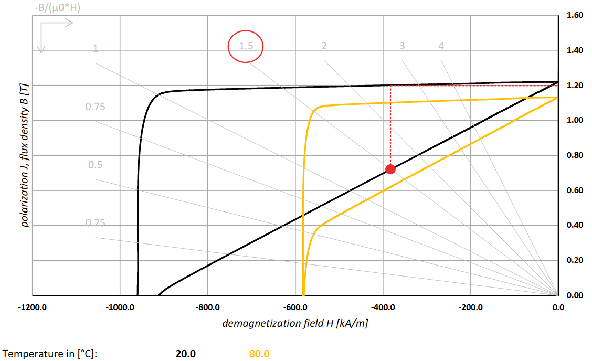
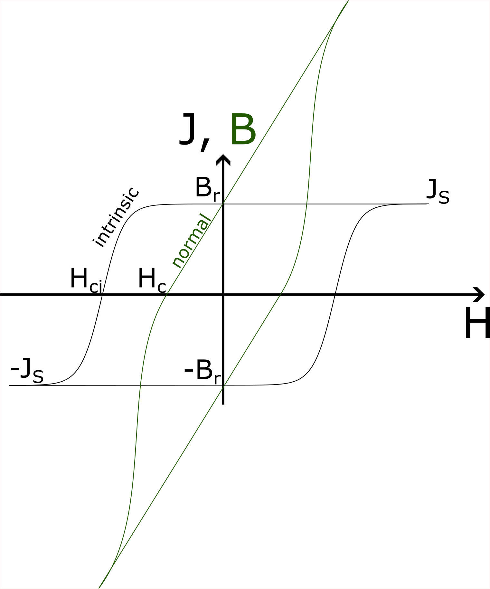
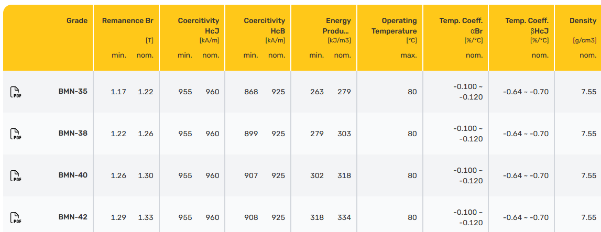
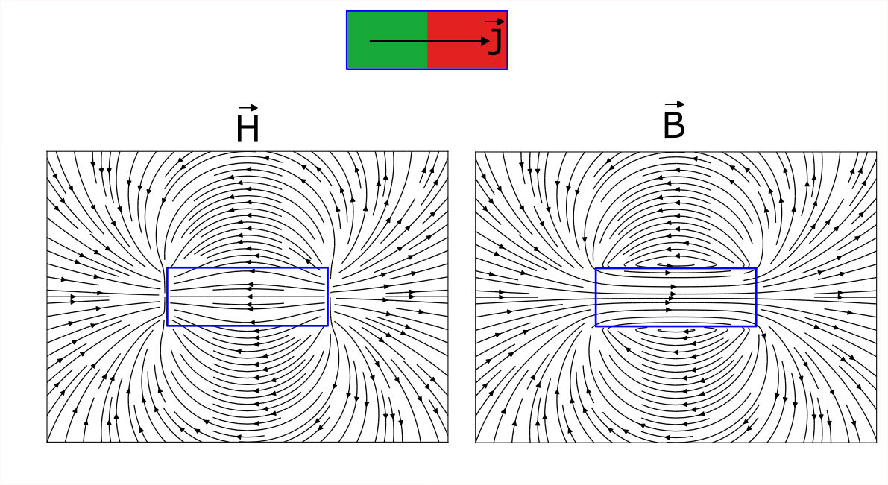

(gallery-tutorial-modelling-magnets)=

# Modelling a real magnet

Whenever you wish to compare Magpylib simulations with experimental data obtained using a real permanent magnet, you might wonder how to properly set up a Magpylib magnet object to reflect the physical permanent magnet in question.

The goal of this tutorial is to provide a better understanding of permanent magnets, how to extract the information you want from the respective datasheet, and how to set up the correct attributes for the `magpylib.magnet` instances.

This tutorial was supported by [BOMATEC](https://www.bomatec.com/de) by providing excellent data sheets and by supplying magnets for the experimental demonstration below.

## Short summary

In the data sheet you find B-H curves and J-H curves that coincide at H=0, which gives the intrinsic material remanence $B_r$. As a result of the material response expressed by the permeability $\mu = \partial B / \partial H$, the magnet "demagnetizes" itself so that the mean magnetic polarization of a real magnet is always below the remanence. How much below depends strongly on the shape of the magnet, and is expressed in the data sheet through the permeance coefficient lines (grey lines). The numbers at the end indicate the typical magnet Length / Diameter ratio.

To find the correct magnetic polarization of a magnet from the data sheet, one must find the crossing between B-H curve and respective permeance coefficient line. This gives the "working point" which expresses the mean opposing H-field inside magnet. The correct polarization to use in the Magpylib simulation is then simply the J-value at the working point taken from the J-H curve.

In the following sections we give background information that explains in more detail why it is like this.

## Hysteresis loop

If you've worked with magnetism, chances are very high that you have seen a magnetic hysteresis loop. The normal loop describes the connection between the **mean values** of an externally applied H-field and the resulting B-field **within a defined volume**. The intrinsic loop describes the connection between the H-field and the magnetic polarization $J$ (or magnetization $M$). This connection depends strongly on size and shape of this volume and what is inside and what is outside. The two loops are connected via $B = \mu_0 H + J$. In free space the B-H "loop" is just a straight line defined via $B = \mu_0 H$. Obviously, the J-H "loop" is just zero everywhere. When the whole space is filled with magnetic material you will see something like this within an arbirary volume,

::::{grid} 2
:::{grid-item}
:columns: 3
:::
:::{grid-item}
:columns: 6

:::
::::

Initially we have $J=0$ and $H=0$ - the magnetic material is not magnetized and there is no external field applied. When increasing the magnetic field the material's polarization will follow the "virgin curve" and increase up to its maximum possible value, the saturation polarizaion $J_S$. Higher values of $H$ will not affect $J$, while the resulting $B$ will keep increasing. This is reflected in the flat line of the intrinsic curve and the linear normal curve. Now we are on the "major loop" - we will never return to the virgin curve. Then we slowly turn the H-fiel off. As it drops to zero the material will retain its strong polarization at saturation level while the resulting $B$ decreases. The B-field value when $H = 0$ is known as the "remanence field" $B_r$, and its only contribution is $J_S$.

As the external field goes negative, its amplitude increases with a direction opposite to the magnetic polarization. We are now trying to actively demagnetize the material, which is happens in the second quadrant of the hysteresis loop, often termed "demagnetization curves". At first, $B$ continues to become smaller until it reaches zero at the "coercive field" $H_c$. There the net B-field inside the volume is zero, however, it is still magnetized! At $H_c$ the polarization is still at $J_S$ in the example loop above. However, hereon, the opposing field becomes so strong that it starts to demagnetize the material. This can be seen by the non-linear drop of $J$. $J$ then reaches zero at the "intrinsic coercive field" $H_{ci}$. The net polarizaion is now $J=0$. The magnet is demagnetized. This value characterizes how well a magnetized material can resist a demagnetizing field.

Moving to the third quadrant the behavior is now mirrored. As $H$ gets stronger past $H_{ci}$, polarization quickly aligns with the external field and the material once again reaches magnetization saturation, but now in the opposite direction from the previous state, and by turning the field around again, we move through the fourth quadrant to complete the hysteresis loop.

Realistic hysteresis curves are not completely flat as shown above but generally follow the above behavior. Hysteresis in magnetism as presented here is a macroscopic model that is the result of a complex interplay between dipole and exchange interaction and material texture at a macroscopic level. Details can be found, for example, in Aharoni's classical textbook "Introduction to the Theory of Ferromagnetism".

## The demagnetizing field

If in your application the applied external field can be considered zero, it seems intuitive to use the remanence $B_r$ for the magnetic polarization in the Magpylib simulation. You will easily find values of remanence, coercivity, operating temperature, density and others, usually presented by the magnet supplier in a table like this:

However, when you do this you will quickly see that the experimental results are 5 - 30 % below what you would expect. The reason for this is the self-induced demagnetizing field of the magnet which is generated by the polarization itself. Just like it generates a H-field on the outside of the magnet, the polarization also generates a H-field on the inside which is opposed to itself.

The figure below, obtained like in the [streamplot example](gallery-vis-mpl-streamplot), shows the H-field on the inside and the outside of a Cuboid magnet with homogeneous magnetization.

As claimed, the H-field opposes the magnetic polarization on the inside of the magnet so that J is moved along the J-H curve into the 2nd quadrant. The difficulty is finding the correct value of H which is often referred to as the "working point".

## Finding the correct polarization

As explained above, the hysteresis loop depends strongly on the chosen observation volume, the material, and what is outside of the volume. Magnet manufacturers usually provide such loops (usually only the 2nd quadrant) for their magnets, meaning that the observation volume is the whole magnet with air outside.

To obtain then correct mean polarization of a magnet we only have to compute the mean demagnetizing field and read the resulting J off the provided hysteresis loop. Computing the mean demagnetizing field is, however, not a simple task. The field depends stongly on the magnet geometry. Fortunately, good magnet data sheets provide this information.

This datasheet snippet shows the second quadrant of the B-H and J-H loops. The working point is given by the intersection between the gray lines and the B-H curve. The number at the end of these lines indicate the length/diameter (L/D) ratio of the magnet which is the critical geometric factor. Different lines are for different L/D ratios which allows you to select the correct working point for your magnet. Once the working point is found, the correct magnetic polarization, here denoted by $J_W$, can be read off, as indicated in the following figure.

## Example

In the datasheet provided by [Bomatec](https://www.bomatec.com/en) the remanence at room temperature is $B_r = 1.22$ T. If it were a cylinder magnet with $L/D = 1.5$, the polarization value in your Magpylib simulation has to be 1.2 T.

The difference in this case is small, but it can be much greater in many others! It depends on the grade, material, shape and quality of the magnet. You may find datasheets in which $J_W$ for the magnet geometry is already indicated, sometimes referred to as "$B_r$ at the working point".

An experimental demonstration will be published here in the near future.

**Exterior reference**
G. Martinek, S. Ruoho and U. Wyss. (2021).*Magnetic Properties of Permanents Magnets & Measuring Techniques* [White paper]. Arnold Magnetic Technologies. https://www.arnoldmagnetics.com/blog/measuring-permanent-magnets-white-paper/