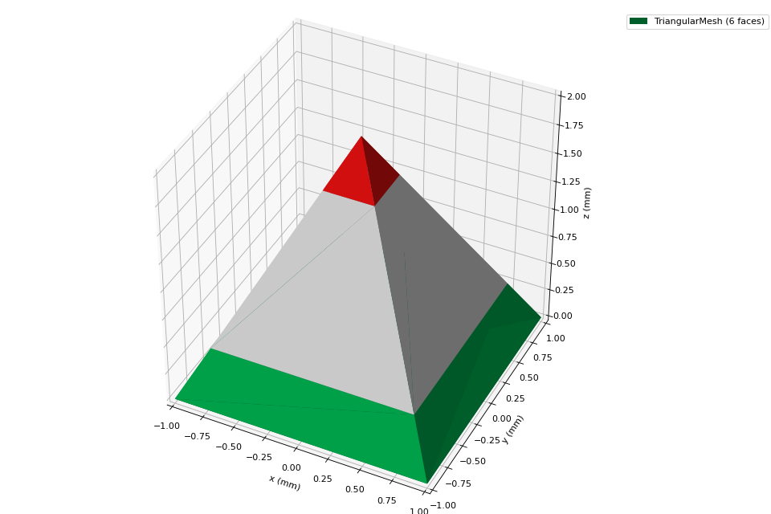
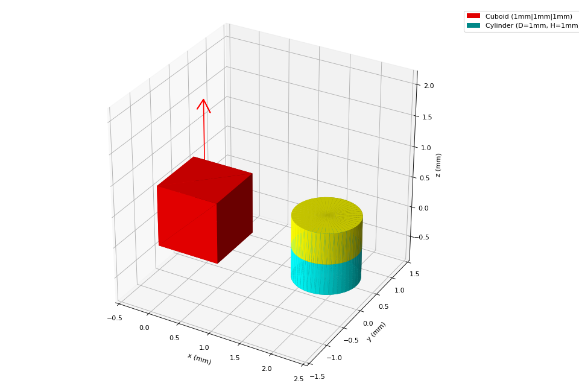

---
jupytext:
  text_representation:
    extension: .md
    format_name: myst
    format_version: 0.13
    jupytext_version: 1.13.7
kernelspec:
  display_name: Python 3 (ipykernel)
  language: python
  name: python3
---

(get-started)=

# Get Started

## Installation and Dependencies

Magpylib supports *Python3.8+* and relies on common scientific computation libraries *Numpy*, *Scipy*, *Matplotlib* and *Plotly*. Optionally, *Pyvista* is recommended as graphical backend.

::::{grid} 2
:::{grid-item-card} Install with pip:
:text-align: center
:shadow: none
```console
pip install magpylib
```
:::
:::{grid-item-card} Install with conda:
:text-align: center
:shadow: none
```console
conda install -c conda-forge magpylib
```
:::
::::

## Magpylib fundamentals

Learn the Magpylib fundamentals in 5 minutes. This requires a basic understanding of the Python programming language, the [Numpy array class](https://numpy.org/doc/stable/) and the [Scipy Rotation class](https://docs.scipy.org/doc/scipy/reference/generated/scipy.spatial.transform.Rotation.html).

### Step 1: Create sources and observers as Python objects

```python
import magpylib as magpy

# Create a Cuboid magnet with magnetic polarization
# of 1000 mT pointing in x-direction and sides of
# 1,2 and 3 mm respectively.

cube = magpy.magnet.Cuboid(magnetization=(1000,0,0), dimension=(1,2,3))

# Create a Sensor for measuring the field

sensor = magpy.Sensor()
```

### Step2: Manipulate object position and orientation

```python
# By default, the position of a Magpylib object is
# (0,0,0) and its orientation is the unit rotation,
# given by a scipy rotation object.

print(cube.position)                   # -> [0. 0. 0.]
print(cube.orientation.as_rotvec())    # -> [0. 0. 0.]

# Manipulate object position and orientation through
# the respective attributes:

from scipy.spatial.transform import Rotation as R
cube.position = (1,0,0)
cube.orientation = R.from_rotvec((0,0,45), degrees=True)

print(cube.position)                            # -> [1. 0.  0.]
print(cube.orientation.as_rotvec(degrees=True)) # -> [0. 0. 45.]

# Apply relative motion with the powerful `move`
# and `rotate` methods.
sensor.move((-1,0,0))
sensor.rotate_from_angax(angle=-45, axis='z')

print(sensor.position)                            # -> [-1.  0.  0.]
print(sensor.orientation.as_rotvec(degrees=True)) # -> [ 0.  0. -45.]
```

### Step 3: View your system

```python
# Use the `show` function to view your system
# through Matplotlib, Plotly or Pyvista backends.

magpy.show(cube, sensor, backend='plotly')
```


### Step 4: Compute the magnetic field

```python
# Compute the B-field in units of mT for some points.

points = [(0,0,-1), (0,0,0), (0,0,1)]
B = magpy.getB(cube, points)

print(B.round()) # -> [[263.  68.  81.]
                 #     [276.  52.   0.]
                 #     [263.  68. -81.]]

# Compute the H-field in units of kA/m at the sensor.

H = magpy.getH(cube, sensor)

print(H.round()) # -> [220.  41.   0.]
```

```{warning}
Magpylib makes use of vectorized computation (massive speedup). This requires that you hand over all field computation instances (multiple objects with multiple positions (=paths)) at the same time to `getB` or `getH`. Avoid Python loops at all costs !!!
```

## Other important features

:::{dropdown} Paths
Magpylib position and orientation attributes can store multiple values that are referred to as paths. The field will automatically be computed for all path positions. Use this to model objects moving to multiple locations.

```python
import numpy as np
import magpylib as magpy

# Create magnet
sphere = magpy.magnet.Sphere(diameter=1, magnetization=(0,0,1000))

# Assign a path
sphere.position = np.linspace((-2,0,0), (2,0,0), 7)

# The field is automatically computed for every path position
B = sphere.getB((0,0,1))
print(B.round())  # ->[[  4.   0.  -1.]
                  #    [ 13.   0.   1.]
                  #    [ 33.   0.  26.]
                  #    [  0.   0.  83.]
                  #    [-33.   0.  26.]
                  #    [-13.   0.   1.]
                  #    [ -4.   0.  -1.]]
```
:::


:::{dropdown} Collections
Magpylib objects can be grouped into Collections. An operation applied to a Collection is applied to every object in it.

```python
import magpylib as magpy

# Create objects
obj1 = magpy.Sensor()
obj2 = magpy.magnet.Cuboid(magnetization=(0,0,1000), dimension=(1,2,3))

# Group objects
coll = magpy.Collection(obj1, obj2)

# Manipulate Collection
coll.move((1,2,3))

print(obj1.position.round()) # -> [1. 2. 3.]
print(obj2.position.round()) # -> [1. 2. 3.]
```
:::


:::{dropdown} Complex Magnet Shapes
There most convenient way to create a magnet with complex shape is by using the ConvexHull of a point cloud (= simplest form that includes all given points).

```python
import magpylib as magpy

# Create a Pyramid magnet
points = [
    (-1,-1, 0),
    (-1, 1, 0),
    ( 1,-1, 0),
    ( 1, 1, 0),
    ( 0, 0, 2),
]
pyramid = magpy.magnet.TriangularMesh.from_ConvexHull(
    magnetization=(0,0,1000),
    points=points
)

# Display the magnet graphically
pyramid.show()
```

:::


:::{dropdown} Graphic Styles
Magpylib offers many ways to customize the graphic output.

```python
import magpylib as magpy

# create Cuboid magnet with custom style
cube = magpy.magnet.Cuboid(
    magnetization=(0,0,1000),
    dimension=(1,1,1),
    style_color='r',
    style_magnetization_mode='arrow'
)

# create Cylinder magnet with custom style
cyl = magpy.magnet.Cylinder(
    magnetization=(0,0,1000),
    dimension=(1,1),
    position=(2,0,0),
    style_magnetization_color_mode='bicolor',
    style_magnetization_color_north='m',
    style_magnetization_color_south='c',
)
magpy.show(cube, cyl)
```

:::


:::{dropdown} Animation
Object paths can be animated

```python
import numpy as np
import magpylib as magpy


# Create magnet with path
cube = magpy.magnet.Cuboid(magnetization=(0,0,1000), dimension=(1,1,1))
cube.rotate_from_angax(angle=np.linspace(10,360,18), axis='x')

# Generate an animation with `show`
cube.show(animation=True, backend="plotly")
```

:::


:::{dropdown} Direct interface
Magpylib's object oriented interface is convenient to work with but is also slowed down by object initialization and handling. The direct interface bypasses this load and enables field computation for a set of input parameters.

```python
import magpylib as magpy

# Compute the magnetic field via the direct interface.
B = magpy.getB(
    sources="Cuboid",
    observers=[(-1,0,1), (0,0,1), (1,0,1)],
    dimension=(1,1,1),
    magnetization=(0,0,1000)
)

print(B.round()) # -> [[-43.   0.  14.]
                 #     [  0.   0. 135.]
                 #     [ 43.   0.  14.]]
```
:::
