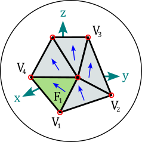

(docs-classes)=
# The Magpylib Classes

In Magpylib's [object oriented interface](docs-fieldcomp-oo) magnetic field **sources** (generate the field) and **observers** (read the field) are created as Python objects with various defining attributes and methods.

------------------------
## Base Properties

The following basic properties are shared by all Magpylib classes:

**Position and orientation**

* **`position`**: property that describes the object placement in the global coordinate system. Can also describe a path, i.e. a vector of position vectors.

* **`orientation`**: property that describes the object orientation in the global coordinate system using the `scipy.spatial.transform.Rpotation` class. Can also describe a path, i.e. a vector of orientations.

* **`centroid`**: property (read only) which returns the object barycenter assuming homogeneous mass density. It is often the same as the `position`.

* **`move()`** and **`rotate()`**: methods that enable relative object positioning. There are multiple `rotate()` methods allowing for all kinds of rotation inputs.

* **`reset_path()`** method: Sets `position` and `orientation` to their default values.

See {ref}`docs-position` for more information on these features.

**Graphic representation**

* **`style`**: property which includes all settings for graphical object representation.

* **`show()`**: method that initiates graphical representation.

See {ref}`guide-graphics` for more information on graphic output, default styles and customization possibilities.

**Field computation**

* The **`getB()`**, **`getH()`**, **`getJ()`** and **`getM()`** methods give quick access to field computation.

See {ref}`docs-fieldcomp` for more information.

**Force computation**

* **`meshing`**: property which defines the mesh finesse (splitting of the target into small parts) for the force computation.

A detailed overview of the force computation is found in {ref}`docs-forcecomp`. Note that force and torque computation is only available via the top-level function **`getFT()`**.

**Miscellaneous**

* **`volume`**: property (read only) which returns the volume of magnet bodies.

* **`dipole_moment`**: property (read only) which returns the dipole moment of magnet bodies and closed currents.

* **`parent`**: property which references a [Collection](guide-docs-classes-collections) that the object is part of.

* **`copy()`**: method which creates a clone of any object where selected properties can be modified with kwargs.

* **`describe()`**: method which provides a brief description of the object and returns the unique object id.


---------------------------------------------
## Local and Global Coordinates

::::{grid} 2
:::{grid-item}
:columns: 9
Every Magpylib object has its own local coordinate system where its shape and properties are defined. For instance, a `Tetrahedron` magnet's `vertices` are specified in the magnet's local coordinates. The `position` and `orientation` properties control where and how this local coordinate system is placed within the global coordinate system - see figure on the right.
:::
:::{grid-item}
:columns: 3

:::
::::
Local and global coordinate systems are identical when `position=(0, 0, 0)` and `orientation=None`. The {ref}`docs-position` section provides a detailed overview about positioning and orienting objects.


---------------------------------------------
(docu-magnet-classes)=
## Magnet Classes

All magnets are sources. They have the **`polarization`** attribute which is of the format $\vec{J}=(J_x, J_y, J_z)$ and denotes a homogeneous magnetic polarization vector in the local object coordinates in units (T). Alternatively, the magnetization vector can be set via the  **`magnetization`** attribute of the format $\vec{M}=(M_x, M_y, M_z)$. These two parameters are codependent and Magpylib ensures that they stay in sync via the relation $\vec{J}=\mu_0\cdot\vec{M}$. Information on how this is related to material properties from data sheets is found in {ref}`examples-tutorial-modeling-magnets`.

### Cuboid
```python
magpylib.magnet.Cuboid(
    position, orientation, dimension, polarization, magnetization, meshing, style
)
```

::::{grid} 2
:::{grid-item}
:columns: 9
`Cuboid` objects represent magnets with cuboid shape. The **`dimension`** attribute has the format $(a, b, c)$ and denotes the sides of the cuboid units (m). The center of the cuboid lies in the origin of the local coordinates, and the sides are parallel to the coordinate axes.
:::
:::{grid-item}
:columns: 3

:::
::::


### Cylinder
```python
magpylib.magnet.Cylinder(
    position, orientation, dimension, polarization, magnetization, meshing, style
)
```

::::{grid} 2
:::{grid-item}
:columns: 9
`Cylinder` objects represent magnets with cylindrical shape. The **`dimension`** attribute has the format $(d, h)$ and denotes diameter and height of the cylinder in units (m). The center of the cylinder lies in the origin of the local coordinates, and the cylinder axis coincides with the z-axis.
:::
:::{grid-item}
:columns: 3

:::
::::


### CylinderSegment
```python
magpylib.magnet.CylinderSegment(
    position, orientation, dimension, polarization, magnetization, meshing, style
)
```

::::{grid} 2
:::{grid-item}
:columns: 9
`CylinderSegment` objects represent magnets with the shape of a cylindrical ring section. The **`dimension`** attribute has the format $(r_1, r_2, h, \varphi_1, \varphi_2)$ and denotes inner radius, outer radius and height in units (m), and the two section angles $\varphi_1<\varphi_2$ in °. The center of the full cylinder lies in the origin of the local coordinates, and the cylinder axis coincides with the z-axis.
:::
:::{grid-item}
:columns: 3

:::
:::{grid-item}
:columns: 12
**Info:** When the cylinder section angles span 360°, then the much faster `Cylinder` methods are used for the field computation.
:::
::::


### Sphere
```python
magpylib.magnet.Sphere(
    position, orientation, diameter, polarization, magnetization, style
)
```

::::{grid} 2
:::{grid-item}
:columns: 9
`Sphere` objects represent magnets of spherical shape. The **`diameter`** attribute is the sphere diameter $d$ in units (m). The center of the sphere lies in the origin of the local coordinates.
:::
:::{grid-item}
:columns: 3

:::
::::


### Tetrahedron
```python
magpylib.magnet.Tetrahedron(
    position, orientation, vertices, polarization, magnetization, meshing, style
)
```

::::{grid} 2
:::{grid-item}
:columns: 9
`Tetrahedron` objects represent magnets of tetrahedral shape. The **`vertices`** attribute stores the four corner points $(\vec{P}_1, \vec{P}_2, \vec{P}_3, \vec{P}_4)$ in the local object coordinates in units (m).
:::
:::{grid-item}
:columns: 3

:::
:::{grid-item}
:columns: 12
**Info:** The `Tetrahedron` field is computed from four `Triangle` fields.
:::
::::

(docu-magpylib-api-trimesh)=

### TriangularMesh
```python
magpylib.magnet.TriangularMesh(
    position,
    orientation,
    vertices,
    faces,
    polarization,
    magnetization,
    meshing,
    check_open,
    check_disconnected,
    check_selfintersecting,
    reorient_faces,
    style,
)
```

::::{grid} 2
:::{grid-item}
:columns: 9
`TriangularMesh` objects represent magnets with surface given by a triangular mesh. The mesh is defined by the **`vertices`** attribute, an array of all unique corner points $(\vec{P}_1, \vec{P}_2, ...)$ in units (m), and the **`faces`** attribute, which is an array of index-triplets that define individual faces $(\vec{F}_1, \vec{F}_2, ...)$. The property **`mesh`** returns an array of all faces as point-triples $[(\vec{P}_1^1, \vec{P}_2^1, \vec{P}_3^1), (\vec{P}_1^2, \vec{P}_2^2, \vec{P}_3^2), ...]$.
:::
:::{grid-item}
:columns: 3

:::
:::{grid-item}
:columns: 12
At initialization the mesh integrity is automatically checked, and all faces are reoriented to point outwards. These actions are controlled via the kwargs
* **`check_open`**
* **`check_disconnected`**
* **`check_selfintersecting`**
* **`reorient_faces`**

which are all by default set to `'warn'`. Options are `'skip'` (don't perform check), `'ignore'` (ignore if check fails), `'warn'` (warn if check fails), `'raise'` (raise error if check fails).

Results of the checks are stored in the following object attributes
* **`status_open`** can be `True`, `False` or `None` (unchecked)
* **`status_open_data`** contains an array of open edges
* **`status_disconnected`** can be `True`, `False` or `None` (unchecked)
* **`status_disconnected_data`** contains an array of mesh parts
* **`status_selfintersecting`** can be `True`, `None` or `None` (unchecked)
* **`status_selfintersecting_data`** contains an array of self-intersecting faces
* **`status_reoriented`** can be `True` or `False`

The checks can also be performed after initialization using the methods
* **`check_open()`**
* **`check_disconnected()`**
* **`check_selfintersecting()`**
* **`reorient_faces()`**

The following class methods enable easy mesh creating and mesh loading.

* **`TriangularMesh.from_mesh()`** generates a `TriangularMesh` objects from the input **`mesh`**, which is an array in the mesh format $[(\vec{P}_1^1, \vec{P}_2^1, \vec{P}_3^1), (\vec{P}_1^2, \vec{P}_2^2, \vec{P}_3^2), ...]$.
* **`TriangularMesh.from_ConvexHull()`** generates a `TriangularMesh` object from the input **`points`**, which is an array of positions $(\vec{P}_1, \vec{P}_2, \vec{P}_3, ...)$ from which the convex Hull is computed via the [Scipy ConvexHull](https://docs.scipy.org/doc/scipy/reference/generated/scipy.spatial.ConvexHull.html) implementation.
* **`TriangularMesh.from_triangles()`** generates a `TriangularMesh` object from the input **`triangles`**, which is a list or a `Collection` of `Triangle` objects.
* **`TriangularMesh.from_pyvista()`** generates a `TriangularMesh` object from the input **`polydata`**, which is a [Pyvista PolyData](https://docs.pyvista.org/version/stable/api/core/_autosummary/pyvista.PolyData.html) object.

The method **`to_TriangleCollection()`** transforms a `TriangularMesh` object into a `Collection` of `Triangle` objects.

**Info:** While the checks may be disabled, the field computation guarantees correct results only if the mesh is closed, connected, not self-intersecting and all faces are oriented outwards. Examples of working with the `TriangularMesh` class are found in {ref}`examples-shapes-triangle` and in {ref}`examples-shapes-pyvista`.
:::
::::


---------------------------------------------
(docs-classes-current)=
## Current Classes

All currents are sources. Current objects (except `TriangleSheet`) have the **`current`** attribute which is a scalar that denotes the electrical current in units (A).

### Circle
```python
magpylib.current.Circle(position, orientation, diameter, current, meshing, style)
```

::::{grid} 2
:::{grid-item}
:columns: 9
`Circle` objects represent circular line current loops. The **`diameter`** attribute is the loop diameter $d$ in units (m). The loop lies in the xy-plane with it's center in the origin of the local coordinates.
:::
:::{grid-item}
:columns: 3

:::
::::

### Polyline
```python
magpylib.current.Polyline(position, orientation, vertices, current, meshing, style)
```

::::{grid} 2
:::{grid-item}
:columns: 9
`Polyline` objects represent line current segments where the electric current flows in straight lines from vertex to vertex. The **`vertices`** attribute is a vector of all vertices $(\vec{P}_1, \vec{P}_2, ...)$ given in the local coordinates in units (m).
:::
:::{grid-item}
:columns: 3

:::
::::

### TriangleStrip
```python
magpylib.current.TriangleStrip(position, orientation, vertices, current, meshing, style)
```

::::{grid} 2
:::{grid-item}
:columns: 9
`TriangleStrip` objects represent triangular current sheets arranged in a strip. The current flows along a band which consists of Triangles {T1, T2, ...} defined by the vertices {V1, V2, V3, V4, ...} as T1=(V1, V2, V3), T2=(V2, V3, V4), and so on. The **`vertices`** attribute is a vector of all vertices $(\vec{V}_1, \vec{V}_2, ...)$ given in the local coordinates in units (m). The given current is recomputed as a current density flowing in the direction $\vec{V}_3-\vec{V}_1$, in the first triangle, $\vec{V}_4-\vec{V}_2$ in the second triangle, and so on.
:::
:::{grid-item}
:columns: 3

:::
::::

### TriangleSheet
```python
magpylib.current.Polyline(
    position, orientation, vertices, faces, current_densities, meshing, style
)
```

::::{grid} 2
:::{grid-item}
:columns: 9
`TriangleSheet` objects represent collections of triangular current sheets. The triangles are defined by the **`vertices`** attribute, an array of unique points $(\vec{V}_1, \vec{V}_2, ...)$ in units (m), and the **`faces`** attribute, which is an array of index-triplets that define individual faces $(\vec{F}_1, \vec{F}_2, ...)$. The electrical current density flowing along the sheet is given by the attribute **`current_densities`**, which is a vector of current density vectors $(\vec{j}_1, \vec{j}_2, ...)$ in units (A/m) that must be of the same length as the faces input. The effective current density is the projection of the given current density vectors into the planes defined by the faces.
:::
:::{grid-item}
:columns: 3

:::
::::

---------------------------------------------
## Miscellaneous Classes

There are classes listed hereon that function as sources, but they do not represent physical magnets or current distributions.


### Dipole
```python
magpylib.misc.Dipole(position, orientation, moment, style)
```

::::{grid} 2
:::{grid-item}
:columns: 9
`Dipole` objects represent magnetic dipole moments with the **`moment`** attribute that describes the magnetic dipole moment $\vec{m}=(m_x, m_y, m_z)$ in SI-units (A*m²), which lies in the origin of the local coordinates.
:::
:::{grid-item}
:columns: 3

:::
:::{grid-item}
:columns: 12
**Info:** The total dipole moment of a homogeneous magnet with body volume $V$ is given by $\vec{m}=\vec{M}\cdot V$.
:::
::::


### Triangle (charged)
```python
magpylib.misc.Triangle(
    position, orientation, vertices, polarization, magnetization, style
)
```

::::{grid} 2
:::{grid-item}
:columns: 9
`Triangle` objects represent triangular surfaces with homogeneous charge density given by the projection of the polarization or magnetization vector onto the surface normal. The attributes **`polarization`** and **`magnetization`** are treated similar as by the {ref}`docu-magnet-classes`. The **`vertices`** attribute is a set of the three triangle corners $(\vec{P}_1, \vec{P}_2, \vec{P}_3)$ in units (m) in the local coordinates.
:::
:::{grid-item}
:columns: 3

:::
:::{grid-item}
:columns: 12
**Info:** When multiple Triangles with similar magnetization/polarization vectors form a closed surface, and all their orientations (right-hand-rule) point outwards, their total H-field is equivalent to the field of a homogeneous magnet of the same shape. In this case, the B-field is only correct on the outside of the body. On the inside the polarization must be added to the field. This is demonstrated in the tutorial {ref}`examples-shapes-triangle`.
:::
::::

(guide-docs-classes-custom-source)=
### CustomSource
```python
magpylib.misc.CustomSource(field_func, position, orientation, style)
```

::::{grid} 2
:::{grid-item}
:columns: 9
The `CustomSource` class is used to create user defined sources provided with with custom field computation functions. The argument **`field_func`** takes a function that is then automatically called for the field computation. This custom field function is treated like a [core function](docs-field-core). It must have the positional arguments `field` with values `'B'` or `'H'`, and `observers` (must accept array with shape (o, 3)) and return the B-field and the H-field with a similar shape.
:::
:::{grid-item}
:columns: 3

:::
:::{grid-item}
:columns: 12
**Info:** A tutorial {ref}`examples-tutorial-custom` is found in the examples.
:::
::::


---------------------------------------------
## Sensor
```python
magpylib.Sensor(position, orientation, pixel, handedness, style)
```

::::{grid} 2
:::{grid-item}
:columns: 9
`Sensor` objects represent observers of the magnetic field and can be used as Magpylib `observers` input for magnetic field computation. The **`pixel`** attribute is an array of positions $(\vec{P}_1, \vec{P}_2, ...)$ provided in units (m) in the local sensor coordinates. A sensor returns the magnetic field at these pixel positions. By default `pixel=(0, 0, 0)` and the sensor simply returns the field at it's position. The **`handedness`** attribute can be `'left'` or `'right'` (default) to set a left- or right-handed sensor coordinate system for the field computation.
:::
:::{grid-item}
:columns: 3

:::
:::{grid-item}
:columns: 12
**Info:** Sensors can have their own position and orientation and enable easy relative positioning between sources and observers. The field is always computed in the reference frame of the sensor, which might itself be moving in the global coordinate system. Magpylib sensors can be understood as perfect magnetic field sensors with infinitesimally sensitive elements. An example how to use sensors is given in {ref}`examples-tutorial-field-computation-sensors`.
:::
::::


---------------------------------------------
(guide-docs-classes-collections)=
## Collection
```python
magpylib.Collection(*children, position, orientation, override_parent, style)
```

::::{grid} 2
:::{grid-item}
:columns: 9
A `Collection` is a group of Magpylib objects that is used for common manipulation. All these objects are stored by reference in the **`children`** attribute. The collection becomes the **`parent`** of the object. An object can only have one parent. There are several options for accessing only specific children via the following properties

* **`sources`**: return only sources
* **`observers`**: return only observers
* **`collections`**: return only collections
* **`sources_all`**: return all sources, including the ones from sub-collections
* **`observers_all`**: return all observers, including the ones from sub-collections
* **`collections_all`**: return all collections, including the ones from sub-collections

Additional methods for adding and removing children:

- **`add()`**: Add an object to the collection
- **`remove()`**: Remove an object from the collection
:::
:::{grid-item}
:columns: 3

:::
:::{grid-item}
:columns: 12
**Info:** A collection object has its own `position` and `orientation` attributes and spans a local reference frame for all its children. An operation applied to a collection moves the frame and is individually applied to all children such that their relative position in the local reference frame is maintained. This means that the collection functions as a container for manipulation, but child position and orientation are always updated in the global coordinate system. After being added to a collection, it is still possible to manipulate the individual children, which will also move them to a new relative position in the collection frame.

Collections have **format** as an additional argument for **describe()** method. Default value is `format='type+id+label'`. Any combination of `'type'`, `'id'`, and `'label'` is allowed.

A tutorial {ref}`examples-tutorial-collection` is provided in the example examples.
:::
::::
