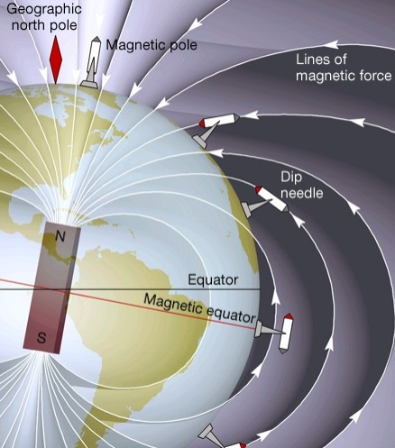

(examples-force-physics)=

# Force and Torque Physics

We show a few classical physics examples that demonstrate Magpylib force and torque computation.

----------------------------
(examples-force-physics-reciprocity)=
## Newton's Third Law - Reciprocity

::::{grid} 2
:::{grid-item}
:columns: 7
Newton's third law states that when two objects interact, the influence one exerts on the other is matched by an equal and opposite influence in return. Practically this means that a source acting on a target creates the same force as when the target would act on the source.
:::
:::{grid-item}
:columns: 5

:::
::::

The following code computes the force between a spherical magnet and a circular current loop using both computational directions: first with the loop as source acting on the sphere, then with the sphere as source acting on the loop.

```{code-cell} ipython3
:tags: [hide-input]

import numpy as np
import magpylib as magpy

print('TESTING NEWTONS THIRD LAW')

# Enforce scientific notation
np.set_printoptions(formatter={'float': '{:.3e}'.format})

# Spherical magnet
sphere = magpy.magnet.Sphere(
  diameter=1e-2,
  polarization=(0, 0, 1),
  position=(0, 1e-2, 1e-2),
)

# Circular current loop
loop = magpy.current.Circle(
  diameter=2e-2,
  current=1000,
  meshing=1200,
)

# Forward
F_sphere, T_sphere = magpy.getFT(loop, sphere, pivot=(0, 0, 0))

# Backward
F_loop, T_loop = magpy.getFT(sphere, loop, pivot=(0, 0, 0))

print('\nForces:')
print(f'  on loop:   {F_loop} N')
print(f'  on sphere: {F_sphere} N')
print(f'  summation: {np.linalg.norm(F_loop + F_sphere):.3e} N (should be zero)')

print(f'\nTorques:')
print(f'  on loop:   {T_loop} N*m')
print(f'  on sphere: {T_sphere} N*m')
print(f'  summation: {np.linalg.norm(T_loop + T_sphere):.3e} N*m (should be zero)')
```

**Key observations:**
The results confirm Newton's third law—forces and torques are equal in magnitude but opposite in direction. The small discrepancy arises because the forward computation is exact (spheres require no meshing), while the backward computation uses numerical discretization. This error decreases with higher `meshing` values.

```{hint}
**Computational efficiency**: Always choose whichever direction requires less computational effort. Objects like `Sphere` and `Dipole` have analytical solutions and make ideal targets to minimize discretization errors.
```

-----------------------------

## Dipole Force

The magnetic force between two dipoles has a complex analytical solution that serves as an excellent validation benchmark for numerical electromagnetic codes. This example demonstrates Magpylib's computation against the exact analytical formula, showing perfect agreement for dipole interactions.

The analytical solution, taken from [Encyclopedia Magnetica](https://www.e-magnetica.pl/doku.php/magnetic_dipole_moment), is:

```{figure} ../../../_static/images/examples_force_physics_dipole1.png
:width: 80%
:align: center
:alt: Sketch of two dipole.
```

```{figure} ../../../_static/images/examples_force_physics_dipole2.png
:width: 100%
:align: center
:alt: Dipole force equation.
```

The following code compares this analytical expression with Magpylib's numerical computation using randomly oriented dipoles at arbitrary positions.

```{code-cell} ipython3
:tags: [hide-input]

import numpy as np
import magpylib as magpy

print('DIPOLE FORCE MODEL COMPARISON\n')

# Enforce scientific notation
np.set_printoptions(formatter={'float': '{:.8e}'.format})

def analytical(ra, rb, ma, mb):
    """
    Analytical solution for the magnetic force between two dipoles.

    Parameters:
    ra, rb: positions of dipoles (m)
    ma, mb: magnetic moments (A*m²)

    Returns:
    force: force (N) on dipole b due to dipole a
    """
    r = rb - ra
    r_abs = np.linalg.norm(r)
    r_unit = r / r_abs

    force = (
      3 * magpy.mu_0 / (4 * np.pi * r_abs**4) *
        (
            np.cross(np.cross(r_unit, ma), mb)
            + np.cross(np.cross(r_unit, mb), ma)
            - 2 * r_unit * np.dot(ma, mb)
            + 5 * r_unit * (np.dot(np.cross(r_unit, ma), np.cross(r_unit, mb)))
        )
    )
    return force

# Test configuration with random numbers
m1 = np.array((0.976, 4.304, 2.055))
m2 = np.array((0.878, -1.527, 2.918))
p1 = np.array((-1.248, 7.835, 9.273))
p2 = np.array((-2.331, 5.835, 0.578))

# Analytical calculation
F_ana = analytical(p1, p2, m1, m2)

# Magpylib calculation
dipole1 = magpy.misc.Dipole(position=p1, moment=m1)
dipole2 = magpy.misc.Dipole(position=p2, moment=m2)
F_magpy, _ = magpy.getFT(dipole1, dipole2)

print(f'   Analytical: {F_ana}')
print(f'   Magpylib:   {F_magpy}')
```

**Key observations:**
Magpylib matches the analytical solution to machine precision, demonstrating perfect agreement. Since `Dipole` (and `Sphere`) objects use analytical field calculations rather than discretization, there are no meshing errors.

```{hint}
**Exact calculations**: Use `Dipole` and `Sphere` objects for validation and benchmarking since they provide exact solutions without discretization errors.
```

-----------------------------

## Dipole Approximation

Any localized magnetic source (magnet or current distribution) can be described using a [multipole expansion](https://phys.libretexts.org/Bookshelves/Mathematical_Physics_and_Pedagogy/Mathematical_Methods/The_Multipole_Expansion)—a series of terms (monopole, dipole, quadrupole, ...) that decay with increasing powers of distance from the source.

```{figure} ../../../_static/images/examples_force_physics_dipole3.png
:width: 100%
:align: center
:alt: Multipole expansion.
```

This series expansion is valid because of the fundamental mathematical equivalence between static dipole, charge, and current distributions (see also [equivalent sources](examples-misc-equivalent)).

Since magnetic monopoles don't exist, the dipole term dominates at large distances. This means **localized magnetic objects behave like magnetic dipoles when viewed from far away**, making dipole approximations extremely valuable for efficiently computing long-range interactions.

**Magnetic dipole moments:**
- Magnets with homogeneous magnetization $\vec{M}$ and volume $V$ have a dipole moment of $\vec{m} = \vec{M} \cdot V$.
- Planar current loops with current $i_0$ and loop area $A$ with normal $\hat{n}$ have a dipole moment of $\vec{m} = i_0 \cdot A \cdot \hat{n}$.

The following example validates dipole approximation accuracy by comparing exact force calculations with dipole approximations across various separation distances:

```{code-cell} ipython3
:tags: [hide-input]

import numpy as np
from numpy.linalg import norm
import magpylib as magpy

print('DIPOLE APPROXIMATION ACCURACY\n')

# Source: spherical magnet (exact solution, no meshing needed)
source = magpy.magnet.Sphere(
    diameter=0.1,
    polarization=(0.6, 0.4, 0.2),
)

# Cube magnet
cube = magpy.magnet.Cuboid(
    dimension=(0.1, 0.1, 0.1),
    polarization=(0.5, 0.6, 0.7),
)

# Cube dipole approximation
moment = cube.magnetization * cube.volume
dipole = magpy.misc.Dipole(moment=moment)

# Test at increasing distances
distances = [0.2, 0.5, 1.0, 2.0]  # units (m)

print("Cube:\t Distance \tForce Error\tTorque Error")

for distance in distances:
    source.position = (distance, 0, 0)

    F0, T0 = magpy.getFT(cube, source)   # Full model
    F1, T1 = magpy.getFT(dipole, source) # Dipole approximation

    # Compute and print relative errors
    errF = norm(F0-F1) / norm(F0)
    errT = norm(T0-T1) / norm(T0)
    print(f'\t {distance:.2e} \t {errF:.2e} \t {errT:.2e}')

```

```{code-cell} ipython3
:tags: [hide-input]

# Example continued from above

# Square current loop
loop = magpy.current.Polyline(
    vertices=[
        (-0.05, -0.05, 0),
        ( 0.05, -0.05, 0),
        ( 0.05,  0.05, 0),
        (-0.05,  0.05, 0),
        (-0.05, -0.05, 0)
    ],
    current=1,
)

# Loop dipole approximation
m_loop = loop.current * 0.01 * np.array((0, 0, 1))
dipole = magpy.misc.Dipole(moment=m_loop)

print("Loop:\t Distance \tForce Error\tTorque Error")

for distance in distances:
    source.position = (distance, 0, 0)

    F0, T0 = magpy.getFT(loop, source)   # Full model
    F1, T1 = magpy.getFT(dipole, source) # Dipole approximation

    # Compute and print relative errors
    errF = norm(F0-F1) / norm(F0)
    errT = norm(T0-T1) / norm(T0)
    print(f'\t {distance:.2e} \t {errF:.2e} \t {errT:.2e}')
```

**Key observations:**
- The dipole approximation accuracy improves dramatically with distance.
- Compact shapes (cube with aspect ratio of 1) approximate better than extended shapes (flat loop).
- We have used the [third law](examples-force-physics-reciprocity) to yield exact results and avoid meshing the cube and loop objects.

```{tip}
**Computational strategy**:
- Close range (distance < 2× object size): Use full calculations
- Medium range (2-5× object size): Dipole approximation with ~1% error
- Far field (>5× object size): Dipole approximation with <0.1% error
```

-----------------------------

## Forces between Parallel Wires

The force between two infinitely long parallel current-carrying wires is a classical electromagnetic example with a simple analytical solution. The analytical model is derived and explained in this [YouTube video](https://www.youtube.com/watch?v=RvKSwQaYUno), from which the following screenshot is taken.

```{figure} ../../../_static/images/examples_force_physics_wires.png
:width: 100%
:align: center
:alt: Force between parallel wires.
```

While Magpylib cannot model truly infinite wires, very long wires provide excellent approximations to the theoretical result.

```{code-cell} ipython3
:tags: [hide-input]

from numpy import pi
from magpylib import mu_0, getFT
from magpylib.current import Polyline

print('FORCE BETWEEN PARALLEL WIRES\n')

i1 = 1   # wire1 current (A)
i2 = 2   # wire2 current (A)
d = 123  # distance between wires (m)
L = 1e6  # wire length (m)

wire1 = Polyline(
    current=i1,
    vertices=[(d, 0, -L/2), (d, 0, L/2)],
)
wire2 = Polyline(
    current=i2,
    vertices=[(0, 0, -L/2), (0, 0, L/2)],
    meshing=10
)
F,_ = getFT(wire1, wire2)

print(f'Magpylib result:   F/L = {F[0]/L:.6e} N/m')
print(f'Analytical result: F/L = {mu_0/2/pi*i1*i2/d:.6e} N/m')
```

**Key observations:**
- Accuracy increases with wire length, not with meshing. This is because with increasing length the influence of the wire ends becomes less significant. At the same time, the result is independent of the meshing, because the field is constant along the straight wire.
- The force is attractive between the wires, as dictated by the literature.


--------------------------------

## Force in a Homogeneous Field

Closed current loops and permanent magnets in homogeneous (uniform) magnetic fields $\vec{B}$ experience zero net force, but non-zero torque.

- **Current loops**: Each wire segment $d\vec{l}$ carrying a current $i_0$ experiences a Lorentz force $\vec{F} = i_0 \, d\vec{l} \times \vec{B}$. For a closed loop: $\vec{F}_{\text{total}} = i_0 \oint d\vec{l} \times \vec{B} = - i_0 \vec{B} \times \oint d\vec{l} = 0$ (since $\oint d\vec{l} = 0$ for any closed path). <!-- codespell:ignore -->

- **Magnets**: Each magnetic dipole element $\vec{m}$ of a permanent magnet experiences a force $d\vec{F} = \nabla(\vec{m} \cdot \vec{B}) = [(\vec{m} \cdot \nabla) \vec{B} + \vec{m} \times (\nabla \times \vec{B})] \, dV$. In a homogeneous field, $\nabla \vec{B} = 0$ and $\nabla \times \vec{B} = 0$, so the net force vanishes.

- **Torque persists**: Current and magnet objects experience $\vec{T} = \vec{m} \times \vec{B}$ (in addition to the intrinsic torque experienced by permanent magnets), which tends to align the magnetic moment with the field direction.


**Numerical validation:**

These analytical principles are not hardcoded into Magpylib but emerge naturally from the numerical integration over discretization elements, as demonstrated below.

```{code-cell} ipython3
:tags: [hide-input]

import magpylib as magpy
import numpy as np

print("FORCE AND TORQUE IN HOMOGENEOUS FIELD")

# Set numpy print format
np.set_printoptions(formatter={'float': '{:.2e}'.format})

# Custom Source with homogeneous field
def homogeneous_field(field, observers):
    """ homogeneous field pointing in y-direction"""
    BH = np.zeros_like(observers)
    BH[:,1] = 1e5
    BH = magpy.mu_0 * BH if field=="B" else BH
    return BH

source = magpy.misc.CustomSource(
    field_func=homogeneous_field
)

# Force on closed current loop
loop = magpy.current.Polyline(
    current=1,
    vertices=[(0, 0, 0), (1, 0, 0), (2, 2, 0), (3, -3, 0), (0, 0, 0)],
    meshing=400,
)
F,T = magpy.getFT(source, loop)

print('\nClosed current loop:')
print(f'  force:  {F} N')
print(f'  torque: {T} N*m')

# Force on magnet
cube = magpy.magnet.Cuboid(
    dimension=(0.1, 0.2, 0.3),
    polarization=(.1, 0, 0),
    meshing=(3, 6, 9),
)
F,T = magpy.getFT(source, cube)

print('\nCuboid magnet:')
print(f'  force:  {F} N')
print(f'  torque: {T} N*m')
```
**Key observations:**
- The forces disappear, confirming theoretical predictions.
- Both objects experience significant torque attempting to align their moments with the y-directed field (loop moment points in z-direction, cube moment points in x-direction).


--------------------------

## Compass Needle

The previous example explains why magnets in Earth's geomagnetic field experience torque but no net force—this is the fundamental principle behind magnetic compasses. The following example models a realistic compass needle, demonstrating the extraordinary numerical stability of Magpylib's force computations.

**Physical model**
::::{grid} 2
:::{grid-item}
:columns: 7
- The earth is modeled as a magnetic dipole with moment $8 \times 10^{22}\,\text{Am}^2$ located in the origin and pointing in z-direction.
- The compass needle is a magnetized iron cylinder with diameter 0.5 mm, length 10 mm, and polarization $|\vec{P}| = 0.1\,\text{T}$ along the axis.
- The needle is located at the equator (distance $6378\,\text{km}$ from Earth's center) where the geomagnetic field is about 30-35 μT.
- 0° needle orientation means the needle points northward (z-direction).
:::
:::{grid-item}
:columns: 5

*Image taken from this [script](http://helios.fmi.fi/~juusolal/geomagnetism/Lectures/Chapter3_dipole.pdf)*
:::
::::


```{code-cell} ipython3
:tags: [hide-input]

import magpylib as magpy
import numpy as np

print('MODEL OF COMPASS NEEDLE IN EARTHS MAGNETIC FIELD')

# Set numpy print format
np.set_printoptions(formatter={'float': '{:.1e}'.format})

# Earth magnetic field model
earth = magpy.misc.Dipole(moment=(0, 0, 8e22))

# B-field at equator
equator_position = (6378e3, 0, 0)
print(f'\nMagnetic field at aquator: {earth.getB(equator_position)} T')

# Compass needle at equator pointing north
needle = magpy.magnet.Cylinder(
    dimension=(0.5e-2, 10e-2),
    polarization=(0, 0, 0.1),
    position=equator_position,
    meshing=20,
)

# Test needle at different orientation angles
angles = [-135, -90, -45, 0, 45, 90, 135]
needle.rotate_from_angax(angles, "y", start=0)
F,T = magpy.getFT(earth, needle)

print('\nCompass Needle: ( 0° = pointing North)')
print('\tAngle \t Force \t\t\t\t\t Torque:')
for f, t, a in zip(F, T, angles):
    print(f'\t{a:>4}° \t {f} N \t {t} N*m')
```

**Key observations:**

- The dipole model of earth's geomagnetic field yields ~31 uT at the equator in agreement with literature values.
- The y-component of torque creates a stable equilibrium at 0°, where the needle aligns with the geomagnetic field. Equal angles (±45°, ±90°, etc.) produce equal but opposite torques, confirming the physical expectation.
- The force is small and of order of $|\vec{F}| \approx 10^{-11}$. This is not numerical noise, but the actual force acting on the needle, as the geomagnetic field modeled here as a dipole is not 100% homogeneous. Despite the enormous scale difference (10⁻³ m needle vs. 10⁷ m Earth radius), the computation remains stable because the `Dipole` field is stable.

```{hint}
**Numerical stability** of `getFT()` is granted if the underlying `getB()` computation is stable.
```
