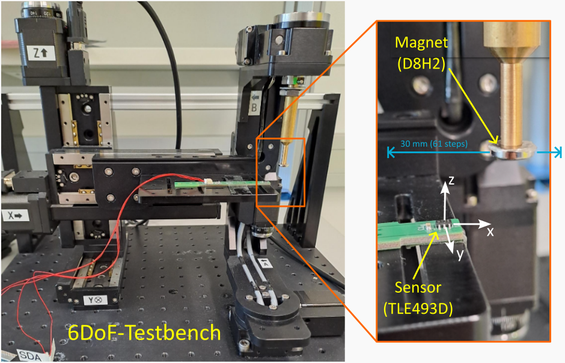
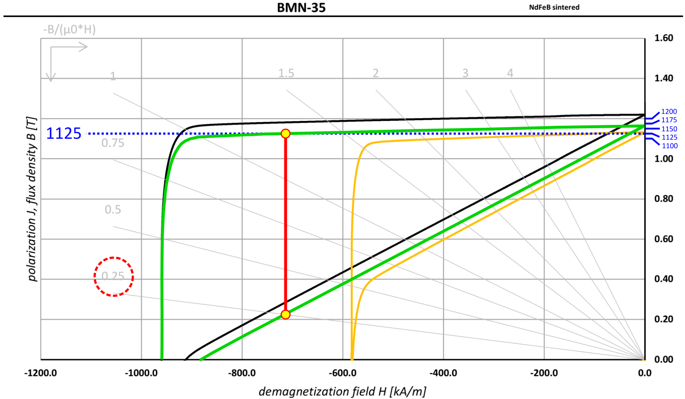

---
jupytext:
  formats: md:myst
  text_representation:
    extension: .md
    format_name: myst
    format_version: 0.13
    jupytext_version: 1.17.1
kernelspec:
  name: python3
  display_name: Python 3 (ipykernel)
  language: python
---

(examples-tutorial-modeling-magnets)=

# Modeling a Real Magnet

When comparing Magpylib simulations with experimental measurements, it's essential to set up your simulated magnet to match the real one. This tutorial explains how to configure Magpylib magnets using manufacturer datasheets and provides insights into the fundamental properties of permanent magnets.

This tutorial was supported by [BOMATEC](https://www.bomatec.com/de) by providing excellent data sheets and by supplying magnets for the experimental demonstration below.

## Remanence

Magnet datasheets typically include a table of technical material specifications, including the remanence \( B_r \). This value corresponds to the `polarization` magnitude in Magpylib when no material response is modeled. The remanence is usually given as a range to account for manufacturing tolerances.


## Material Response

Magpylib magnets represent bodies with homogeneous magnetic polarization. A real magnet, however, has material response and "demagnetizes" itself resulting in a polarization distribution throughout the magnet that is inhomogeneous and always lower than the remanence. A Magpylib magnet, beiing a homogeneous body, can only catch the mean of the reduced remanence. The following sections explain what happens, and how to estimate the reduced remanence value.

%How much lower depends strongly on the shape of the magnet and its demagnetization curve, characterized in simple cases by material coercivity $H_{c,J}$ or permeability $\mu_r$.

If you are interested in modelling inhomogenous magnets you can make use of the [magpylib-material-response](https://github.com/magpylib/magpylib-material-response) package.

An excellent and more detailed explanation of these phenomena is found on the [Encyclopedia Magnetica](https://www.e-magnetica.pl/doku.php/coercivity).


%and is expressed in the data sheet through the permeance coefficient lines (grey lines). The numbers at the end indicate the typical magnet length to diameter ratio (L/D). you should find B-H curves and J-H curves. These curves coincide at $H=0$, giving the intrinisic material remanence $B_r$. This is the `polarization` magnitude of a magpylib magnet when there is no material response.

%The remanence is typically given as a range accounting for production tolerances

%However, a real magnet has material response and "demagnetizes" itself so that the mean magnetic polarization is always below the intrinsic remanence.

%As a result of material response and self-interaction, the magnet "demagnetizes" itself so that the mean magnetic polarization of a real magnet is always below the remanence. How much below depends strongly on the shape of the magnet and is expressed in the data sheet through the permeance coefficient lines (grey lines). The numbers at the end indicate the typical magnet length to diameter ratio (L/D).

%To obtain the correct magnetic polarization of a magnet from the data sheet, one must find the crossing between B-H curve and respective permeance coefficient line. This gives the "working point" which corresponds to the mean demagnetizing H-field inside the magnet. The correct polarization to use in the Magpylib simulation is the J-value at the working point which can be read off from the J-H curve.

%

%The following sections provide further explanation on the matter.

### Intrinsic Hysteresis Loop

The intrinsic Hysteresis loop relates the effective H-field in a material sample volume to the resulting polarization J (or magnetization M) in that volume. It does not depend on sample volume size, shape, and surroundings, but only on the material properties and the history $H(t)$. With different histories the same H-field can result in different polarizations. They intrinsic hysteresis loop of a material used for permanent magnets typically looks like this:

%Hysteresis loops relate the applied H-field to the resulting B-field, polarization J, or magnetization M of a material.
%*within a defined volume*. This relationship strongly depends on the volume’s size, shape, and surrounding materials.
%The B–H curve is known as the *normal loop*, while J–H (or M–H) curves are called *intrinsic loops*. The normal loops show the 
%In this tutorial, we focus on J–H loops; the discussion for M–H is analogous. Normal and intrinsic loops are related by \( B = \mu_0 H + J \). In free space, \( B = \mu_0 H \) is a straight line, but if the entire space is filled with magnetic material, the loop within any volume will show nonlinear behavior.

%The B-H curve is called the "normal loop", while J-H (and M-H) curves are called "intrinsic loops". Hereon we only make use of the J-H loops, but the discussion is similar for M-H. Normal and intrinsic loops are connected via $B = \mu_0 H + J$. In free space the B-H connection is just a straight line defined via $B = \mu_0 H$. When the whole space is filled with magnetic material you will see something like this within an arbitrary volume:

::::{grid} 2
:::{grid-item}
:columns: 1
:::
:::{grid-item}
:columns: 10

:::
::::

**1st quadrant (create a magnet):**  
We start with \( J = 0 \) and \( H = 0 \); the material is unmagnetized and there is no magnetic field. As \( H \) increases, the polarization \( J \) follows the *virgin curve*—a nonlinear rise toward the saturation polarization \( J_s \). Beyond this point, further increases in \( H \) have no effect on \( J \); the material is saturated. We are now on the *major loop* and cannot return to the virgin curve, because as H is gradually reduced back to zero, the material retains a high level of polarization. At \( H = 0 \), the remaining polarization is called the *remanent polarization* \( J_r \), which equals the remanent flux density \( B_r \). We have now created a permanent magnet.

**2nd quadrant (demagnetize a magnet):**
Next, the H-field increases in magnitude but points opposite to the initial direction, acting against the existing polarization. Initially, \( J \) remains nearly unchanged, but as the opposing field strengthens, the response becomes nonlinear and \( J \) decreases rapidly. When \( J \) reaches zero, the H-field equals the *intrinsic coercive field* \( H_{c,J} \), a value that characterizes the material’s resistance to demagnetization. This quadrant—often called the *demagnetization curve*. Materials with a high \( H_{c,J} \) (also denoted \( H_{ci} \)) are referred to as *hard magnets*, capable of maintaining their magnetization even under strong opposing fields.

**3rd and 4th quadrants:**  
In the third quadrant, the behavior mirrors that of the first: as \( H \) increases beyond \( H_{c,J} \) in the negative direction, the polarization rapidly aligns with the field, reaching saturation at \( J = -J_s \). Reversing the field once more brings us through the fourth quadrant, completing the hysteresis loop.

Magnetic hysteresis, as described here, is a macroscopic phenomenon arising from a complex interplay of dipole and exchange interactions, material anisotropy, and domain formation at the microscopic level. For a detailed treatment, see Aharoni’s classical textbook *Introduction to the Theory of Ferromagnetism*.

### The demagnetizing field

If the applied H-field is zero in an experiment, it may seem intuitive to use the remanent flux density \( B_r \) as the magnetic polarization amplitude in a Magpylib simulation. However, this approach neglects the strong opposing field that the magnet generates within itself. Just as the polarization \( J \) produces a magnetic field outside the magnet (known as the *stray field*), it also induces an H-field on the inside which is mostly opposed to $J$ called the *demagnetizing field*. The effect is illustrated in the following figure:


Building on the [streamplot example](examples-vis-mpl-streamplot), the left panel shows the cross-section of a cuboid magnet with uniform polarization, while the right panel illustrates the resulting H-field. Inside the magnet, the H-field is generally opposed to $J$. The average H-field inside the magnet is commonly referred to as the *working point*.

Consequently, the magnet’s mean polarization is not equal to \( B_r \), but is instead a lower value \( J \) on the *demagnetization curve* (2nd quadrant) corresponding to the working point.

(examples-tutorial-modeling-magnets-findJ)=
### Finding the Correct Polarization

To determine the correct mean polarization of a magnet, we must compute its *working point*—the average internal H-field—and then read the corresponding \( J \) from the provided J–H curve. However, calculating this internal field is not trivial, as it depends not only on the material's permeability but also on the magnet's geometry.

Fortunately, well-prepared datasheets often include working point information directly.


The snippet above shows the second quadrant of the J–H loop for two temperatures. The lower curves are the corresponding B–H loops. The working point is found at the intersection of the *permeance coefficient* lines (gray) with the B–H curves. The labels at the ends of these lines indicate the magnet’s length-to-diameter (L/D) ratio, a key geometric factor influencing internal demagnetization. Each line represents a different L/D value, enabling you to identify the correct working point for a specific magnet geometry.

Once identified, the corresponding magnetic polarization \( J_W \) can be read directly from the J–H curve. The figure below illustrates how \( J_W \) varies with L/D for a cylindrical magnet:


%Keep in mind that magnets with different shapes, such as parallelepipeds, will exhibit different L/D behavior. Always ensure you refer to the correct section of the datasheet that matches your magnet’s geometry and part number.

## Sources of Error

Keep in mind that there are many factors that can cause discrepancies between your simulation and experimental results. Below are some of the most common issues:

1. **Sensor position errors:** Even small misalignments—less than 100 µm—can significantly affect the measurement. The sensitive element inside a sensor package may be offset by 10–100 µm or slightly rotated, introducing notable deviations.

2. **Sensor errors:** The sensor may not be properly calibrated or may operate outside its optimal measurement range. Even well-calibrated sensors can exhibit systematic errors of several percent of their full scale. In addition, sensitive elements, e.g. Hall cells, are finite sized and return the mean field in their sensitive volume.

3. **External stray fields:** Ambient magnetic fields—such as the geomagnetic field—or interference from nearby electronic equipment or magnetic objects (e.g. metal stands or tools) can distort the measurements.

4. **Magnet quality deviations:** Off-the-shelf magnets often deviate from their datasheet specifications:
   - The magnetic polarization amplitude may vary by several percent due to prior demagnetization or lower material grade.
   - The polarization direction can differ by a few degrees from the nominal axis.
   - Inhomogeneous polarization is common, particularly in injection-molded magnets.


## Example

In this example, we demonstrate how to align theory and experiment by measuring and simulating the linear motion of a magnet above a sensor.

We use a cylindrical Neodymium magnet from Bomatec with diameter \( D = 8\,\mathrm{mm} \), height \( H = 2\,\mathrm{mm} \), axial magnetization, and made of BMN35 material with a nominal remanence of \( B_{r,\mathrm{nom}} = 1220\,\mathrm{mT} \) and a minimum guaranteed value of \( B_{r,\mathrm{min}} = 1170\,\mathrm{mT} \). As the sensor, we use an Infineon TLE493D, a true 3D Hall sensor.

Both components are mounted on our custom test bench that allows precise relative positioning between the magnet and sensor in six degrees of freedom.



While the relative positioning is highly accurate—limited mainly by the motor resolution, typically a few micrometers and millidegrees—absolute positioning remains a challenge. Even with precise tools (e.g. touch probe, interferometer), achieving accurate 6D alignment between the sensor and the magnet is difficult. This is further complicated by unknown offsets or misalignments of the sensing element within the sensor package.

Due to the lack of a robust common reference, we position the magnet above the sensor by a combination of visual alignment and touch probing, estimating a surface-to-surface distance of 6 mm.

The magnet is then moved linearly along the x-axis from –15 mm to +15 mm in 61 steps. At each step, we perform 1000 measurements and average the results to reduce sensor noise.

We now compare this experimental dataset with a Magpylib simulation, using the same geometry and nominal magnet properties.

```{code-cell} ipython3
:tags: [hide-input]

import numpy as np
import matplotlib.pyplot as plt
import magpylib as magpy

# Testbench positioning
xs = np.linspace(-15, 15, 61)

# Load experimental data
data_path = '../../../_static/data/Bomatec_LD025_scan0.npy'
Bexp = np.load(data_path)  # shape should be (61, 3)

# Simulation setup
sensor = magpy.Sensor(position=(0, 0, 0))
magnet = magpy.magnet.Cylinder(
    polarization=(0, 0, 1200), # in mT
    dimension=(8, 2),          # in mm
    position=[(x,0,7) for x in xs], # z=7 mm center height
)
Bsim = sensor.getB(magnet)

# Plotting function
def plot_field(Bsim, Bexp, xs):
    """Plot results."""
    fig, axes = plt.subplots(1, 3, figsize=(12,3.5), sharey=True)

    labels = ['Bx Field (mT)', 'By Field (mT)', 'Bz Field (mT)']
    for i,ax in enumerate(axes):
        ax.plot(xs, Bsim[:, i], color='b', label='Simulation')
        ax.plot(xs, Bexp[:, i], ls='', marker='.', color='orange', label='Experiment')

        ax.set_title(labels[i])
        ax.set_xlabel('Magnet Position (mm)')
        ax.grid(color='.85')
        ax.legend(loc='upper right')

    plt.tight_layout()
    plt.show()

plot_field(Bsim, Bexp, xs)
```

The figure shows general qualitative and quantitative agreement between simulation and measurement. However, the remaining discrepancies are still significant—unsurprising, as we have not yet accounted for any tolerances.

To address this, we introduce seven tolerance parameters:
- The sensor may be displaced in all six degrees of freedom: three translations and three rotations.
- Additionally, the exact value of the magnet's polarization is not known precisely.

Next, we incorporate these tolerances into our simulation model and estimate their values by fitting to the experimental data. To do this, we use a differential evolution algorithm that minimizes a cost function based on the squared differences between simulated and measured magnetic field values.

The following code demonstrates how this optimization is performed.

```{code-cell} ipython3
:tags: [hide-input]

# Continuation of previous code cell

from scipy.optimize import differential_evolution

def simulate_field(px, py, pz, alpha, beta, gamma, J):
    """Simulate the magnetic field in our experiment with tolerances.

    Parameters:
    - px, py, pz: Sensor misalignment in mm
    - alpha, beta, gamma: Sensitive rotation in degrees
    - J: Magnetic polarization ampliotude in mT
    """
    sensor = magpy.Sensor(position=(px, py, pz))
    sensor.rotate_from_euler((alpha, beta, gamma), "xyz")
    magnet = magpy.magnet.Cylinder(
        polarization=(0, 0, J),
        dimension=(8, 2),
        position=[(x, 0, 7) for x in xs],
    )
    return sensor.getB(magnet)

def cost_function(params, Bexp):
    """Returns the quadratic difference between simulated and measured fields."""
    px, py, pz, alpha, beta, gamma, J = params
    Bsim = simulate_field(px, py, pz, J, alpha, beta, gamma)
    mse = sum(np.linalg.norm(Bexp - Bsim, axis=1) ** 2) / len(Bexp)
    return mse

def run_optimization():
    """Finds the best parameters for the simulation by minimizing the cost function."""
    bounds = [
        (-1, 1),   # px: Sensor x-position (mm)
        (-1, 1),   # py: Sensor y-position (mm)
        (-1, 1),   # pz: Sensor z-position (mm)
        (-10,10),  # alpha: Sensor rotation around x-axis (deg)
        (-10,10),  # beta:  Sensor rotation around y-axis (deg)
        (-10,10),  # gamma: Sensor rotation around z-axis (deg)
        (1000, 1300),  # J: Magnet Polarization (mT)
    ]
    result = differential_evolution(
        cost_function,
        bounds=bounds,
        args=(Bexp,),
        popsize=25,
        maxiter=1000,
    )
    return result.x

# We skip running the optimizer live here.
# Fitted result from prior optimization:
result = [
    0.7209,   # px (mm)
   -0.1348,   # py (mm)
    0.3692,   # pz (mm)
   -1.018,    # alpha (deg)
    1.099,    # beta (deg)
    1.131,    # gamma (deg)
 1126.0       # J (mT)
]

# Simulate with optimized parameters
Bsim = simulate_field(*result)

# Plot comparison
plot_field(Bsim, Bexp, xs)
```

Now we find excellent agreement between simulation and experiment.

Let’s take a closer look at the fitted parameters:

- The estimated sensor displacement is less than 1 mm in all directions—remarkably close, considering the positioning was done “by eye.” The rotational misalignments are also modest, below 1.5°. Yet, despite these relatively small deviations, they had a significant impact on the first simulation result. This highlights how sensitive magnetic field measurements can be to even subtle misalignments.

- The fitted magnetic polarization is approximately **1126 mT**, which is notably below the specified minimum remanence value of \( B_{r,\mathrm{min}} = 1170\,\mathrm{mT} \). However, if we return to the [datasheet](examples-tutorial-modeling-magnets-findJ) and take demagnetization effects into account, this result becomes plausible. In fact, 1126 mT corresponds well to the polarization in the expected working point when the remanence is near its lower limit.



In this datasheet snippet, the green curves are parallel-shifted versions of the 20 °C hysteresis loops, representing materials with lower remanence. The blue scale on the right offers finer resolution in the region of interest and helps confirm that the fitted polarization falls within a physically meaningful range.

## A Final Word of Caution

Despite their effectiveness for capturing key qualitative and quantitative effects, it is important to emphasize that analytical models with homogeneous polarization may not faithfully represent the true underlying polarization distribution. Fitting remains a challenge in magnetic inverse problems such as this one, where different physical configurations can yield nearly indistinguishable field profiles.

%**Exterior reference**
%G. Martinek, S. Ruoho and U. Wyss. (2021). *Magnetic Properties of Permanents Magnets & Measuring Techniques* [White paper]. Arnold Magnetic Technologies. https://www.arnoldmagnetics.com/blog/measuring-permanent-magnets-white-paper/
