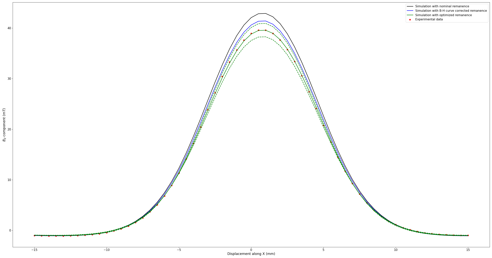

(examples-tutorial-modeling-magnets)=

# Modeling a real magnet

Whenever you wish to compare Magpylib simulations with experimental data obtained using a real permanent magnet, you might wonder how to properly set up a Magpylib magnet object to reflect the physical permanent magnet in question. The goal of this tutorial is to explain how to extract this information from respective datasheets, to provide better understanding of permanent magnets, and show how to align Magpylib simulations with experimental measurements.

This tutorial was supported by [BOMATEC](https://www.bomatec.com/de) by providing excellent data sheets and by supplying magnets for the experimental demonstration below.

## Short summary

In a magnet data sheet, you should find B-H curves and J-H curves. These curves coincide at H=0, which gives the intrinsic material remanence $B_r$. As a result of material response and self-interaction, the magnet "demagnetizes" itself so that the mean magnetic polarization of a real magnet is always below the remanence. How much below depends strongly on the shape of the magnet and is expressed in the data sheet through the permeance coefficient lines (grey lines). The numbers at the end indicate the typical magnet length to diameter ratio (L/D).

To obtain the correct magnetic polarization of a magnet from the data sheet, one must find the crossing between B-H curve and respective permeance coefficient line. This gives the "working point" which corresponds to the mean demagnetizing H-field inside the magnet. The correct polarization to use in the Magpylib simulation is the J-value at the working point which can be read off from the J-H curve.


The following sections provide further explanation on the matter.

## Hysteresis loop

If you've worked with magnetism, chances are very high that you have seen a magnetic hysteresis loop. Hysteresis loops describe the connection between the **mean values** of an externally applied H-field and the resulting B-field, polarization J or magnetization M **within a defined volume**. This connection depends strongly on the size and shape of this volume and what is inside and what is outside.

The B-H curve is called the "normal loop", while J-H and M-H curves are called "intrinsic loops". Hereon we only make use of the J-H loops, but the discussion is similar for M-H. Normal and intrinsic loops are connected via $B = \mu_0 H + J$. In free space the B-H connection is just a straight line defined via $B = \mu_0 H$. When the whole space is filled with magnetic material you will see something like this within an arbitrary volume:

::::{grid} 2
:::{grid-item}
:columns: 3
:::
:::{grid-item}
:columns: 6

:::
::::

**1st quadrant**: Initially we have $J=0$ and $H=0$. The magnetic material is not magnetized, and no external H-field is applied. When increasing the H-field, the material polarization will follow the "virgin curve" and will increase until it reaches its maximum possible value, the saturation polarization $J_S$. Higher values of $H$ will not affect $J$, while $B$ will keep increasing linearly. Now we are on the "major loop" - we will never return to the virgin curve. After reaching a large H-value we slowly turn the H-field off. As it drops to zero the material will retain its strong polarization at saturation level while the resulting $B$ decreases. At $H = 0$ the B-field then approaches the "remanence field" $B_r$, and its only contribution is $J_S$.

**2nd quadrant**: Now the H-field becomes negative. Its amplitude increases but it is oriented opposite to the initial direction. Therefore, it is also opposite to the magnetic polarization. In the 2nd quadrant we are now trying to actively demagnetize the material. This part of the hysteresis loop is often referred to as the "demagnetization curve". With increasing negative H, the B-field continues to become smaller until it reaches zero at the "coercive field" $H_c$. At this point the net B-field inside the volume is zero, however, the material is still magnetized! In the example loop above, the polarization at $H_c$ is still at the $J_S$ level. By increasing the H-field further, a point will be reached where the material will start to demagnetize. This can be seen by the non-linear drop of $J$. The point where $J$ reaches zero is called the "intrinsic coercive field" $H_{ci}$. At this point the net polarization in the observed volume is zero. The material is demagnetized. The intrinsic coercive field is a measure of how well a magnetized material can resist a demagnetizing field. Having large values of $H_{ci}$ is a property of "hard magnets", as they can keep their magnetization $J$ even for strong external fields in the opposite direction.

**3rd and 4th quadrants**: Moving to the third quadrant the behavior is now mirrored. As $H$ increases past $H_{ci}$, polarization quickly aligns with the external field and the material becomes saturated $J=-J_S$. By turning the field around again, we move through the fourth quadrant to complete the hysteresis loop.

Hysteresis in magnetism as presented here is a macroscopic model that is the result of a complex interplay between dipole and exchange interaction, material texture and resulting domain formation at a microscopic level. Details can be found, for example, in Aharoni's classical textbook "Introduction to the Theory of Ferromagnetism".

## The demagnetizing field

If in an application the applied external H-field is zero, it seems intuitive to use the remanence $B_r$ for the magnetic polarization in the Magpylib simulation. It is a value that you will find in the data sheet.


However, if considering $J=B_r$, you will quickly see that the experimental results are up to ~30 % below of what you would expect. The reason for this is the self-induced demagnetizing field of the magnet which is generated by the magnetic polarization itself. Just like $J$ generates an H-field on the outside of the magnet, it also generates an H-field inside the magnet, along the opposite direction of the polarization. The H-field outside the magnet is known as the stray field, and the H-field inside the magnet is called the demagnetizing field (as it opposes the magnetic polarization). This is demonstrated by the following figure:


Making use of the [streamplot example](examples-vis-mpl-streamplot), on the left side we show the cross-section of a Cuboid magnet and its homogeneous polarization. And on the right, we see the H-field generated by it. Inside the magnet the generated H-field opposes the polarization. As a result, the polarization of a magnet will not be $B_r$, but instead will be some value of $J$ in the 2nd quadrant of the J-H loop that corresponds to the mean H-field inside the magnet. This H-value is often referred to as the "working point".

## Finding the correct polarization

As explained above, the hysteresis loop depends strongly on the chosen observation volume geometry, the material inside, and what is outside of the volume. Magnet manufacturers provide such loops (usually only the 2nd quadrant) for their magnets, meaning that the observation volume is the whole magnet with air outside.

To obtain the correct mean polarization of a magnet we simply must compute the mean demagnetizing field (= working point) and read the resulting $J$ off the provided J-H loop. Computing the mean demagnetizing field, however, is not a simple task. In addition to the material response (permeability), it depends strongly on the magnet geometry. Fortunately, the working points can be read off from well written data sheets.


This datasheet snippet shows the second quadrant of the B-H and J-H loops, even for two different temperatures. The working point is given by the intersection between the "permeance coefficient" lines (gray) and the B-H curve. The number at the end of these lines indicate the length to diameter ratio (L/D) of the magnet, which is the critical geometric factor. Different lines are for different L/D values, which allows one to select the correct working point for different magnets made from this specific material. Once the working point is found, the correct magnetic polarization, here denoted by $J_W$ (the magnetic polarization at the working point), can be read off. The following figure exemplifies the changes in $J_W$ for different L/D values, considering a cylinder magnet:


Permanent magnets with different geometries, such as a parallelepiped shape, will have different behavior in terms of L/D values. Make sure you are reading the data from the correct part number.
## Warning

Keep in mind that there are still many reasons why your simulation might not fit well to your experiment. Here are some of the most common problems:

1. Small position errors of less than 100 um can have a large impact on the measurement result. The reference should be the sensitive element inside a sensor package. These elements can be displaced by 10-100 um and even rotated by a few degrees. The sensor might also not be well calibrated.
2. There are external stray fields, like the earth magnetic field, that influence the measurements. Those might also come from other nearby electronic equipment or magnetic parts.
3. Off-the-shelf magnets often do not hold what is promised in the datasheet
    - Magnetic polarization amplitude can be off by 5-10 %.
    - The direction of polarization often varies by up to a few degrees.
    - Worst-case: the polarization can be inhomogeneous which is often a problem in injection-mold magnets.

## Example
For a concrete example, let's consider the case of a simple linear movement of the sensor under a magnet. Two cylinder magnets with axial magnetic polarization but different L/D ratios were chosen: one magnet has 20 mm height and 5 mm diameter (L/D = 4) while the other presents 2 mm height and 8 mm diameter (L/D = 0.25). The magnets are placed such that the magnetization points towards the Z-axis, and the Bz component is measured. The magnets are sintered NdFeB of BMN-35 grade, kindly provided by Bomatec (https://www.bomatec.com/en). According to the datasheet, the nominal remanence of such magnets is 1.22 T at 20 °C. But if this value is used in the magnetic polarization attribute when creating your cylinder magnet in Magpylib, you will see that the simulated field is higher than the measurement. Fortunately, Bomatec also provides well written datasheets from which one can estimate the actual value to be used due to magnet geometry:


### Magpylib simulation code
The code for a linear scan of the sensor under the magnet, keeping an air gap of 12 mm, is the following:
```python
import numpy as np
import magpylib as magpy

magnet = magpy.magnet.Cylinder(dimensions=(5e-3, 20e-3), polarization=(0, 0, 1.22))
sensor = magpy.Sensor(position=(0, 0, -15e-3)) # 22 mm from center of magnet, 5 mm airgap

x = np.linspace(-15, 15, 61)*1e-3 # moving from X = -15 mm to X = +15 mm
move = [(xi, 0, 0) for xi in x]
sensor.move(displacement=move, start=0)

field = sensor.getB(magnet)
```
In which the cylinder magnet with L/D = 4 is considered. Keep in mind that we are using Magpylib version>5, with SI units. For the magnet with L/D = 0.25, cylinder dimensions have to be modified.

### Experimental data and comparison
To obtain the experimental data, a 6-degrees of freedom testbench was used, in which we can place any magnet and magnetic sensor of choice. With independent rotation and linear movement stages, it is possible to control the air gap and sensor movement.


The following figure presents the comparison for the Z-component of the magnetic field for a magnet with L/D = 4. The curves show simulation when using the nominal remanence, the remanence corrected from the B-H curve and the fitted remanence value obtained using the experimental data. Due to tolerances in airgap control and die position inside the sensor packaging, dashed lines are added representing sensor displacement of +/- 100 µm.

Whereas the nominal remanence is of 1.22 T and the corrected value estimated from the datasheet is 1.21 T, an optimization procedure using the experimental data resulted in 1.1847 T. This value is the closest one to what is obtained when performing the characterization of the magnet with a set of coils, which resulted in 1.17 T. Another point to notice is that, for this case, if the sensor was 100 µm closer to the magnet, the resulting curve is even above of that obtained with the nominal remanence.  

The same comparison is made for a magnet with L/D = 0.25, for which greater differences are expected.

In this case, from the B-H one can estimate a remanence of 1.18 T, and the fitting with the experimental data yields 1.1254 T remanence. Again, this value is the closest one to what is obtained with magnetic characterization, which resulted in 1.11 T remanence. The same air gap tolerance analysis is performed, and if the sensor was 100 µm closer to the magnet even the B-H curve correction would indicate a remanence above the obtained data.

Surely, there are other aspects that will influence your magnetic readings that were not mentioned here, such as sensor offset, sensitivity, and higher order components of the magnetic field that are not taken into account in the analytical expressions solved by Magpylib. But understanding from the start that the geometry of the magnet itself affects its magnetic polarization value, and how to infer the corrected value from a well written datasheet, is an important step towards a better alignment between your simulations and the experimental data.

If possible, the best practice is to characterize the magnet being used. As briefly mentioned, it is also possible to run optimization algorithms to better understand your experiment, but make sure to set realistic boundaries for the fitting parameters and double-check if the results make sense physically.
::::{grid} 2
:::{grid-item}
:columns: 3
:::
:::{grid-item}
:columns: 6

:::
::::

coming soon:
1. Magpylib simulation code
2. Experimental data
3. Comparison and discussion


###

**Exterior reference**
G. Martinek, S. Ruoho and U. Wyss. (2021). *Magnetic Properties of Permanents Magnets & Measuring Techniques* [White paper]. Arnold Magnetic Technologies. https://www.arnoldmagnetics.com/blog/measuring-permanent-magnets-white-paper/