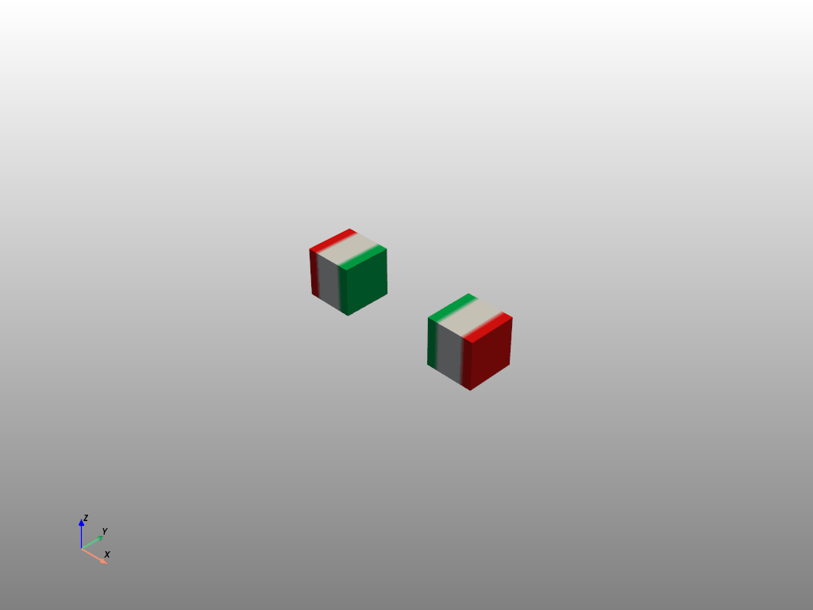
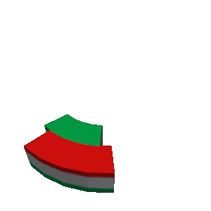
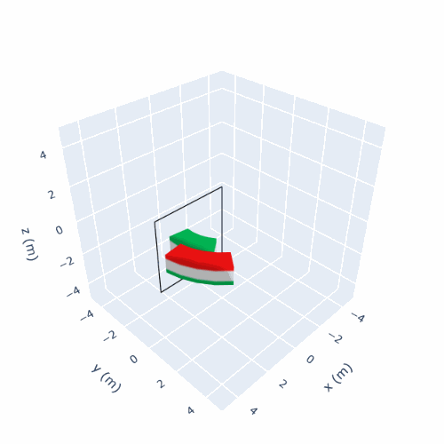

---
jupytext:
  text_representation:
    extension: .md
    format_name: myst
    format_version: 0.13
    jupytext_version: 1.16.1
kernelspec:
  display_name: Python 3 (ipykernel)
  language: python
  name: python3
orphan: true
---

(examples-vis-animations)=

# Animations

Magpylib can display the motion of objects along paths in the form of animations.

```{hint}
1. Animations work best with the [plotly backend](guide-graphic-backends).

2. If your browser window opens, but your animation does not load, reload the page.

3. Avoid rendering too many frames.
```

Detailed information about how to tune animations can be found in the [graphics documentation](guide-graphic-animations).

## Simple Animations

Animations are created with `show` by setting `animation=True`. It is also possible to hand over the animation time with this parameter.

```{code-cell} ipython3
import magpylib as magpy
import numpy as np

# Define magnet with path
magnet = magpy.magnet.Cylinder(
    polarization=(1, 0, 0),
    dimension=(2, 1),
    position=(4, 0, 0),
    style_label="magnet",
)
magnet.rotate_from_angax(angle=np.linspace(0, 300, 40), start=0, axis="z", anchor=0)

# Define sensor with path
sensor = magpy.Sensor(
    pixel=[(-0.2, 0, 0), (0.2, 0, 0)],
    position=np.linspace((0, 0, -3), (0, 0, 3), 40),
    style_label="sensor",
)

# Display as animation - prefers plotly backend
magpy.show(sensor, magnet, animation=True, backend="plotly")
```

(examples-vis-animated-subplots)=

## Animated Subplots

[Subplots](examples-vis-subplots) are a powerful tool to see the field along a path while viewing the 3D models at the same time. This is specifically illustrative as an animation where the field at the respective path position is indicated by a marker.

```{code-cell} ipython3
# Continuation from above - ensure previous code is executed

magpy.show(
    dict(objects=[magnet, sensor], output=["Bx", "By", "Bz"], col=1),
    dict(objects=[magnet, sensor], output="model3d", col=2),
    backend="plotly",
    animation=True,
)
```

It is also possible to use the [show_context](guide-graphics-show_context) context manager.

```{code-cell} ipython3
# Continuation from above - ensure previous code is executed

with magpy.show_context([magnet, sensor], backend="plotly", animation=True) as sc:
    sc.show(output="Bx", col=1, row=1)
    sc.show(output="By", col=1, row=2)
    sc.show(output="Bz", col=2, row=1)
    sc.show(output="model3d", col=2, row=2)
```

(examples-vis-exporting-animations)=

## Exporting Animations

Animations are wonderful but can be quite difficult to export when they are needed, for example, in a presentation. Here we show how to creat and export animations using the *.gif format.

### Built-in export

The easiest way to export an animation is via the Magpylib built-in command `animation_output` in the `show` function. It works only with the Pyvista backend. The following code will create a file "test4.gif".

```python
import magpylib as magpy
import numpy as np

# Create magnets with Paths
path = [(np.sin(t)+1.5,0,0) for t in np.linspace(0, 2*np.pi, 30)]
cube1 = magpy.magnet.Cuboid(dimension=(1,1,1), polarization=(1,0,0), position= path)
cube2 = cube1.copy(position=-np.array(path), polarization=(-1,0,0))

# Store gif with animation_output using Pyvista
magpy.show(
    cube1,
    cube2,
    style_legend_show=False,
    animation=3,
    animation_output="my.gif",
    backend="pyvista",
    style_path_show=False,
)
```



### Custom export Pyvista

For customizing videos it is best to work directly in the respective graphic backends. Here we show how to transfer the Magpylib graphic objects to a Pyvista plotter, customize the plotting scene, export screen shots, and combine them in a *.gif. The following example also shows how to achieve transparency.

```python
import magpylib as magpy
import pyvista as pv
from PIL import Image

def create_gif(images, frame_time, output_file):
    """Create a GIF from images"""
    frames = [Image.fromarray(img) for img in images]
    if frames:
        frames[0].save(
            output_file,
            format="GIF",
            append_images=frames[1:],
            save_all=True,
            duration=frame_time,
            loop=0,  # Infinite loop
            disposal=2,  # Remove previous frames for transparency
        )


def init_plotter():
    """ Init Pyvista plotter with custom scene layout"""
    pl = pv.Plotter(notebook=False, off_screen=True, window_size=[300, 300])
    pl.camera_position = [
        (5, 5, 5),  # Position of the camera
        (0, 0, 0),  # Focal point (what the camera is looking at)
        (0, 0, 1)   # View up direction
    ]
    pl.camera.zoom(0.5)
    pl.set_background("k")  # For better transparency
    return pl


def create_frames(frames):
    """Create frames with Pyvista."""
    
    # Create Magpylib objects
    mag1 = magpy.magnet.CylinderSegment(dimension=(3, 4, 1, 0, 45), polarization=(0, 0, 1))
    mag2 = magpy.magnet.CylinderSegment(dimension=(2, 3, 1, 0, 45), polarization=(0, 0, -1))

    images = []
    pl = init_plotter()
    for i in range(frames):
        
        # Modify object positions
        mag1.rotate_from_angax(360 / frames, axis='z')
        mag2.rotate_from_angax(-360 / frames, axis='z')

        # Transfer Magpylib objects to Pyvista plotter
        pl.clear()
        magpy.show(mag1, mag2, canvas=pl, style_legend_show=False)

        # Edit figure in Pyvista
        pl.add_mesh(pv.Line(mag1.barycenter, mag2.barycenter), color="cyan")

        # Screenshot
        print(f"Writing frame {i+1:3d}/{frames}")
        ss = pl.screenshot(transparent_background=True, return_img=True)
        images.append(ss)

    pl.close()
    return images


def main():
    frames = 100
    frame_time = 40
    output_file = "my.gif"

    images = create_frames(frames)
    create_gif(images, frame_time, output_file)


if __name__ == "__main__":
    main()
```



Notice that when providing a canvas, no update to its layout is performed by Magpylib, unless explicitly specified by setting `canvas_update=True` in `show()`. By default `canvas_update="auto"` only updates the canvas if is not provided by the user. Details can be found in the [graphics documentation](guide-graphics-canvas).

### Custom export Plotly

The following examples shows how to work in the Plotly backend.

```python
import magpylib as magpy
from PIL import Image
import io


def create_gif(images, frame_time, output_file):
    """Create GIF from frames in the temporary directory."""
    frames = [Image.open(io.BytesIO(data)) for data in images]
    if frames:
        frames[0].save(
            output_file,
            format="GIF",
            append_images=frames[1:],
            save_all=True,
            duration=frame_time,
            loop=0,  # Infinite loop
        )


def create_frames(frames):
    """Create frames with Pyvista."""

    # Create Magpylib objects
    mag1 = magpy.magnet.CylinderSegment(dimension=(3, 4, 1, 0, 45), polarization=(0, 0, 1))
    mag2 = magpy.magnet.CylinderSegment(dimension=(2, 3, 1, 0, 45), polarization=(0, 0, -1))
    
    images = []
    for i in range(frames):
        # Set object position
        mag1.rotate_from_angax(360 / frames, axis="z")
        mag2.rotate_from_angax(-360 / frames, axis="z")

        fig = magpy.show(
            mag1, mag2, return_fig=True, backend="plotly", style_legend_show=False
        )

        # Edit figure in Plotly
        fig.add_scatter3d(
            x=(0, 0, 4, 4, 0),
            y=(0, 0, 0, 0, 0),
            z=(-2, 2, 2, -2, -2),
            mode="lines",
            line_color="black",
        )

        # Customize layout
        fig.update_layout(
            scene=dict(
                camera_eye={"x": 1.5, "y": 1.5, "z": 1.5},
                camera_up={"x": 0, "y": 0, "z": 1},
                xaxis_range=(-5, 5),
                yaxis_range=(-5, 5),
                zaxis_range=(-5, 5),
            ),
            showlegend=False,
            margin=dict(l=0, r=0, t=0, b=0),
        )

        # Screenshot (requires kaleido package)
        print(f"Writing frame {i+1:3d}/{frames}")
        img = fig.to_image(format="png", width=500, height=500)
        images.append(img)
    return images


def main():
    frames = 50
    frame_time = 50
    output_file = "my.gif"

    images = create_frames(frames)
    create_gif(images, frame_time, output_file)


if __name__ == "__main__":
    main()
```


