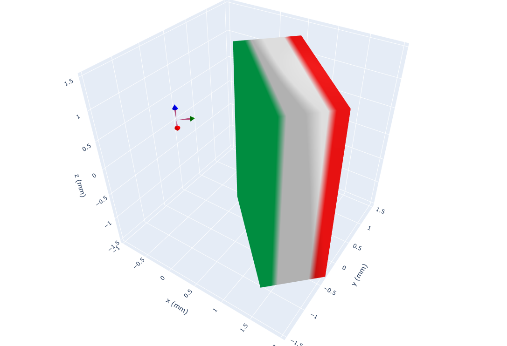

(getting-started)=
# The Magpylib fundamentals

In this section we present the most important Magpylib features, focussing on the intuitive object-oriented interface.

## Basic features

Learn the Magpylib fundamentals (create magnets, view system, compute field) in 5 minutes. This requires a basic understanding of the Python programming language, the [NumPy array class](https://numpy.org/doc/stable/) and the [Scipy Rotation class](https://docs.scipy.org/doc/scipy/reference/generated/scipy.spatial.transform.Rotation.html).

```{hint}
Since v5 all Magpylib inputs and ouputs are by default in SI-units. See {ref}`guide-docs-io-scale-invariance` for convenient use.
```

### Create sources and observers as Python objects

In the object oriented interface sources of the magnetic field (magnets, currents, others) and observers of the magnetic field (sensors) are created as Python objects.

```python
import magpylib as magpy

# Create a Cuboid magnet with magnetic polarization
# of 1 T pointing in x-direction and sides of
# 1,2 and 3 cm respectively (notice the use of SI units).

cube = magpy.magnet.Cuboid(polarization=(1,0,0), dimension=(0.01,0.02,0.03))

# Create a Sensor for measuring the field

sensor = magpy.Sensor()
```

Find detailed information on the Magpylib classes [here](docs-classes).

### Position and orientation

All Magpylib objects (sources and observers) have position and orientation in a global Cartesian coordinate system that can be manipulated.

```python
# By default, the position of a Magpylib object is
# (0,0,0) and its orientation is the unit rotation,
# given by a scipy rotation object.

print(cube.position)                   # -> [0. 0. 0.]
print(cube.orientation.as_rotvec())    # -> [0. 0. 0.]

# Manipulate object position and orientation through
# the respective attributes (move 10 mm and rotate 45 deg):

from scipy.spatial.transform import Rotation as R
cube.position = (0.01,0,0)
cube.orientation = R.from_rotvec((0,0,45), degrees=True)

print(cube.position)                            # -> [0.01 0.   0.  ]
print(cube.orientation.as_rotvec(degrees=True)) # -> [0. 0. 45.]

# Apply relative motion with the powerful `move`
# and `rotate` methods.
sensor.move((-0.01,0,0))
sensor.rotate_from_angax(angle=-45, axis='z')

print(sensor.position)                            # -> [-0.01  0.    0.  ]
print(sensor.orientation.as_rotvec(degrees=True)) # -> [ 0.  0. -45.]
```

Find detailed information on position and orientation attributes and how to manipulate them [here](docs-position).

### 3D view of objects

In-built 3D graphic output helps to see if all Magpylib objects are positioned properly. The magnet polarization is represented by default by a 3-color scheme, the sensor by an axes cross.

```python
# Use the `show` function to view your system
# through Matplotlib, Plotly or Pyvista backends.

magpy.show(cube, sensor, backend='plotly')
```



Detailed information on the graphical output with `show` is given [here](guide-graphics).

### Computing the field

The field can be computed at sensor objects, or simply by specifying a position of interest.

```python
# Compute the B-field for some positions.

points = [(0,0,-.01), (0,0,0), (0,0,.01)] # in SI Units (m)
B = magpy.getB(cube, points)

print(B.round(2)) # -> [[ 0.26  0.07  0.08]
                  #     [ 0.28  0.05  0.  ]
                  #     [ 0.26  0.07 -0.08]] # in SI Units (T)

# Compute the H-field at the sensor.

H = magpy.getH(cube, sensor)

print(H.round()) # -> [51017. 24210.     0.] # in SI Units (A/m)
```

```{hint}
Magpylib makes use of vectorized computation (massive speedup). This requires that you hand over all field computation instances (multiple objects with multiple positions (=paths)) at the same time to `getB`, `getH`, `getJ` and `getM`. Avoid Python loops at all costs !!!
```

Detailed information on field computation is provided [here](docs-fieldcomp).

## Advanced features

While most things can be achieved with the above, the following features will make your live much easier.

### Paths

Magpylib position and orientation attributes can store multiple values that are referred to as paths. The field will automatically be computed for all path positions. Use this feature to model objects that move to multiple locations.

```python
import numpy as np
import magpylib as magpy

# Create magnet
sphere = magpy.magnet.Sphere(
    diameter=.01,
    polarization=(0,0,1)
)

# Assign a path
sphere.position = np.linspace((-.02,0,0), (.02,0,0), 7)

# The field is automatically computed for every path position
B = sphere.getB((0,0,.01))
print(B.round(3))  # ->[[ 0.004  0.    -0.001]
                      # [ 0.013  0.     0.001]
                      # [ 0.033  0.     0.026]
                      # [ 0.     0.     0.083]
                      # [-0.033  0.     0.026]
                      # [-0.013  0.     0.001]
                      # [-0.004  0.    -0.001]]
```

More information on paths is provided [here](docs-position).

### Collections
Magpylib objects can be grouped into Collections. An operation applied to a Collection is applied to every object in it. The Collection itself behaves like a single source object.

```python
import magpylib as magpy

# Create objects
obj1 = magpy.Sensor()
obj2 = magpy.magnet.Cuboid(
    polarization=(0,0,1),
    dimension=(.01,.02,.03))

# Group objects
coll = magpy.Collection(obj1, obj2)

# Manipulate Collection
coll.move((.001,.002,.003))

print(obj1.position) # -> [0.001 0.002 0.003]
print(obj2.position) # -> [0.001 0.002 0.003]
```

Collections are dicussed in detail [here](guide-docs-classes-collections).

### Complex Magnet Shapes
There most convenient way to create a magnet with complex shape is by using the convex hull of a point cloud (= simplest geometric form that includes all given points) and transform it into a triangular surface mesh.

```python
import numpy as np

import magpylib as magpy

# Create a Pyramid magnet
points = (
    np.array(
        [
            (-1, -1, 0),
            (-1, 1, 0),
            (1, -1, 0),
            (1, 1, 0),
            (0, 0, 2),
        ]
    )
)
pyramid = magpy.magnet.TriangularMesh.from_ConvexHull(
    magnetization=(0, 0, 1e6),
    points=points,
)

# Display the magnet graphically
pyramid.show()
```


There are several other possibilities to create complex magnet shapes. Some can be found in the [examples](examples-complex-magnet-shapes).


### Graphic Styles
Magpylib offers many ways to customize the graphic output.

```python
import magpylib as magpy

# Create Cuboid magnet with custom style
cube = magpy.magnet.Cuboid(
    polarization=(0,0,1),
    dimension=(.01,.01,.01),
    style_color='r',
    style_magnetization_mode='arrow'
)

# Create Cylinder magnet with custom style
cyl = magpy.magnet.Cylinder(
    polarization=(0,0,1),
    dimension=(.01,.01),
    position=(.02,0,0),
    style_magnetization_color_mode='bicolor',
    style_magnetization_color_north='m',
    style_magnetization_color_south='c',
)
magpy.show(cube, cyl)
```


The many options for graphic styling can be found [here](guide-graphic-styles).

### Animation
Object paths can be animated. For this feature the plotly graphic backend is recommended.

```python
import numpy as np
import magpylib as magpy


# Create magnet with path
cube = magpy.magnet.Cuboid(
    magnetization=(0,0,1),
    dimension=(1,1,1),
)
cube.rotate_from_angax(
    angle=np.linspace(10,360,18),
    axis='x'
)

# Generate an animation with `show`
cube.show(animation=True, backend="plotly")
```


Nice animation examples are shown [here](examples-vis-animations), and a detailed discussion is provided [here](guide-graphic-animations).

### Functional interface
Magpylib's object oriented interface is convenient to work with but is also slowed down by object initialization and handling. The functional interface bypasses this load and enables fast field computation for an arbitrary set of input parameters.

```python
import magpylib as magpy

# Compute the magnetic field via the functional interface.
B = magpy.getB(
    sources="Cuboid",
    observers=[(-1, 0, 1), (0, 0, 1), (1, 0, 1)],
    dimension=(1, 1, 1),
    polarization=(0, 0, 1),
)

print(B.round(3))  # -> [[-0.043  0.     0.014]
                       # [ 0.     0.     0.135]
                       # [ 0.043  0.     0.014]]
```

Details on the functional interface are found [here](docs-field-functional).
