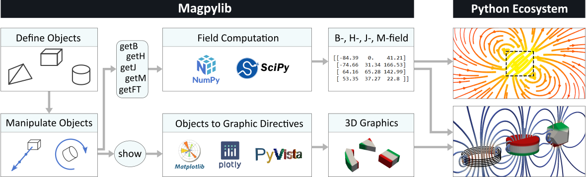

# Magpylib Documentation

Magpylib is an **open-source Python package** for calculating static **magnetic fields** of magnets, currents, and other sources. It uses **analytical expressions**, solutions to macroscopic magnetostatic problems, implemented in **vectorized** form which makes the computation **extremely fast** and leverages the open-source Python ecosystem for spectacular visualizations!

<h2> Resources </h2>

::::{grid} 1 2 3 3
:margin: 4 4 0 0
:gutter: 2

:::{grid-item-card}
:link: getting-started
:link-type: ref
:link-alt: link to Getting Started
:img-top: _static/images/index_icon_get_started.png
:text-align: center
**Getting Started**
:::

:::{grid-item-card}
:link: examples
:link-type: ref
:link-alt: link to Examples
:img-top: _static/images/index_icon_examples.png
:text-align: center
**Examples**
:::

:::{grid-item-card}
:link: https://www.sciencedirect.com/science/article/pii/S2352711020300170
:link-alt: link to Journal
:img-top: _static/images/index_icon_academic.png
:text-align: center
**Scientific Reference**
:::

::::

<h2> How it works</h2>



In Magpylib, **sources** (magnets, currents, ...) and **observers** (sensors, position grids, ...) are created as Python objects with position and orientation attributes. These objects can be **grouped** and **moved** around. The system can be **viewed** graphically through various backends. The **magnetic field** is computed in the observer reference frame. Magpylib collects all inputs, and vectorizes the computation for maximal performance.


```{toctree}
:maxdepth: 2
:hidden:

_pages/user_guide/guide_index.md
_pages/API_reference.md
_pages/contributing/cont_index.md
_pages/changelog_.md

```
