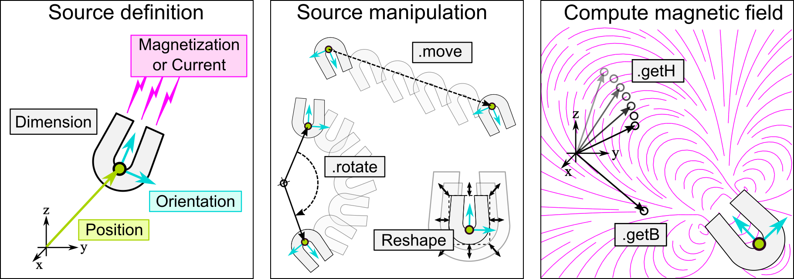

.. magpylib documentation master file, created by
   sphinx-quickstart on Tue Feb 26 11:58:33 2019.
   You can adapt this file completely to your liking, but it should at least
   contain the root `toctree` directive.

What is Magpylib ?
##################

- Python package for calculating 3D static magnetic fields of magnets (e.g. Cuboids, Cylinders, Spheres, ...), line currents (e.g. straight or loops) and other sources (e.g. Dipoles).
- The fields are computed using analytical solutions which makes the computation very fast (fully vectorized)
- The field computation is coupled to an object oriented geometry interface (position, orientation, paths) which makes it convenient to realize relative motion between sources and observers.

Quickstart
##########

**Install Magpylib** with pip or conda:

``> pip install magpylib``.

``> conda install magpylib``.

This **Example code** calculates the magnetic field of a cylindrical magnet.

.. code-block:: python

    import magpylib as mag3
    s = mag3.magnet.Cylinder(magnetization=(0,0,350), dimension=(4,5))
    observer_pos = (4,4,4)
    print(s.getB(observer_pos))

    # Output: [ 5.08641867  5.08641867 -0.60532983]

A cylinder shaped permanent magnet with diameter and height of 4 and 5 millimeter, respectively, is created in a global coordinate system with cylinder axis parallel to the z-axis and geometric magnet center in the origin. The magnetization is homogeneous and points in z-direction with an amplitude of 350 millitesla. The magnetic field is calculated in units of millitesla at the observer position (4,4,4) in units of millimeter.

.. toctree::
   :glob:
   :maxdepth: 1
   :caption: Content:

   _pages/*

.. toctree::
   :glob:
   :maxdepth: 1
   :caption: Library Docstrings:

   _autogen/magpylib

Index
#####

* :ref:`genindex`
* :ref:`modindex`