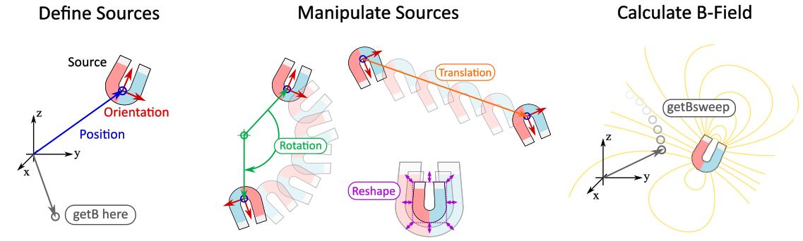

.. MagPyLib documentation master file, created by
   sphinx-quickstart on Tue Feb 26 11:58:33 2019.
   You can adapt this file completely to your liking, but it should at least
   contain the root `toctree` directive.

Welcome to magpylib's documentation!
====================================

What is magpylib ?
~~~~~~~~~~~~~~~~~~
 - Open-source Python package to calculate magnetic fields of sources (magnets, currents, moments).
 - magpylib provides simple methods to generate, geometrically manipulate, group and vizualize assemblies of sources and calculate the fields they generate.
 - The magnetic fields are determined from underlying (semi-analytical) solutions that are found in the literature
 - Fast computation of fields (sub-millisecond) with litte computation power

.. toctree::
   :glob:
   :maxdepth: 2
   :caption: Content:

   _pages/*

.. toctree::
   :glob:
   :maxdepth: 1
   :caption: Library Docstrings:

   _autogen/magpylib
   _autogen/magpylib.source
   _autogen/magpylib.math

Index and tables
~~~~~~~~~~~~~~~~~~

* :ref:`genindex`
* :ref:`modindex`
* :ref:`search`
