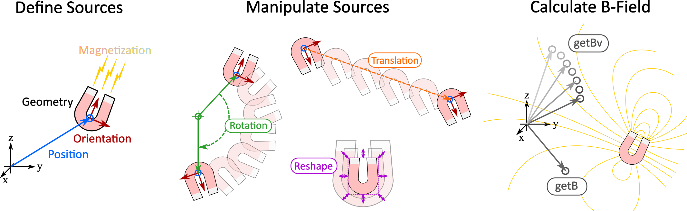

.. magpylib documentation master file, created by
   sphinx-quickstart on Tue Feb 26 11:58:33 2019.
   You can adapt this file completely to your liking, but it should at least
   contain the root `toctree` directive.

What is magpylib ?
~~~~~~~~~~~~~~~~~~
- Python package for calculating magnetic fields of magnets, currents and
  moments (sources).
- Provides convenient methods to generate, geometrically manipulate, group
  and vizualize assemblies of sources.
- The magnetic fields are determined from underlying (semi-analytical)
  solutions which results in fast computation times and requires little
  computation power.

Quickstart
~~~~~~~~~~
Install magpylib with pip (``>> pip install magpylib``).

Run this simple code to calculate the magnetic field of a cylindrical magnet.

.. code-block:: python

    from magpylib.source.magnet import Cylinder
    s = Cylinder( mag = [0,0,350], dim = [4,5])
    print(s.getB([4,4,4]))       

    # Output: [ 5.08641867  5.08641867 -0.60532983]

In this example the magnet axis is parallel to the z-axis. The magnetization / 
remanence field is homogeneous and points in z-direction with amplitude of 
350 millitesla. The diameter and height of the magnet are 4 millimeter and 
5 millimeter respectively and the magnet position (=geometric center) is in the
origin. Finally, the magnetic field *B* is calculated in units of millitesla at
the positition *[4,4,4]* given in units of millimeter.

More examples where sources are moved, rotated, grouped and displayed graphically,
can be found in the `Examples Section`__.

__ docs/_pages/2_guideExamples.md

Find detailed technical information how to use the library in the
Documentation__.

__ docs/_pages/0_documentation.md

.. toctree::
   :glob:
   :maxdepth: 1
   :caption: Content:

   _pages/*

.. toctree::
   :glob:
   :maxdepth: 1
   :caption: Library Docstrings:

   _autogen/magpylib
   _autogen/magpylib.source
   _autogen/magpylib.math

Index and tables
~~~~~~~~~~~~~~~~~~

* :ref:`genindex`
* :ref:`modindex`
.. * :ref:`search`
